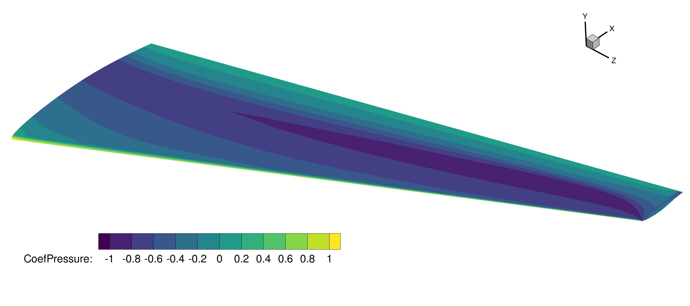
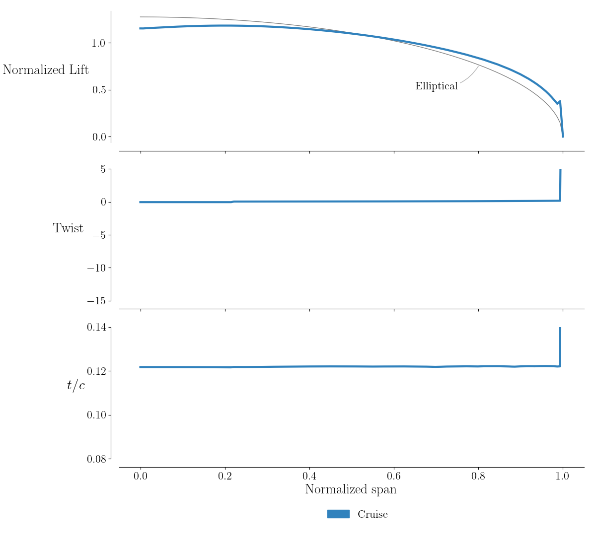
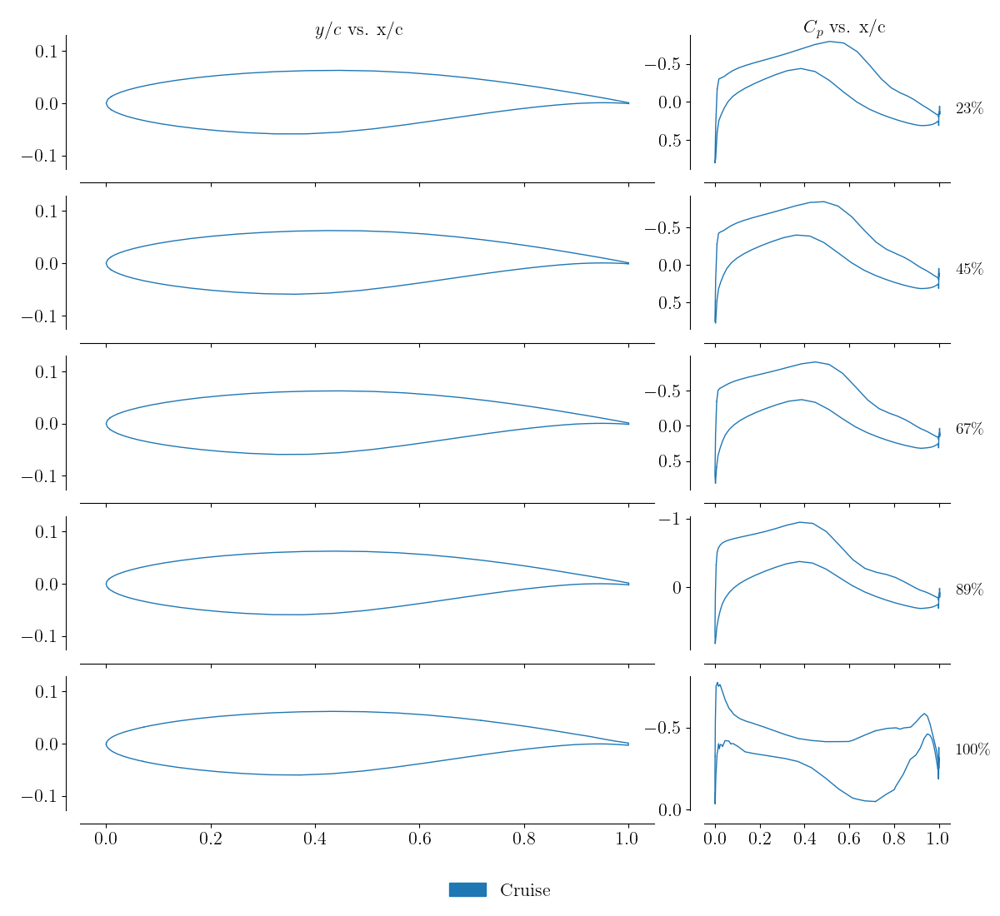

.. _aero_adflow:

********************
Analysis with ADflow
********************

Introduction
============
Now that we have a valid structured volume mesh, we can start our aerodynamics analysis with ADflow.
There is no graphical user interface for ADflow.
The cases are prepared with python scripts and run from the command line.
In this section of the tutorial, we will explain the nuts and bolts of a basic ADflow runscript.
You will find a complete introduction to ADflow in the :doc:`docs <adflow:introduction>`.
For this tutorial we will use the L2 mesh that we generated in the previous step.
L1 meshes are what is typically used for analysis but we want to limit computational time for the purpose of this tutorial.

Files
=====
Navigate to the directory ``aero/analysis`` in your tutorial folder.
Copy the following file from the volume meshing directory:

.. prompt:: bash

    cp ../meshing/volume/wing_vol_L1.cgns .

Create the following empty runscript in the current directory:

- ``aero_run.py``

Dissecting the ADflow runscript
===============================
Open the file ``aero_run.py`` with your favorite text editor.
Then copy the code from each of the following sections into this file.

Import libraries
----------------
.. literalinclude:: ../tutorial/aero/analysis/aero_run.py
   :start-after: # rst Imports
   :end-before: # rst ADflow options

This section is identical to the one shown in :ref:`the airfoil analysis tutorial <airfoilanalysis_adflow>`.
We import ADflow and baseclasses among several other things.

Adding command line arguments
-----------------------------
.. literalinclude:: ../tutorial/airfoil/analysis/airfoil_run.py
    :start-after: # rst Args
    :end-before: # rst ADflow options

This is a convenience feature that allows the user to pass in command line arguments to the script.
Three options are provided:

-  Output directory
-  Grid file to be used
-  Task to execute

ADflow options
--------------
.. literalinclude:: ../tutorial/aero/analysis/aero_run.py
   :start-after: # rst ADflow options
   :end-before: # rst Start ADflow

We will use the same ADflow solver settings that we used in the :ref:`the airfoil analysis tutorial <airfoilanalysis_adflow>`.
An exhaustive list of the ADflow options and their descriptions can be found `in the docs <https://mdolab-adflow.readthedocs-hosted.com/en/latest/options.html>`_.
We strongly recommend going over the descriptions and tips on solvers and solver options in the ADflow :doc:`solvers docs <adflow:solvers>`.
A basic overview of the options used in this example are provided here.

`I/O Parameters`
    We include the mesh file, the output directory, and the variables that will be printed as the solver runs.

`Physics Parameters`
    We set the equation type that ADflow will solve which in this case will be RANS.

`Solver Parameters`
    We typically select the smoother (RK or DADI) and multigrid settings for the explicit solver.
    However we will be using the implicit solver in this example so we just set the number of turburlence sub-iterations to 10 and turn off multigrid.
    For most practical problems we use the Approximate Newton-Krylov (ANK) and Newton-Krylov (NK) solvers to speed up convergence and increase the robustness of the solver.

`ANK Solver Parameters`
    We will simply turn on the ANK solver

`NK Solver Parameters`
    We will turn on the NK solver and request that ADflow switch to it from ANK at a specific relative tolerance.

`Termination Criteria`
    We set the termination criteria of the solver based on relative convergence of the norm of the residuals or maximum number of iterations.

Create solver
-------------
.. literalinclude:: ../tutorial/aero/analysis/aero_run.py
   :start-after: # rst Start ADflow
   :end-before: # rst Create AeroProblem

When ADflow is instantiated, it reads in the mesh and then waits for the user to dictate further operations.
Before running the case, we can choose to set up some additional output options.
First, ADflow can write a file containing distribution data over the extent of the wing (e.g. lift, drag, twist) using ``addLiftDistribution``.
Also, ADflow can write airfoil data for a given set of slices along the wing using `addSlices`.

Set flow conditions
-------------------
.. literalinclude:: ../tutorial/aero/analysis/aero_run.py
    :start-after: # rst Create AeroProblem
    :end-before: # rst Run ADflow

The flow conditions and any auxiliary information about the geometry (such as reference dimensions) are provided to ADflow by way of an AeroProblem.
The AeroProblem automatically generates complete flow state information from the Mach number and altitude based on the 1976 U.S. Standard Atmosphere.
The ``alpha`` parameter is used to rotate the flow in the far-field to simulate angle-of-attack.
The ``evalFuncs`` parameter stipulates which functions the user would like to compute from the converged flow solution.
Some available functions include ``'cl'``, ``'cd'``, ``'cmz'``, ``'lift'``, and ``'drag'``.

Single analysis
---------------
.. literalinclude:: ../tutorial/aero/analysis/aero_run.py
    :start-after: # rst Run ADflow
    :end-before: # rst Create polar arrays

The solver is run the same way it was for the airfoil analysis.
We print out the requested functions on the root proc.

Generating Drag Polars
----------------------
The other task is to generate a drag polar, which shares the same ADflow setup as the previous task.
The only difference is that the analysis is now done within a loop.

.. literalinclude:: ../tutorial/aero/analysis/aero_run.py
    :start-after: # rst Create polar arrays
    :end-before: # rst Start loop

We start by creating a list of the angle of attack values that we wish to analyze.
In this case we use the ``numpy.linspace`` function to create a uniformly-spaced array with six whole number entries from 0 -- 5.
We also create the empty lists for storing the lift and drag coefficients.
The lift and drag data will be appended to these lists as the flow solutions are completed.

.. literalinclude:: ../tutorial/aero/analysis/aero_run.py
    :start-after: # rst Start loop
    :end-before: # rst update AP

Having created the input array and data storage lists, we can now loop over the desired angles of attack to evaluate the polar.
We accomplish this by using the builtin ``for`` loop structure in python.

.. literalinclude:: ../tutorial/aero/analysis/aero_run.py
    :start-after: # rst update AP
    :end-before: # rst Run ADflow polar

Now for each angle of attack, we update two attributes of the aero problem.
We update the name to include the current angle of attack.
This allow the filenames of the lift distribution, slices, volume solution and surface solution to be updated with the current angle of attack, making it easier to keep track of the output files.
We also update the alpha parameter, which is the attribute of the AeroProblem that represents the angle of attack.

.. literalinclude:: ../tutorial/aero/analysis/aero_run.py
    :start-after: # rst Run ADflow polar
    :end-before: # rst Print polar

Running the solver is identical to the simple single point example.
We simply call the ``CFDSolver`` instance with the current AeroProblem.
This causes the CFD solver to be updated with the values of that AeroProblem prior to solving the flow.
We then use the same ``EvalFunctions`` call to integrate the surface forces to get the lift and drag coefficients.
The difference is that here, we append the coefficients from ``funcs`` into the ``CLList`` and ``CDList`` variables, so that they can be used later.

.. literalinclude:: ../tutorial/aero/analysis/aero_run.py
    :start-after: # rst Print polar

Once we complete the loop and evaluate all of the desired flow conditions, we can print the completed data set to the screen.

Run it yourself!
================
First we run the analysis task, which is the default ``task``:

.. prompt:: bash

    mpirun -np 4 python aero_run.py

ADflow will print to the terminal various information during the initialization stages before starting the solution process.
Once the solution process starts the terminal should show information about the convergence history of the variables specified in ``monitorvariables``, in addition to the total residual.
The solver terminates either by reaching the maximum number of iterations or a reduction in the total residual is specified by the ``L2Convergence`` option::

    #
    # Grid 1: Performing 1000 iterations, unless converged earlier. Minimum required iteration before NK switch:      5. Switch to NK at totalR of:   3.61E+03
    #
    #------------------------------------------------------------------------------------------------------------------------------------------------------------
    #  Grid  | Iter | Iter |  Iter  |   CFL   | Step | Lin  |        Res rho         |         C_lift         |        C_drag          |        totalRes        |
    #  level |      | Tot  |  Type  |         |      | Res  |                        |                        |                        |                        |
    #------------------------------------------------------------------------------------------------------------------------------------------------------------
        1       0      0     None     ----    ----   ----   6.8119748545184311E+03   1.9394144207511646E-03   2.4312259541704428E-01   3.6094050319128953E+07 
        1       1      3     *ANK   5.00E+00  0.15  0.003   5.8572738966604538E+03   1.8989712699411621E-02   2.6123889984648263E-01   3.1352868776105475E+07 
        1       2      8      ANK   5.00E+00  0.27  0.009   4.6089215189533606E+03   4.4525558730598352E-02   2.8498526143324743E-01   2.4773109167467546E+07 
        1       3     13      ANK   5.00E+00  0.33  0.041   3.5025352222930269E+03   6.8498556695627710E-02   3.0433066592584856E-01   1.8846824280113395E+07 
        1       4     19      ANK   5.00E+00  0.35  0.042   2.6699412809756282E+03   8.6390466858499493E-02   3.1559956223410290E-01   1.4367066116567381E+07 
        1       5     22     *ANK   5.00E+00  0.40  0.003   1.9757472700339504E+03   9.9430257820697240E-02   3.2024272121454633E-01   1.0601828712621000E+07 
        1       6     26      ANK   5.00E+00  0.48  0.022   1.3888090756109468E+03   1.0919402720764211E-01   3.1963945970217400E-01   7.4425613020580597E+06 
        1       7     31      ANK   5.00E+00  0.57  0.041   9.2179785838505518E+02   1.1539564346119087E-01   3.1349652648176851E-01   4.9568734645600524E+06 
        1       8     34     *ANK   2.26E+01  0.17  0.024   7.6273858823998421E+02   1.1567830141497529E-01   3.0472963157151689E-01   4.1308216360540828E+06 
        1       9     39      ANK   2.26E+01  0.25  0.017   5.8580673596702957E+02   1.1641929329539358E-01   2.9358215767993850E-01   3.1955814997564522E+06 
        1      10     45      ANK   2.26E+01  0.33  0.031   4.1549338721272227E+02   1.1717496789448868E-01   2.7985031979470509E-01   2.2665665704495241E+06 
        1      11     48     *ANK   2.26E+01  0.49  0.021   2.4757116949369279E+02   1.1727492268792626E-01   2.6081950164257406E-01   1.3302071881474971E+06 
        1      12     52      ANK   2.26E+01  0.34  0.030   1.8250248743251592E+02   1.1750657681680172E-01   2.4941303426866507E-01   9.6985704730397405E+05 
        1      13     55     *ANK   2.26E+01  0.70  0.035   1.0002579520325294E+02   1.1724024179597634E-01   2.2789062116475137E-01   5.3375137176422135E+05 
        1      14     60      ANK   2.26E+01  0.33  0.023   8.2902569690138748E+01   1.1722506986984907E-01   2.1939014366228304E-01   4.5774571297449461E+05 
        1      15     64     *ANK   2.26E+01  0.49  0.015   7.0596830401630214E+01   1.1732594723754182E-01   2.0738998024595637E-01   4.1040888019435667E+05 
        1      16     68      ANK   2.26E+01  0.50  0.020   6.8675429643261637E+01   1.1758832822069054E-01   1.9611918158167213E-01   4.1033439302761073E+05 
        1      17     72      ANK   2.26E+01  0.55  0.028   6.9859599747432497E+01   1.1808444999658321E-01   1.8432392053487451E-01   4.2313850570385414E+05 
        1      18     76      ANK   2.26E+01  0.66  0.039   7.0714456885922843E+01   1.1902480710946281E-01   1.7114401168657262E-01   4.3176661279191874E+05 
        1      19     81      ANK   2.26E+01  0.84  0.011   7.0232128961845120E+01   1.2090452004783939E-01   1.5542403407613520E-01   4.3088020577741868E+05 
        1      20     86      ANK   2.26E+01  1.00  0.016   6.6278715535291610E+01   1.2415423221763990E-01   1.3851629489604175E-01   4.0385095381866227E+05 
        1      21     91      ANK   2.26E+01  1.00  0.025   5.8937971371447645E+01   1.2866981271593930E-01   1.2409256020587708E-01   3.5400946868247463E+05 
        1      22     96      ANK   2.26E+01  1.00  0.031   5.1422151188650183E+01   1.3437548861746101E-01   1.1231447181527715E-01   3.0234070815789758E+05 
        1      23    101      ANK   2.26E+01  1.00  0.035   4.5817810439630676E+01   1.4100515960158011E-01   1.0297392718004639E-01   2.6262631764697091E+05 
        1      24    106      ANK   2.26E+01  1.00  0.043   4.1896472555197953E+01   1.4822428983597594E-01   9.5695664221359791E-02   2.3512450214780931E+05 
        1      25    110     *ANK   6.92E+01  0.79  0.041   3.0202908552802491E+01   1.6624528599708899E-01   8.4979359035136162E-02   1.7685496277017219E+05 
        1      26    115      ANK   6.92E+01  1.00  0.044   2.3118146626757831E+01   1.9281128809556980E-01   7.5162232517128363E-02   1.4018413005472886E+05 
        1      27    121      ANK   6.92E+01  1.00  0.035   1.9072972329473423E+01   2.2099065698901638E-01   6.7525233956668262E-02   1.1655408359163751E+05 
        1      28    131     *ANK   2.21E+02  1.00  0.048   1.2889921646286551E+01   2.8887483619053234E-01   4.8955111614079228E-02   1.0035212634564967E+05 
        1      29    139      ANK   2.21E+02  0.76  0.048   1.0705284683289600E+01   3.3707259765242059E-01   3.7695225453775280E-02   8.1755163549431338E+04 
        1      30    148      ANK   2.21E+02  0.82  0.040   9.4354468542402117E+00   3.7938201383603443E-01   2.8487785392167918E-02   6.7362304395816886E+04 
        1      31    158      ANK   2.21E+02  0.85  0.043   8.2668929103244579E+00   4.1100760757093335E-01   2.2752194062945021E-02   5.5624136272653566E+04 
        1      32    172     *ANK   7.37E+02  0.50  0.043   7.5317099246511825E+00   4.3068556322022422E-01   2.0306757411906275E-02   5.3744401207667353E+04 
        1      33    185      ANK   7.37E+02  0.60  0.044   7.6367132619013631E+00   4.4497237995853128E-01   1.8841633094818296E-02   5.3927332260161784E+04 
        1      34    197      ANK   7.37E+02  0.80  0.041   7.4255812874680425E+00   4.5320171242512874E-01   1.8295480776796515E-02   5.0089364490166321E+04 
        1      35    210      ANK   7.37E+02  1.00  0.049   7.3538854148625061E+00   4.5642804611843568E-01   1.8587474749775165E-02   4.4817368257839997E+04 
        1      36    226      ANK   7.37E+02  1.00  0.049   7.1237927524399396E+00   4.5755499774005637E-01   1.8999934832486021E-02   4.1142846271264520E+04 
        1      37    240      ANK   7.37E+02  1.00  0.044   6.5681249836877118E+00   4.5853135986627080E-01   1.9303028432959286E-02   3.8127310780427906E+04 
        1      38    252      ANK   7.37E+02  1.00  0.047   6.1533393022458700E+00   4.5996735514928494E-01   1.9475400779736505E-02   3.5765088637642264E+04 
        1      39    263      ANK   7.37E+02  1.00  0.047   5.7896273631621478E+00   4.6168624698299898E-01   1.9525665618187246E-02   3.3101615677303431E+04 
        1      40    274      ANK   7.37E+02  1.00  0.045   5.3931757398562530E+00   4.6342457950529592E-01   1.9509529437184474E-02   3.0386650150557205E+04 
        1      41    285      ANK   7.37E+02  1.00  0.044   4.8122558936070501E+00   4.6458255332589754E-01   1.9517036394032738E-02   2.7116136086588038E+04 
        1      42    293     *ANK   2.40E+03  1.00  0.047   4.4586815823345765E+00   4.6482338414550500E-01   1.9201704514888673E-02   2.5935204404020114E+04 
        1      43    302      ANK   2.40E+03  1.00  0.043   4.1643235231801654E+00   4.6360597901634415E-01   1.9183654787164654E-02   2.4120680122559035E+04 
        1      44    311      ANK   2.40E+03  1.00  0.044   3.8357230601980024E+00   4.6118277078467079E-01   1.8981393601919257E-02   2.2234030517046056E+04 
        1      45    320      ANK   2.40E+03  1.00  0.044   3.3030011389184777E+00   4.5797882788303518E-01   1.8595009654328858E-02   1.9203912802449966E+04 
        1      46    330      ANK   2.40E+03  1.00  0.045   2.7799363698373325E+00   4.5396374424647123E-01   1.8132785595286277E-02   1.6113168061856399E+04 
        1      47    341      ANK   2.40E+03  1.00  0.049   2.4563113309235867E+00   4.4878526901273885E-01   1.7716432621376461E-02   1.4093806268692522E+04 
        1      48    353      ANK   2.40E+03  1.00  0.042   2.3870349603532923E+00   4.4174304212320514E-01   1.7416497285562115E-02   1.3660297089298425E+04 
        1      49    364      ANK   2.40E+03  1.00  0.046   1.8737253673179386E+00   4.3603200157053651E-01   1.7219249582773058E-02   1.1057202501305514E+04 
    #------------------------------------------------------------------------------------------------------------------------------------------------------------
    #  Grid  | Iter | Iter |  Iter  |   CFL   | Step | Lin  |        Res rho         |         C_lift         |        C_drag          |        totalRes        |
    #  level |      | Tot  |  Type  |         |      | Res  |                        |                        |                        |                        |
    #------------------------------------------------------------------------------------------------------------------------------------------------------------
        1      50    372     *ANK   9.38E+03  1.00  0.048   1.2819446104648946E+00   4.3259104762816286E-01   1.7040526416216902E-02   8.0510899424026366E+03 
        1      51    381      ANK   9.38E+03  1.00  0.047   9.8465263430555805E-01   4.2999571637220035E-01   1.6911019694127109E-02   6.1448228986455806E+03 
        1      52    391      ANK   9.38E+03  1.00  0.044   8.6444700402191377E-01   4.2808748066131586E-01   1.6839112017998779E-02   5.3504816042884913E+03 
        1      53    401     *ANK   3.08E+04  1.00  0.040   7.5647238721176202E-01   4.2682843632133738E-01   1.6820256914138638E-02   4.6616718052841707E+03 
        1      54    411      ANK   3.08E+04  1.00  0.038   6.7100211473459870E-01   4.2592567635162804E-01   1.6802115574901008E-02   4.0074017081978222E+03 
        1      55    421      ANK   3.08E+04  1.00  0.037   5.8922000534057606E-01   4.2528327437943353E-01   1.6759148996593708E-02   3.4363124345322422E+03 
        1      56    429      *NK     ----    1.00  0.288   1.8707839441336904E-01   4.2490221993599514E-01   1.6741873761246397E-02   1.0989461853190485E+03 
        1      57    458       NK     ----    1.00  0.157   5.6695143602025232E-02   4.2420651730607972E-01   1.6687142765024154E-02   6.2845755956568098E+02 
        1      58    463       NK     ----    1.00  0.388   4.2789630014640125E-02   4.2415989094892725E-01   1.6684728769927340E-02   2.4354282124737250E+02 
        1      59    500       NK     ----    1.00  0.230   1.2597257900794929E-02   4.2374169843187381E-01   1.6765685731168958E-02   8.9435228401279716E+01 
        1      60    562       NK     ----    1.00  0.212   6.6671151544535640E-03   4.2319986533648285E-01   1.6678717698346349E-02   2.9321412153287884E+01 

A the end of the terminal output the functions defined in ``evalFuncs``  are printed to the screen::

    {'wing_cd': 0.01667871769834634, 'wing_cl': 0.4231998653364828}

Next, run the ``polar`` task:

.. prompt:: bash

    mpirun -np 4 python aero_run.py --task polar --output polar

The final table should look something like::

      Alpha       CL       CD
     ========================
        0.0   0.2356   0.0099
        1.0   0.3631   0.0138
        2.0   0.4801   0.0202
        3.0   0.5817   0.0290
        4.0   0.6600   0.0402
        5.0   0.7161   0.0535

Postprocessing the solution output
==================================
All output is found in the ``output`` directory.
The solutions file (``.dat``, ``.cgns`` or ``.plt``) can be viewed in the Tecplot.
A contour plot of the pressure coefficient using the surface ``.plt`` is shown below.

The lift and slice files (``.dat``) can also be viewed in tecplot or parsed directly and plotted e.g. matplotlib.
From the lift file we show the spanwise normalized lift, compared to elliptical lift, as well as the twist distribution and t/c.

For the slice file, here the normalized airfoil shape and pressure coefficient are shown.

