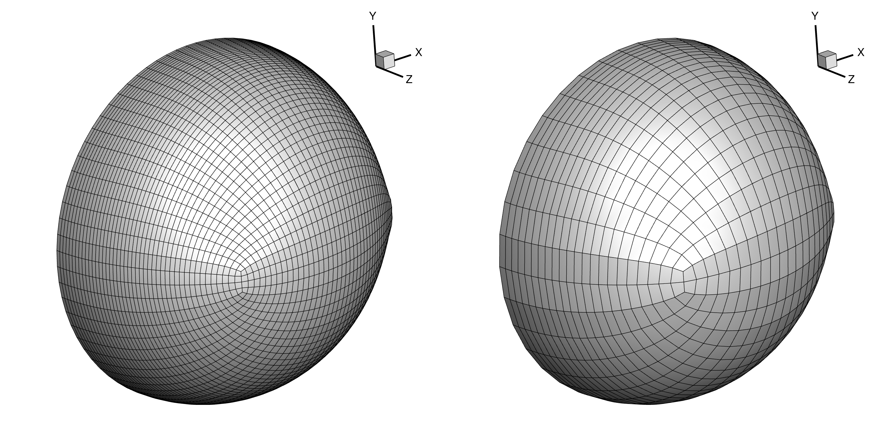

.. _aero_cgnsutils:

***********************
Mesh Manipulation Tools
***********************

Introduction
================================================================================
There are several simple meshing operations that can be done easily enough from the command line.
For example, creating a 3D cartesian block of a given size with a specified uniform cell size only requires 4 parameters.
We have developed a suite of functions called `cgnsUtilities <https://github.com/mdolab/cgnsutilities>`_ that can be called from the command line to perform simple, repeatable tasks like this.

Files
=====
Navigate to the directory ``aero/meshing/volume`` in your tutorial folder.
We will perform operations on the file ``wing_vol.cgns``.

cgnsUtilities Operations
========================
To get a list of all of the operations available with cgnsUtilities, run the command

.. prompt:: bash

    cgns_utils -h

For any cgns_utils operation, you can add the argument ``-h`` to get information about the required and optional parameters (e.g. ``cgns_utils symmzero -h``).

Coarsening a volume mesh
------------------------
The command ``cgns_utils coarsen`` takes a volume mesh and coarsens it by removing every other node in all three dimensions.
Although our volume mesh is already very coarse, we can coarsen it even further.
This function is more useful in instances where we start with a very fine mesh.
If you are doing a mesh convergence study, coarsen the surface mesh and apply the extrusion to the coarsened surface mesh.
To coarsen the mesh run the following from the terminal:

.. prompt:: bash

    cgns_utils coarsen wing_vol.cgns wing_vol_coarsened.cgns

The original and the coarsened meshes are shown below.

CGNS Viewer
===========
Bundled with cgnsUtilities is a very barebones mesh viewing software that can be useful for debugging problems with the mesh such as incorrect boundary conditions or missing face-to-face connections.
CGNS Viewer can be run from the terminal with the command

.. prompt:: bash

    cgnsview

More details to come later.

