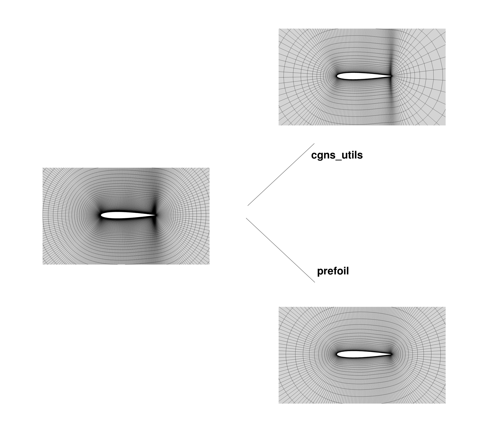

.. Standard method of doing a grid refinement study.

.. _gridRefinementStudy:

Grid Refinement Study
=====================

Theory
------
Computational physics models generally use discretized physical domains (grids) to transform physical laws into systems of equations that can be solved by numerical methods.
The discretization of a physical domain introduces discretization error, which can be reduced in two ways:

- h-refinement: Increasing the resolution of the grid.
- p-refinement: Increasing the order of the numerical approximation at each cell.

In a grid refinement study, we demonstrate that iterative h-refinement converges to the exact solution.
For a given grid/mesh, the grid spacing is

.. math::
    h = N^{-1/d}

where :math:`N` is the number of cells and :math:`d` is the dimension of the domain.
For two grids, the grid refinement ratio is

.. math::
    r = \frac{h_{coarse}}{h_{fine}}

Generally, we use a grid refinement ratio of 2.
The convention is to name the grids with an `L` (for level) followed by an integer beginning at 0 for the finest grid (i.e. L0 for the finest, L1 for the next, etc).

If the grids are sufficiently fine, the error is roughly proportional to :math:`h^p`, where :math:`p` is the order of the solution method.
Grids that follow this relationship are in what is termed the "region of asymptotic convergence".
Although for a second-order finite volume solver, the theoretical order of convergence is :math:`p=2`, the achieved rate of convergence (:math:`\hat{p}`) may vary.
The achieved rate of convergence for a given h-refinement study can be computed as

.. math::
    \hat{p} = ln\left(\frac{f_{L2}-f_{L1}}{f_{L1}-f_{L0}}\right) / ln(r)

using the finest three grids.
When plotting the results of the grid convergence study, we generally plot the results of the grid convergence using :math:`h^p` on the x-axis.

The Richardson extrapolation is an estimation of the solution for a grid with a grid spacing on the order of zero.
It is computed using the solutions from the L0 and L1 grids with the equation

.. math::
    f_{h=0} = f_{L0} + \frac{f_{L0}-f_{L1}}{r^{\hat{p}} - 1}

Approaches to Grid Refinement
-----------------------------

There are two methods we use for performing grid refinement: 
1) coarsening the volume mesh or 
2) coarsening the surface mesh and extruding the family of surface meshes.
We discuss the pros and cons of each method and underlying theory;
it is up to the user to choose the method.

A few general notes first:
   - The bottom line is as long as the CFD mesh is fine enough to capture the correct physical trends, then the design space will be accurate enough such that coarse mesh optimizations will get you close enough to the optimal solution.
     Subsequently, one can use finer meshes using the design variables from the coarser optimizations, thus decreasing overall computational cost.
   - Redo your mesh convergence study on the optimized result to double check everything is behaving as expected
   - Plotting contours of :math:`y^+` can help with debugging
   - This whole refinement study is also not as simple with a coupled structural model because, depending on the structural model, there are likely differences in order of the method (TACS has linear finite elements) and truncation error constants, all of which will affect the observed order of accuracy.

.. _option-1:

Option 1: Coarsening volume meshes
~~~~~~~~~~~~~~~~~~~~~~~~~~~~~~~~~~

1. Generate fine grid (L0) with :math:`N=(2^n) (m) + 1` nodes along each edge.
2. Coarsen the L0 grid :math:`n-1` times using ``cgns_utils coarsen``.
3. Compute the Richardson extrapolation using the L0 and L1 grids keeping all flow setups the same.
4. Plot :math:`h^p` vs :math:`C_D`.
   For ADflow, use :math:`p=2` to indicate a second-order method.

This mesh refinement method is consistent with the original Richardson Extrapolation theory, which relies on uniform coarsening between meshes.
A mesh is in the asymptotic range if it lies on the line connecting the extrapolated value and the finest mesh value.
If you do not get this despite using fine meshes, this usually means the output you are looking at is not second-order accurate (which is rather common).
In this case, we redo the extrapolation after determining the correct order.
The slope of the line is the coefficient of the leading truncation error term.

An example of grid convergence plot for a family of RAE 2822 Airfoil meshes is illustrated below:

.. figure:: images/RAE2822_gridconvergence.png
    :scale: 60
    :align: center
    :alt: RAE 2822 Grid Convergence
    :figclass: align-center

    Figure 1: Grid convergence plot for RAE 2822 Transonic Airfoil.

Pros:
    - The grid is coarsened uniformly, giving the most mathematically rigorous convergence study, which is important for justifying solutions in your scholarly articles.

Cons:
    - To generate enough points to make a line (at least three), the finest mesh (L0) has to be extremely fine for 3D meshes to have a coarse mesh that is still in the asymptotic regime since for the :math:`n`:sup:`th` level, it needs to have :math:`(2^3)^n` fewer cells assuming a refinement ratio of 2.
    - Growth ratio is changing, so be wary of the off-wall cell resolution and boundary layer accuracy.

Option 2: Coarsening surface meshes and extruding a family of volume meshes
~~~~~~~~~~~~~~~~~~~~~~~~~~~~~~~~~~~~~~~~~~~~~~~~~~~~~~~~~~~~~~~~~~~~~~~~~~~

Instead of using the ``cgns_utils coarsen`` feature, we can easily make the finer or coarser meshes with the ``prefoil`` package.
The main reason behind this idea is to generate the meshes without changing the ``growth rate`` of the off-wall layers.
By maintaining the growth rate, extrusion in all directions is better and node clustering is then smoother with this method.
If you use ``cgns_utils coarsen`` feature (i.e. :ref:`option-1`), you will be able to increase the first off-wall spacing ``s0`` uniformly; 
however, the grow ratio is going to change and the off-wall layers will have too much distance between each other.

In order to avoid this, we can use the ``prefoil`` package easily and still be able to coarsen or refine the meshes.
The example code is given below.
You can either upload a ``.dat`` file or create the NACA 4 digit airfoils.
Then, you can manipulate the meshing parameters and get mesh grids with different levels.

.. literalinclude:: ../tutorial/refinement/prefoilMeshRefine.py

As an example, the Tecplot of both cases are shown.
As we can see, when we coarsen through ``cgns_utils``, the distance between each layers become higher and the growth ratio is not the same as the ``prefoil`` mesh.

    Figure 2: Mesh comparison.

.. TODO: add mesh refinement plot using this method that's similar to the RAE one

For 3D, you could use ``cgns_utils coarsen`` feature (i.e. :ref:`option-1`), you will be able to increase the first off-wall spacing ``s0`` uniformly.
However, the grow ratio is going to change and the off-wall layers will have too much distance between each other.
You can also directly tweak the surface mesh discretization in your meshing software (e.g., ICEM/Pointwise).

Pros:
    - It is more practical for 3D meshes since you could make refinement ratio less aggressive compared to ``Option 1`` (i.e., :math:`r < 2`).
      This places the points on the refinement plot closer to each other  on the :math:`x`-axis so it is more likely that your coarsest volume mesh is in the asymptotic regime, which you can then use for coarse optimizations.
    - It is the only way to generate the 0.5 level family of meshes (e.g., L0.5, L1.5, L2.5) using the ``scaleBlkFile`` procedure in the postprocessing repository to scale the surface meshes by a factor of :math:`1/\sqrt{2}`.

Cons:
    - It is harder to be mathematically rigorous (and therefore justifiable in a scholarly article) using this method because all options from the surface mesh extrusion have to be scaled accordingly, and even then, there may be variations in volume cell scaling from the procedure.
    - Your mesh refinement results might not follow a perfectly straight line compared to ``Option 1`` even if they are in the asymptotic regime since it is not a uniform refinement (but it should be close to linear).
      Improper scaling of the off-wall and far-field cells may add to discretization error.

External Links
--------------

- https://www.grc.nasa.gov/www/wind/valid/tutorial/spatconv.html
- https://turbmodels.larc.nasa.gov/uncertainty_summary.pdf
