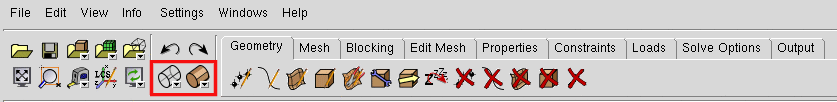
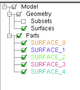
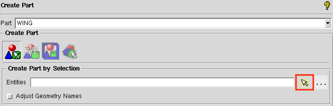
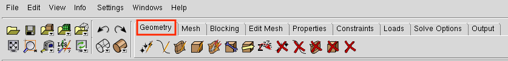
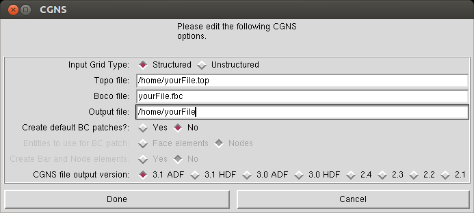

.. _aero_icem:

***************
Surface Meshing
***************

Introduction
============
The objective of this section is to familiarize the user with the ICEM CFD software and to create a surface mesh.
ICEM CFD is a meshing software with advanced CAD/geometry readers and repairs tools.
It allows the user to produce volume or surface meshes.
At times ICEM may test your patience, however, it offers a lot of functionality and is quite handy once you get to know its quirks.
A full ICEM CFD tutorial can be found `here <https://engineering.purdue.edu/~scalo/menu/teaching/me608/tutorial.pdf>`_.
For more theoretical background of mesh generation, refer to "Thompson, et.al. Handbook of grid generation. CRC press, 1998."

.. warning:: Make sure you save your work often when using ICEM. It is known to crash at the worst possible moments. We also recommend saving instances of a single project in different locations just in case you need to go back to a previous state.

Files
=====
Navigate to the directory ``aero/meshing/surface`` in your tutorial folder.
Copy the following file from the the ``geometry`` directory:

.. prompt:: bash

    cp ../../geometry/wing.tin .

Basic ICEM Usage
================
This section contains some general usage information that will helpful in becoming familiar with ICEM.
The actual tutorial starts with :ref:`surface_meshing`.

Opening ICEM
------------
First, determine where the ICEM executable is located.

.. prompt:: bash

    which icemcfd

The output should look like the following, where <your-version> is the version you installed. ::

    /usr/ansys_inc/<your-version>/icemcfd/linux64_amd/bin/icemcfd

Then run the executable with superuser privileges, replacing the path with the results of the previous command.

.. prompt:: bash

    sudo /usr/ansys_inc/<your-version>/icemcfd/linux64_amd/bin/icemcfd

File Types
----------
ICEM uses several native file types with the following extensions:

.prj
    Project file. Contains references to the geometry and blocking files of the same name.

.tin
    Geometry file. Contains a geometry definition made up of points, lines, and surfaces.

.blk
    Blocking file. Contains the definition of the geometry and parameters used to generate the mesh.

.. _icem_navigating:

Navigating in ICEM
------------------
To adjust your view of the geometry in ICEM the following functions are possible with the mouse:

- Hold down left button while dragging mouse:
    - Rotate the view in 3D space
- Hold down middle button while dragging mouse:
    - Translate view in viewing plane
- Hold down right button while dragging mouse:
    - Planar rotation of the viewing plane
- Scroll middle button:
    - Slow zoom in/out
- Hold down right button
    - Drag mouse up/down: Fast zoom
    - Drag mouse left/right: Rotate view in viewing plane
- ``x`` on the keyboard: fit the complete geometry to the window
- ``z`` on the keyboard: allows creating a zoom-in box on the viewing pane with the left mouse button
- ``F9`` on the keyboard: switches the view in/out of Dynamic Mode so the above mouse operations can be used without affecting selections

.. _icem_appearance:

Changing the appearance of the geometry
---------------------------------------

The two buttons outlined in red can be used to view the geometry as a wire frame (left button) or a collection of opaque surfaces (right button).

.. _surface_meshing:

Creating a surface mesh
=======================

Load the geometry
-----------------
In ICEM, select ``File`` → ``Geometry`` → ``Open Geometry``.

Navigate to the surface meshing folder and open ``wing.tin``.

ICEM will prompt you to create a project called ``wing.prj``. Select Yes.

Rename Parts
------------
You will see in the model tree that there are 5 different parts with arbitrary names.
We want to redefine a single part that contains all wing geometry and call it WING.

Right-click on ``Parts`` in the model tree and select ``Create Part``.
The options for creating a new part will appear in the lower left-hand pane as shown below.
Change the name from "PART.1" to "WING".
We want to create the "WING" part by selecting objects in the viewing pane.
To do this, select the arrow to the right of the ``Entities`` box (outlined in red) and then drag a box (with the left mouse button) over all the wing surfaces in the viewing pane.
All of the selected geometry should become highlighted.
Now click the center mouse button to verify the operation.
All of the selected components should become the same color, and a new part called "WING" should appear in the model tree under ``Parts``.
To refresh the model tree, deselect and then reselect the checkbox next to the "WING" part.
This should make all of the other parts go away.

Auxiliary Geometry
------------------
Before actually creating the mesh, it is helpful to create some additional geometric features to use as references for the mesh.
All geometry creation and manipulation is done under the ``Geometry`` tab, outlined in red in the image below.

1. Create curves and points from surfaces
~~~~~~~~~~~~~~~~~~~~~~~~~~~~~~~~~~~~~~~~~
    You will notice that the geometry section of the model tree contains only Subsets and Surfaces.
    We want to see the curves and points that define the boundaries of these surfaces.
    This can be done by clicking on the ``Repair Geometry`` button in the ``Geometry`` tab.

    The ``Repair Geometry`` section will open up in the lower left pane.
    The default operation in this section is ``Build Diagnostic Topology``.
    This will create the curves and points that define the surface intersections, if they are missing.
    Click ``Apply`` at the bottom of the pane (the default options should be sufficient).
    You will see red and yellow curves appear on the geometry.
    The red curves denote an intersection between two surfaces and the yellow curves denote unattached surface edges.
    Additionally, points appear at the corners of the surfaces.
    If you look at the model tree now, you should see Subsets, Points, Curves, and Surfaces under the Geometry branch and a single part named "WING" in the Parts branch.

    .. image:: images/icem_ModelTree2.png
       :scale: 80

    There are some curves and points missing still.
    If you look closely at the trailing edge of the wing, you will see that only one curve was made when we repaired the geometry (uncheck the ``Surfaces`` branch in the model tree under ``Geometry`` to make it easier to see).
    This is because the lower surface of the wing is continuous with the trailing edge surface, so there is no intersection.
    We need to make a curve to define the lower edge of the trailing edge.
    First we need to create some points.
    To do this, let's go to the ``Create Point`` button of the ``Geometry`` tab and then select ``Curve Ends`` in the lower left pane.

    .. image:: images/icem_PointsCurveEnds.png
       :scale: 80

    Select "both" in the ``How`` drop-down menu and then click the arrow to the right of the ``Curve(s)`` box.
    Now select the curve on the upper edge of the trailing edge and the lower surface curves at the root and tip of the wing.
    Now let's go to the ``Create/Modify Curve`` button of the ``Geometry`` tab.

    .. image:: images/icem_CurveFromPoints.png
       :scale: 80

    Select the first option in the lower left pane (``From Points``).
    This will create a straight line between two points or a spline between multiple points.
    Select the arrow to the right of the ``Points`` box and then choose the points at either end of the lower edge of the trailing edge.
    For good measure, you can close off the trailing edge by creating curves between the upper and lower surfaces at the root and tip of the trailing edge.
    In the end, your trailing edge should look like this (only ``Curves`` and ``Points`` are turned on in the Geometry tree).

    .. image:: images/icem_TrailingEdgeCurves.png
       :scale: 30

2. Create auxiliary curves
~~~~~~~~~~~~~~~~~~~~~~~~~~
    Now let's create some curves to help define the leading edge section of the surface mesh.
    First we need to create some points, so go back to the ``Create Point`` section.
    This time select the ``Parameter along a Curve`` operation.

    .. image:: images/icem_PointsParameter.png
       :scale: 80

    Put 0.01 in the ``Parameters`` box and then click the arrow to the right of the ``Curve`` box.
    Now select the upper and lower airfoil curves at the wingtip.
    You should see two points appear near the leading edge.
    For the root airfoil section, the curves are flipped, so we need to enter 0.99 in the ``Parameters`` box and then select the upper and lower curves just like we did for the wingtip.

    Now we need to connect these points with curves.
    Go back to the ``Create/Modify Curve`` button under the ``Geometry`` tab and select the ``From Points`` operation.
    Connect the points on the upper surface with one line and the points on the lower surface with another line.
    Now the leading edge of your wing should look like this:

    .. image:: images/icem_LeadingEdgeCurves.png
       :scale: 30

Blocking
--------
The blocking is the underlying structure that defines the mesh.
In the blocking we can define how many cells we want and how we want them to be arranged.
For this case, we will define properties for the edges of the blocks which will then be project by ICEM onto the geometry to create a surface mesh.

1. Create 3D blocking with bounding box
~~~~~~~~~~~~~~~~~~~~~~~~~~~~~~~~~~~~~~~
    The best way to create the blocking is to first create a 3-D bounding box and to then convert that blocking from 3-D to 2-D.
    This approach is preferred as it helps ICEM understand the topology, often preventing future issues.

    To do this, under the ``Blocking`` tab, select the first icon, ``Create Block`` shown here:

    .. image:: images/icem_TabBlocking.png
        :scale: 80

    This opens a menu in the lower left corner of the window.
    With the default options, click the button next to the input box for the entities (if it was not automatically selected).
    This button allows you to select the entities you want to create a blocking for from the CAD model.
    Directions for selecting entities are found in red text at the bottom of the CAD window.
    To create a bounding box around the entire wing, select all of the wing entities by clicking and dragging with the left mouse button.

    .. image:: images/icem_CreateBlock.png
        :scale: 80

2. Convert 3D blocking to 2D blocking
~~~~~~~~~~~~~~~~~~~~~~~~~~~~~~~~~~~~~
    Now the 3-D bounding box needs to be converted to a 2-D blocking (as we only want a surface mesh output from ICEM).
    To do this, select the fifth icon in the ``Create Block`` menu (shown below).

    .. image:: images/icem_Blocking3Dto2D.png
        :scale: 80

    After selecting the fifth icon, select OK or Apply at the bottom of the Create Block menu.
    If the conversion was successful, in the dialog box there will be a message reading "...Blocking successfully converted to 2D..."

    Look back at the model tree and you should see something like this (expand the Blocking tab).

    .. image:: images/icem_ModelTree3.png
        :scale: 80

    If you check the box next to ``Blocks``, you will see green surfaces appear surrounding the wing.
    Since the wing root is on the symmetry plane, we want to remove the block along the symmetry plane.
    This can be done with the ``Delete Block`` button in the ``Blocking`` tab.
    Check the box for "Delete permanently" and then select the green surface parallel with the root airfoil.
    It should become highlighted like in the image below.

    .. image:: images/icem_DeleteBlock.png
        :scale: 30

    To complete the operation, click the middle mouse button.

3. Associate blocking to geometry
~~~~~~~~~~~~~~~~~~~~~~~~~~~~~~~~~
    In order to control the shape of the surface mesh, we can associate the block edges to curves on the geometry.
    We can do this with the ``Associate`` button in the ``Blocking`` tab.
    First, let's associate the vertices of the blocks to points on the geometry.

    .. image:: images/icem_AssociateVertex.png
        :scale: 80

    The first operation in the ``Associate`` pane allows us to associate vertices to points, curves, or surfaces.
    We want to associate the 8 vertices to the corresponding 8 points at the corners of our wing.
    Click the arrow to the right of the ``Vertex`` box.
    The first selection in the view pane will choose the vertex and the second selection will choose the point to which it will be associated.
    The association will happen immediately and the vertex should move to the same location as the point.
    You can continue selecting vertex and point pairs until you are done.
    After associating the vertices at the wing root, the blocking should look like this.

    .. image:: images/icem_AssociatedVertices.png
        :scale: 30

    Now do the same thing at the wing tip.

    The next step is to associate the block edges to the geometry.
    Go to the second button in the ``Associate`` pane: ``Associate Edge to Curve``.
    Now select the upper edge at the symmetry plane and then select the upper curve of the root airfoil.
    You must confirm each selection by clicking the middle mouse button.
    After the edge is associated, it should turn green.
    Do the same thing with the lower edge and the lower curve of the root airfoil.
    For the vertical edge at the leading edge of the root, we need to associate to both the upper and lower root airfoil curves.
    First select the edge and confirm, and then select both airfoil curves and confirm.
    Do the same for the wingtip.

    Let's check out the state of the mesh at this point.
    We can view the mesh by checking the box next to ``Pre-Mesh`` in the ``Geometry`` branch of the model tree.
    If you are in wire mesh view, switch to a solid surface view (see :ref:`icem_appearance`).
    You will see that the mesh is collapsed in on itself (don't worry, we'll fix it in the next step).

4. Split and adjust edges
~~~~~~~~~~~~~~~~~~~~~~~~~
    To remedy the collapsed mesh, we need to create some control points along the edges.

    .. image:: images/icem_EditEdge.png
        :scale: 80

    Go to the ``Edit Edge`` button in the ``Blocking`` tab.
    Under the ``Split Edge`` operation, choose the "Linear" method.
    Then click the arrow to the right of the ``Edge`` box and select the upper horizontal edge at the symmetry plane.
    Immediately, a point will snap to the associated curve (make sure you drag it up to the upper curve of the airfoil before you let go).
    Once you let go of the mouse button, a dialog box will pop up with the following message:

    .. image:: images/icem_UpdatePreMesh.png
        :scale: 80

    Select "Yes" and you will see the mesh snap up to the upper surface.
    Do the same for the wingtip.

    At this point we will have a very coarse discretization of the wing surface that looks like the following at the wingtip.

    .. image:: images/icem_BeforeMesh.png
        :scale: 40

    Un-check ``Pre-Mesh`` in the model tree to avoid the recompute mesh dialog box popping up at each step.

5. Define edge properties
~~~~~~~~~~~~~~~~~~~~~~~~~
    To further refine the mesh, we need to modify some edge parameters.
    In the ``Blocking`` tab, click on the ``Pre-Mesh Params`` button (a cube with a grid).
    In the menu in the lower left corner, click on the ``Edge Params`` button under ``Meshing Parameters``.
    For the ``Edge``, select the vertical edge at the leading edge of the wingtip.
    Then type in 17 (in general this should be an odd number, 4n+1 where n is an integer so that multi-grid options can be used) for ``Nodes``, select ``Uniform`` for the ``Mesh law``, select ``Copy Parameters`` (with the default ``To All Parallel Edges`` under ``Copy``), and click ``OK``.

    .. image:: images/icem_InitialTipParams.png
        :scale: 60

    .. note:: The most commonly useful mesh-spacing laws are ``BiGeometric``, ``Poisson``, and ``Hyperbolic``. When specifying edge spacings, it is important to keep in mind that there should not be large jumps in cell sizes across edge boundaries. Large changes in cell size can result in pyHyp errors and poor quality results.

    Now we will specify parameters for the edges associated with the upper and lower airfoil curves at the wingtip.
    Select the upper edge at the wingtip for ``Edge`` in the ``Pre-Mesh Params`` menu.
    Specify 161 for ``Nodes`` and select ``Hyperbolic`` for the ``Mesh law``.
    Next, to avoid large discontinuities in element size, we will select some edges to link to this edge.
    This is done by specifying edges to link to ``Sp1`` and ``Sp2``.
    The edge will have an arrow displayed on it.
    This arrow points from the vertex corresponding to ``Sp1`` to the vertex corresponding to ``Sp2``.
    Click on the box to the left of ``Sp1`` and then click on ``Select`` and select the vertical edge at the leading side of the wingtip (or the trailing edge if ``Sp1`` corresponds to the trailing edge).
    Then do the same for ``Sp2`` with the vertical edge at the trailing side of the wingtip.
    Click the box for ``Copy Parameters`` if it isn't selected by default (this will copy these settings for the three other edges at the wingtip and the root) and click ``OK``.

    Next, we will set the edge parameters for the edges running spanwise along the leading and trailing edges of the wing.
    Select the upper edge at the leading edge of the wing for ``Edge`` in the ``Pre-Mesh Params`` menu.
    Specify 161 for ``Nodes`` and select ``Uniform`` for the ``Mesh law``.
    The click on the box to the left of ``Copy Parameters`` and select ``To All Parallel Edges`` under ``Copy`` (if not already selected by default).
    At this point the pre-mesh should look like the following at the wingtip.

    .. image:: images/icem_BadMesh.png
        :scale: 60

7. Check mesh quality
~~~~~~~~~~~~~~~~~~~~~
    We can see that the above mesh is far from ideal (for example, due to the large changes in element size at the wingtip).
    We can also use the ``Pre-Mesh Quality Histogram`` tool to check the mesh quality.
    In the ``Blocking`` tab, click on the ``Pre-Mesh Quality Histogram`` button (a red Q around a cube with a grid) and then click on ``OK`` with the default settings.
    The following histogram should appear on the bottom right of the window.

    .. image:: images/icem_BadMeshQualityHisto.png
        :scale: 70

    This shows that we have a few poor quality elements (less than 0.5).
    To see the elements corresponding to a particular bar of the histogram, click on the bar.
    Hiding the pre-mesh and then pressing ``x`` on the keyboard should show the elements.
    Showing the pre-mesh again should help see where they lie with respect to the wing.
    These happen to be at the leading edge of the wingtip.
    Also, we need to improve the quality of the mesh as the elements transition from the upper and lower surfaces of the wing to the wingtip surface.

    For surface meshes that will be used in pyHyp, the minimum quality of any cell in the mesh should be about 0.7.
    The mesh needs to be adjusted if there are low quality cells.
    Oftentimes, adjusting node spacing or some associations can fix low mesh quality issues.
    However, adjusting the mesh to assure high quality can often be a bit tricky, particularly for inexperienced users.

    Taking a break at this point and reviewing the steps so far is recommended.

8. Improve mesh
~~~~~~~~~~~~~~~
    To improve the mesh, we will first split the block to gain a little more flexibility with the mesh.
    In the ``Blocking`` tab, click on the ``Split Block`` button (an axe with a cube).
    In the menu at the bottom left, also select the ``Split Block`` option (an axe with a cube).
    Click on the arrow to the right of the ``Edge`` box, then click on the upper leading edge near the wing tip, as shown below to split the block.

    .. image:: images/icem_SplitBlock.png
        :scale: 40

    After this, we will first change the edge parameters of the new horizontal edge at the leading side of the wing.
    Go to the ``Edge Params`` menu under ``Pre-mesh Params`` as shown earlier.
    Select the edge, enter 17 for ``Nodes``, select ``Geometric2`` for the ``Mesh law``, link ``Sp2`` to the vertical edge at the wingtip, click the box for ``Copy Parameters`` if it is not already selected by default, and accept the options.

    .. image:: images/icem_SplitBlockHorizEdge.png
        :scale: 60

    .. note:: For reference, in the menu shown above, the numbers in the gray boxes next to some items (e.g., ``Spacing 1`` and ``Spacing 2``) show the smallest values that can actually be achieved. Also, the ``linked`` numbers shown when linking edges (e.g., ``linked 22 26``) correspond to the numbers of the vertices of the edges. These numbers can be displayed by checking ``Vertices`` in the model tree and then right-clicking it and clicking on ``Numbers``. These numbers can be used to verify that the correct edges are selected while linking.

    Similarly, we will now set the ``Edge Params`` for the longer horizontal leading and trailing edges.
    Select the top edge at the leading side, enter 161 for ``Nodes``, select ``Hyperbolic`` for the ``Mesh law``, set ``Spacing 1`` to 0.1, link ``Sp2`` to the horizontal edge closer to the wingtip that we set parameters for right before this, click the box for ``Copy Parameters`` if it is not already selected by default, and accept the options.
    At this point the mesh should look something like the following at the wingtip.

    .. image:: images/icem_BadMesh2.png
        :scale: 60

    Next, we will disassociate the edges at the wingtip from the curves we had selected in Step 3.
    In the ``Blocking`` tab, click on the ``Associate`` button, and click the  ``Disassociate from Geometry`` (a finger with an X) button in the bottom left menu.
    For ``Edges``, select both halves of the top edge at the wingtip and the bottom edge at the wingtip, and accept.

    .. image:: images/icem_Dissassociate.png
        :scale: 60

    Next, click the ``Associate edge to Surface`` button under ``Edit Associations`` then select both halves of the top edge at the wingtip and the bottom edge at the wingtip, and accept.

    Now we will split these edges into a lot more pieces (``Edit Edge`` in the ``Blocking`` tab, then ``Split Edge`` as described in Step 4).
    Split the top edge at the wingtip into about 6 segments and split the bottom edge at the wingtip into about 12 segments.
    For the upper chordwise edge inboard of the wingtip edge, split the edges into 2 segments.
    Splitting edges provides greater flexibility and more can be created if required.
    The following is what the edges should look like at this point.

    .. image:: images/icem_SplitTips.png
        :scale: 40

    The next phase will be more challenging because these edges are now associated with surfaces and moving the vertices can be tricky.
    In the ``Blocking`` tab, click on the ``Move Vertex`` button (an arrow with two vertices).
    With ``Move Vertex`` selected in the bottom left menu, click on the button to the right of ``Vertex`` and adjust the vertices of the upper and lower wingtip edges to look like the following image.
    Making ``Surfaces`` visible (as a wireframe) from the model tree should also help.
    This process will require some patience.
    Rotating the view should show if the vertices actually moved to the desired location.
    Also, the ``Fix X/Y/Z`` options in the menu can be useful to prevent the vertices from moving in unwanted directions while dragging them.

    .. image:: images/icem_TipVertices.png
        :scale: 40

    The pre-mesh should look something like the following at this point.

    .. image:: images/icem_BetterMesh.png
        :scale: 40

    If you see an overlapping or collapsed mesh, check the associations of the edges.
    Right click on ``Edges`` in the model tree and click on ``Show Association``.
    If an edge associated with a surface does not have an arrow pointing toward the surface, splitting and dragging should fix the problem as shown earlier in Step 4.

9. Check mesh quality again
~~~~~~~~~~~~~~~~~~~~~~~~~~~

    Using the mesh quality check, we see that we have a better quality mesh at this point (although it can certainly still be improved with more fine tuning and splitting of edges).

    .. image:: images/icem_BetterMeshQuality.png
        :scale: 80

    .. note:: To improve the mesh quality further, the vertical edge of the wing tip at the leading edge can also be disassociated from its curve and associated with a surface instead using ``Disassociate from Geometry`` and ``Associate edge to Surface`` like the other edges.

10. Ensure correct block orientation
~~~~~~~~~~~~~~~~~~~~~~~~~~~~~~~~~~~~

    We now have a pre-mesh defined over the surface of the wing.
    Before proceeding, we need to check the orientation of the blocking.
    For pyHyp to correctly extrude the mesh and for the boundary conditions to be applied properly, it is essential that the blocking is correctly oriented.
    The orientation of the blocking can be checked in the ``Edit Block`` (fourth button under the ``Blocking`` tab) menu.
    Within that menu, select the button with ``ijk`` and ``kji`` in the icon.
    That will open the ``Change Block IJK`` sub menu, as shown below.

    .. image:: images/icem_BlockOrientation.png
        :scale: 80

    If the blocking faces are not shown, turn them on in the hierarchy tree.
    When they are enabled and the ``Change Block IJK`` button is selected, the faces of the blocking should be red and green.
    If the blocking is properly oriented, all of the green sides of the faces will be outward facing.
    If any of the faces have red facing outward, select the icon in the ``Change Block IJK`` and select the face to flip.

    .. note:: To see the colors of the faces while moving the model, use Dynamic Mode (see :ref:`icem_navigating`).

Convert to MultiBlock Mesh
--------------------------

Converting the pre-mesh to a multiblock mesh is relatively straightforward.
Right-click on ``Pre-Mesh`` in the model tree.
In the menu that opens, select ``Convert to MultiBlock Mesh``.
A ``Mesh`` branch should then be added to the hierarchy tree.

Export the mesh
---------------

Exporting the mesh is done from the ``Output`` tab.
The first step is to select the first button, with the red toolbox.
This opens a menu where you can select the solver to export to.
For our purposes, select ``CGNS``.
At that point, the fourth and final button under the ``Output`` tab can be selected.
At the prompt, click ``Open`` to use your multiblock mesh.
Then select ``All`` domains of the mesh.
After that a window should come up with saving options.
All of the default options should work.
The window is shown below.

The surface mesh is now ready for use in pyHyp.
To proceed to the next tutorial (volume meshing with pyHyp), reduce the number of nodes specified for the edges so far (e.g., 17 to 5, and 161 to 41), and convert and export the mesh again.
Or use the ``wing.cgns`` file provided in ``MACH-Aero/tutorial/aero/meshing/volume``.
This should reduce computational time and the probability of pyHyp failing with the default options provided in the following tutorial and the mesh generated so far.
