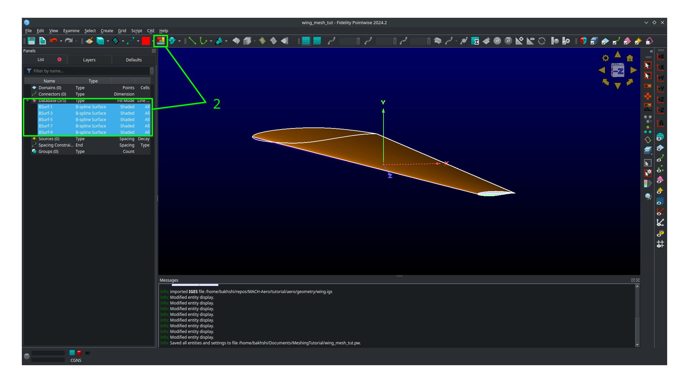
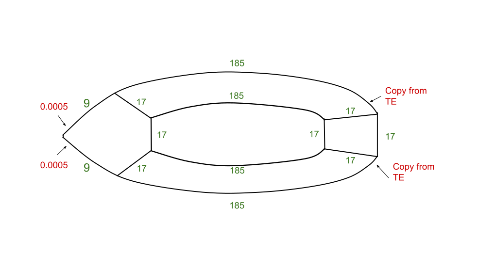
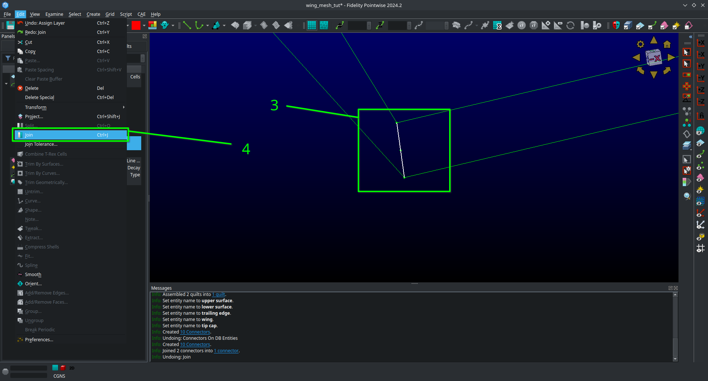
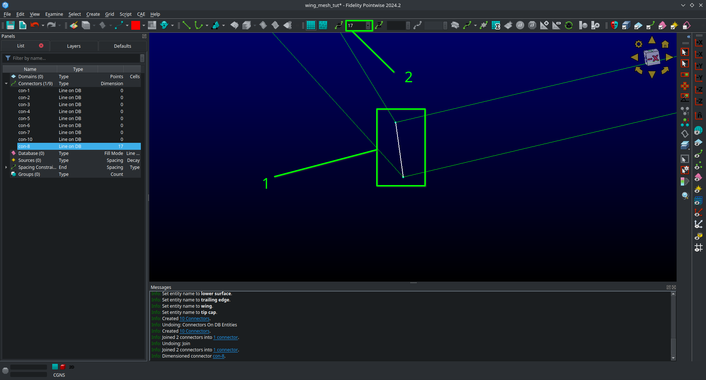
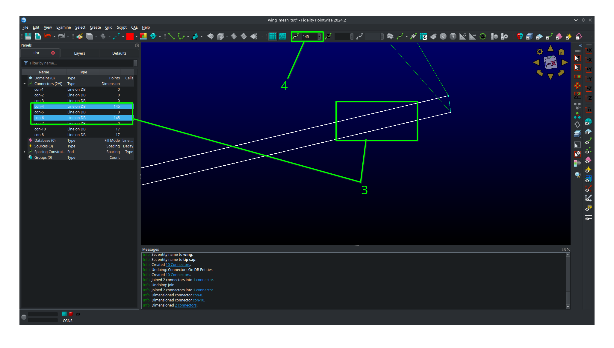
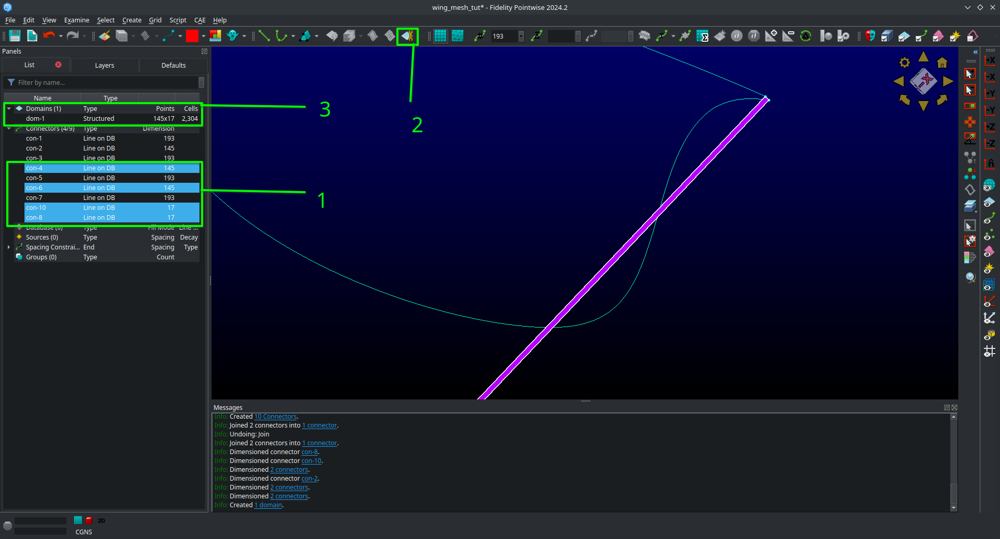
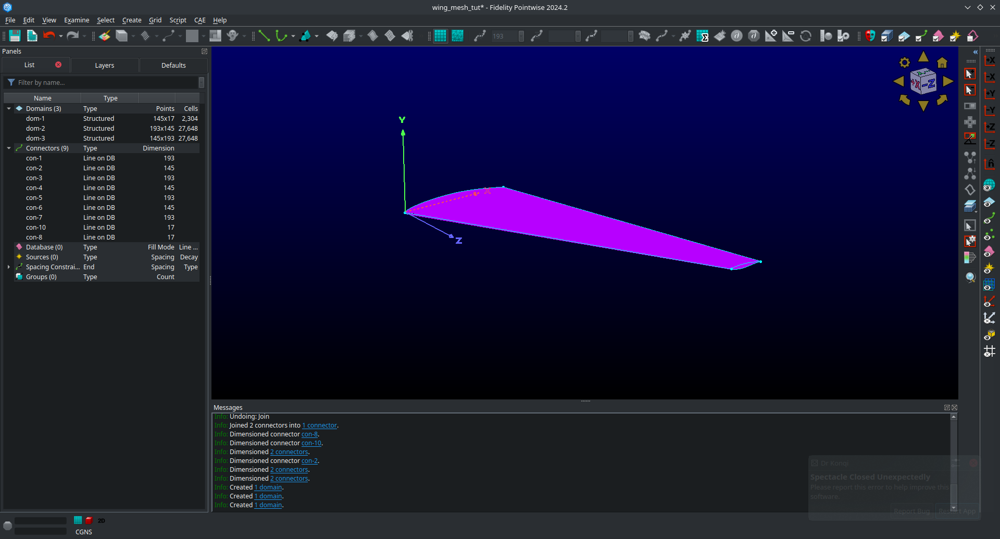

.. _overset_surface_mesh:

*********************************
Surface Meshing with Pointwise
*********************************

.. warning:: This page assumes you are using Pointwise for surface meshing. For a version of this page that uses ICEM see :ref:`here <aero_icem>`.

Introduction
============
Now that we have a geometry definition, we can start meshing it.
Our end goal is to generate a structured volume mesh around the geometry that can be used by ADflow.
Unlike the airfoil, this is a two step process for 3D geometries.

1. We generate a structured surface mesh, a structured grid of points on the B-spline surfaces defining the geometry that create a watertight surface.
2. We *extrude* that surface mesh, using a hyperbolic or elliptic mesh extrusion algorithm, into a volume mesh that we can use with ADflow.

This page describes how to accomplish the **first** step using Pointwise as the meshing tool of choice.
This is not a full blown tutorial of Pointwise, more a step-by-step walk through on how to create a surface mesh for this particular wing geometry.
If you want to learn more about using Pointwise, their `Youtube channel <https://www.youtube.com/user/CFDMeshing>`_ is highly recommended.
If you want to learn more about structured or unstructured meshing theory, refer to "Thompson, et.al. Handbook of grid generation. CRC press, 1998."

Files
=====
Navigate to the directory ``aero/meshing/surface`` in your tutorial folder. Use the ``.igs`` file you generated with pyGeo and copy it from the ``aero/geometry`` folder.

.. prompt:: bash

    cp ../../geometry/wing.igs .

.. It is possible to script Pointwise. In order to use it, we have to download the script first. You can either
.. `download <https://raw.githubusercontent.com/pointwise/Semicircle/master/Semicircle.glf>`_ it here or copy it
.. from the tutorial folder.

.. .. prompt:: bash

..     cp ../../../tutorial/overset/mesh/Semicircle.glf .

Basic Pointwise Usage
===============

Once you start Pointwise, it should look something like in the following picture.

    Pointwise Overview.

1. Object, Layer and Default control - main view for managing all the objects in your project, which layers they are on, and default parameters.
2. Solver information - tells you the current solvers you have selected(i.e 2D, Stuctured, CGNS, etc.)
3. View and Selection - allows you to control your view and some special selection controls
4. Masks - Applies filters that limit what you can select based on the object types you chosen, useful to avoid accidentally selecting things you don't want to select.
5. Discretization and Solvers - Select how the object at had is being descretized and apply solvers to it
6. Create - Buttons to create various kinds of objects
7. Attributes and Basics - Controls attributes of the object selects (like colors) and allows you save your project or undo/redo actions.
8. Main View - what your objects currently look like

It is highly recommend that you turn off mouse glide which is on by default in Pointwise sometimes.
To turn that off click on ``Edit``, ``Preferences``, ``Mouse Style``, and then uncheck ``Glide``.
Then click ``Close``.

We recommend using Tecplot style mouse controls in Pointwise for consistency but you don't have to.
To set those up click on ``Edit``, ``Preferences``, ``Mouse Style``, and then choose ``Tecplot`` under controls.
Then click ``Close``.

With the Tecplot controls, you can control the main view with the following key and mouse combinations:

zoom
  Rotate your ``mouse wheel`` or press the ``middle mouse button`` and drag. The zoom centers around your ``mouse pointer``.

pan
  Press your ``right mouse button`` while moving your mouse.

rotate
  Press ``ctrl`` and your ``middle mouse button`` while moving your mouse.

orbit
  Press ``ctrl`` and your ``right mouse button`` while moving your mouse.
  This will rotate around where the current rotation axes position (red, green, and blue triple axes)

move rotation axes
  Press ``ctrl``, ``shift``, and press your ``right mouse button`` when you're hovering over the position you want to move your axes to.
  This is an extremely handy funtion.

right mouse menu
  Press your ``right mouse button`` to a bring up a handy menu that gives you quick access to many functions.
  All of these functions are also available in other places in Pointwise.

Loading the Geometry Definition
===============
Before we actually begin meshing, we have to set some standard values and import our geometry. At first, we set some
tolerances for Pointwise

1. Click on ``File`` -> ``Properties``
2. The ``Model Size`` should be around ``1000``. (It is enough, if the order of magnitude is similar)
3. The ``Node`` should be ``1e-4``. The value of ``Connector`` should automatically be ``1e-4`` as well
4. ``OK``

.. note:: The defaults seen here should be fine for this project and Pointwise usually automatically selects the correct Model Size and tolerances based on the geometery you import. 
    It may however be necessary to edit these in case Pointwise isn't correctly interpreting the CAD geometry defintion. 

Now we have to choose the proper solver. In my case it is ``CGNS`` with ``adf`` support. If you have compiled the
MACH-Framework with ``hdf5`` support, you can skip the last step.

1. Click ``CAE`` -> ``Select Solver``
2. Make Sure ``CGNS`` is selected.
3. Click ``OK``.
4. Click ``CAE`` -> ``Set Dimension`` -> ``2D`` (that's what surface meshes are called here)
5. Click ``CAE`` -> ``Set Solver Attributes`` (if you have ``hdf5`` support, you can stop here)
6. Select ``adf`` for ``CGNS File Type``
7. Click ``Close``

Now we can import the ``.igs`` file we created in the previous step.

1. Click ``File`` -> ``Import`` -> ``Database``
2. Select your ``.igs`` File -> ``open``
3. Make sure ``Units`` and ``From File`` is selected
4. Also make sure that ``Import Layer`` and ``Use Specified Layer`` are selected 
5. Make sure that the ``Layer Number`` is 0
6. Click ``OK``
7. You may receive a warning that some entities could not be converted. Just ignore it and click ``YES``

.. warning:: In Pointwise, some check boxes like ``Import Layer`` in the above step are only there to hide and show further options. 
    Unchecking them will not uncheck the check boxes the hide/show so be very careful.

After those steps, the window should look like this (you should probably save at this point):

    Pointwise after setup.

Few important Pointwise labels:

Block
    This is a 3 dimensional mesh section
Domain
    This is a 2 dimensional mesh section or section of a surface mesh
Connector
    A line constraining the extent of a ``Block`` or ``Domain``
Database
    An imported geometry definition. Typically composed of B-spline and trimmed surfaces.
Model
    A Database entity containing one or more Quilts.
Quilt
    A Database entity containing one more more B-spline surfaces.
    Comes below Model in the heirarchy.
    See `this video <https://www.youtube.com/watch?v=tcgCRyC9-90>`_  for more details.
Spacing Constraint
    This controls how ``nodes`` lay on a ``Connector``. Further down the line, the ``Connector`` controls
    how the ``nodes`` lay in a ``Domain`` or ``Block``

Geometry Clean-up
===============

To make our life a bit easier in the coming mesh work, we first clean-up the database a bit (take a look at the next
picture to help guide you).

1. Select the whole ``database``. Just draw a rectangle around it while your ``left mouse button`` is pressed
2. Click ``Wireframe`` -> ``Shaded``
3. Click on ``Layers``
4. Double click on ``Description`` and enter ``Geo``

    Geometry clean-up #1.

Now we will join some surfaces together into ``Quilts`` and ``Models`` to simplify our geometry.
We will first assemble our wing into a watertight model composed of several quilts, one for each surface.
We will then combine the two quilt composing the tip cap into a single quilt to make meshing easier.

1. Rotate your view as necessary to get a good view of each surface of the wing then click and drag to select all the database entities.
2. Click on the ``Rainbow Colors`` button with the the whole ``database`` selected to make each database surface a unique color. 
Note that this button assigns colors randomly so your wing will probably look different than the one shown here.
3. With the whole database selected, click on ``Create``, ``Assemble``, and then ``Models``.

1. In the side panel that comes up, be sure that under the ``Tolerance`` checkbox ``Use Default`` is selected.
2. Then click ``Assemble``.
3. Verify that you get 1 model, 5 quilts, 1 symmetry loop, 0 lamina boundaries, and 9 manifold boundaries.
4. Then click ``OK``

You should be able to see that the tip cap is comprised of two B-spline surface, BSurf-7-quilt and BSurf-9-quilt in this case.
We are now going to assemble these two surfaces into a single quilt.

1. Click on an empty space in the main view to unselect any selected database entities.
2. Rotate your view with pressing ``ctrl`` and your ``right mouse button`` while moving your mouse until you have a good view of the tip of the wing (or use the view presets)
3. Select the two surfaces comprising the tip cap by clicking on each of them while holding ``ctrl``. 
You may need to use the spacebar while hovering over to change your select to the quilts instead of the model. 
Alternatively you can just select the quilts from the list.
4. With the tip cap quilts selected, click on ``Create``, ``Assemble``, and then ``Quilts``.
5. In the side panel that comes up you can select ``Use Defaults`` for both the ``Angle`` and ``Boudary Angle``.
6. Click Assemble.
7. Verify you get 1 quilt, 0 lamina boundaries, and 4 manifold boundaries.
8. Click ``OK``.

You should now have 4 quilts and 1 model in your ``Geo`` layers.
Double click on each entity in the list and name them accordingly if you wish as it will make knowing what is what much easier.

This completes the geometry clean-up section of the tutorial.
What we have done here is first assemble the 5 B-spline surfaces from our ``.igs`` file into a single watertight model with 5 quilts.
Then we combine the 2 quilts making up the tip cap into 1 quilt giving us a final total of 4 quilts.
Performing the geometry clean-up process is not an exact science, especially near the tip cap.
What was shown here is only one way to do it.
As a rule of thumb you should always try and create one quilt for each domain you plan on making in your surface mesh.

Meshing Strategy
===============
Before we start meshing, we will first discuss what our overall strategy is and what our mesh will look like.
Our plan is to create a multi-domain structured surface mesh with each quilt in our geometry being used to define a domain.
For the upper surface, lower surface, and trailing edge we will generate ``connectors`` on the boundaries of each associated quilt and then dimension the each connector  with the number of nodes we want along it.
We will then assemble the domain on each quilt using the 4 connectors on each one domain at a time.
Lastly, we will then set the grid spacings at the ends of each connector as necessary.
The domain on the tip cap will require special attention and we will address it after the upper surface, lower surface, and trailing edge are done.
Below sketches of the wing dimensions are provided for the top planform view, root view, trailing edge view, and tip cap view.
The text in green indicates the number of nodes along each connector while the arrows point from the red text point out the space at each connectors end where it needs to be specified.
Some spacing are automatically assigned by Pointwise but will be copied to other connectors are some point so they are indicated as such.

    Planform view

    
    Root view

    
    Trailing edge view

    
    Tip cap view (note the O-grid topology)

Meshing the upper surface, lower surface, and trailing edge
-------------------------------------

1. Start by selecting your upper surface, lower surface, and trailing edge quilts
2. Then click ``Connectors on database entities`` to create your connectors.
3. Verify you have 10 new connectors in your project.

1. Unselect the database entities you had selected and then select all 10 connectors you just created.
2. Go to ``Layers``, then enter 10 for the ``Target layer number`` (it doesn't matter what number you choose as long as its different from everything currently in the list).
3. Then click ``Apply``.
This will move all the connectors to a new layers seperate from the database entries
4. Find you new layer in the list and double click so that the green arrow moves next to it.
This means the new layer is now the active and anything new you create will be added to it.
5. Go ahead and name the new layer ``connectors`` or anything else you want to set it apart.
6. We recommend unchecking the ``Geo`` layer to hide it (we will need to see it later though so don't delete it!).

.. figure:: images/aero_pointwise_dat7.png
    :width: 1000
    :align: center

1. Click on ``List``
2. Adjust your view so that you are looking at the trailing edge of the wing at the tip.
3. Hold ``ctrl`` and click on both of the connectors connectiong the upper and lower surfaces.
4. Click on ``Edit`` and then click on ``Join`` to join the connectors into one (alternatively just use ``ctrl + J`` while having the connectors selected).

1. Leave your newly joined connector selected.
2. Go to the dimension box in the upper bar and enter 17 then hit ``Enter`` on your keyboard.
This will assign 17 grid points to you connector.

1. Adjust your view so that you are looking at the trailing edge at the root.
2. Click on the connector joining the upper and lower trailing edges and dimension it with 17 point the same way you did the connectors at the tip.
3. Select both of the the remaining connectors forming the trailing edge surface.
4. Go to the dimension box in the upper bar and enter 145 then hit ``Enter`` on your keyboard.

1. Adjust your view so that you are looking at the leading edge of the wing.
2. Select the sole leading edge connector.
3. Go to the dimension box in the upper bar and enter 145 then hit ``Enter`` on your keyboard.
4. Adjust your view so that you are looking at the root of the wing.
5. Select both the upper and lower airfoil connectors at the root.
6. Go to the dimension box in the upper bar and enter 193 then hit ``Enter`` on your keyboard.

1. Adjust your view so that you are looking at the tip of the wing.
2. Select both the upper and lower airfoil connectors at the tip.
3. Go to the dimension box in the upper bar and enter 193 then hit ``Enter`` on your keyboard.

Your upper surface, lower surface, and trailing edge have now been dimensioned and are ready to mesh.

1. Hold ``ctrl`` and click on all four connectors forming the trailing edge (some view adjustment is required or just choose them from the list).
2. Click on ``Assemble Domains`` in the top bar
3. You should see the domain at the trailing edge assembled.

1. Hold ``ctrl`` the click on all four connectors forming the upper surface (some view adjustment is required or just choose them from the list).
2. Click on ``Assemble Domains`` in the top bar
3. You should see the domain on the upper surface assembled.
4. Hold ``ctrl`` the click on all four connectors forming the lower surface (some view adjustment is required or just choose them from the list).
5. Click on ``Assemble Domains`` in the top bar
6. You should see the domain on the lower surface assembled.

You should now have three domains in you project corresponding to the upper surface, lower surface, and trailing edge respectively.

We are now going to setup the grid spacings along the connectors.
Before we start we need to eliminate a breakpoint that is left over from the two connectors we join earlier at the trailing edge.

1. Click the ``Show Domains`` button on the right hand side view panel to hide the domains you just created from view for the moment.
2. Click on the trailing edge connector at the tip (the one that you got from joining two connectors earlier)
3. Click on ``Grid``, ``Distribute``, and then ``Break Points``.
4. In the left panel that opens click ``Delete All Breakpoints``.
5. Click ``OK``.

1. Continue selecting the same connector you just deleted the breakpoint from.
2. Click on ``All Masks On/Off``
3. Click on ``Toggle Spacing Constraint Mask`` in the Masks bar.
Only having this mask select will only enable you to select spacing contraints which will make the next part easier.
4. Select the upper spacing contraint on the trailing edge tip connector as shown below.

1. Use ``ctrl + C`` to copy the spacing constraint.
2. Select the trailing edge spacing constraint for both the upper and lower airfoil connectors that meet the trailing edge connect as shown below.
3. Use ``ctrl + shift + V`` to paste the copied spacing on to the upper and lower airfoil connectors at the trailing edge as shown below.

.. figure:: images/aero_pointwise_dat16.png
    :width: 1000
    :align: center

What we have done here is taken the spacing on the trailing edge connectors that was automatically assigned by Pointwise and then applied it to the upper and lower connectors that meet the trailing edge.
This will ensure consistent spacing when the upper and lower surface join the trailing edge which is very important.
We will now repeat the process at the root.

1. Select the upper spacing contraint on the trailing edge root connector.
2. Use ``ctrl + C`` to copy the spacing constraint.
3. Select the trailing edge spacing constraint for both the upper and lower airfoil connectors that meet the trailing edge at the root.
4. Use ``ctrl + shift + V`` to paste the copied spacing on to the upper and lower airfoil connectors at the trailing edge.

We will now apply the rest of the spacings as prescribed in the mesh plan.

1. Select the upper and lower spanwise connector spacings at the trailing edge root.
2. With all three connectors selected enter a spacing of 0.19 in the ``Spacing`` box at the top bar.
3. Then hit ``Enter`` on your keyboard to apply the spacing.

1. Select the leading edge spanwise connector spacing at the root enter a spacing of 0.20 in the ``Spacing`` box at the top bar.
2. Then hit ``Enter`` on your keyboard to apply the spacing.
3. Select the leading edge spanwise connector spacing at the tip and both the upper and lower spanwise trailing edge connector spacings at the tip.
4. With all three connectors selected enter a spacing of 0.001 in the ``Spacing`` box at the top bar.
5. Then hit ``Enter`` on your keyboard to apply the spacing.
6. Select the upper and lower root airfoil connector spacings at the leading edge and enter a spacing of 0.001 in the ``Spacing`` box at the top bar.
7. Then hit ``Enter`` on your keyboard to apply the spacing.
8. Select the upper and lower tip airfoil connector spacings at the leading edge and enter a spacing of 5e-4 in the ``Spacing`` box at the top bar.
9. Then hit ``Enter`` on your keyboard to apply the spacing.
10. Show all domains in your view and click on ``All Masks On/Off`` to enable the remaining selection masks.

Your mesh should now look like this.

    Note that the ``Hidden line`` view option is selected for the domain to allow a better view of the details.

Save your project at this point as we are now ready to move on to meshing the tip cap.

Meshing the tip cap
-------------------------------------
Meshing the tip cap is the most difficult part of meshing the wing and may require several attempts to get right.
We will subdivide the tip cap into five domains using a *O-grid* topology as shown in the mesh plan.
First, according to our meshing plan, we will need to split the upper and lower tip airfoil connectors at 9 points from the leading edge.

1. Click ``Show Domains`` to hide the domains from your view.
This will make the following steps easier.
2. Zoom in on the tip leading edge and select the upper airfoil connector.
3. Click on ``Edit``, ``Split``, then choose the ``Split only at Grid Points`` option under ``Curve Options`` in the left hand panel that opens.
4. Next, click the right green arrow next to ``Slide Point`` to move the selected point.
Monitor the ``I`` index of the point in the bottom right of the screen and stop once you have reached I=9.
5. Click ``OK``
6. Repeat this process on the lower airfoil connector however note the indicies are reversed.
You will need to split at I=185 and use the right green arrow to get to it faster.

Now we are ready to create our domains. 
Carefully examine the mesh plan for the tip cap again and make sure you understand the *O-grid* topology we will be using.

1. Click on ``Layers`` and then click the check box next to the ``Geo`` layer to show it. 
Be careful not to accidentally make it active.
2. Make sure ``Show Database`` is checked in the View panel to see the geometery as shown below.

You should now be able to see the geometery databases as follows.

The next step is the most difficult one to do correctly and may require several attempts to get right.
There are two possible way to do the next step and one may work better than the other for you.
This page will go over both methods.
You may wish to increase the number of undo levels as the default in Pointwise is quiet low.

1. Go to ``Edit``, ``Preferences``, ``Miscellaneous``, and then increase the ``Max. Undo Levels`` to as high as it will go.
2. Click ``Close``.

Meshing the tip cap - Approach 1
+++++++++++++++++++++++++++++

1. Select your tip cap quilt
2. Click on ``Create``, ``Draw Curves``, ``Line on Database...``
3. A panel should open on the left side of the screen.
4. In the ``On Database`` section click on the ``Begin`` button.

1. Click on the tip cap quilt and then click the ``End`` button next to the ``Begin`` button you clicked earlier.

We will now draw three connectors to form the first domain.
Where you place you points will have a major impact.
We suggest you avoid placing point too far away from the boundary but also not too close from the boundary.
The curvature of the tip cap that your connectors follow play major role in the quality of the mesh with more curvature being a bad thing in general.

1. Draw the first segment connecting a point on the upper half to the upper connector split.
Click on the point away from the boundary first to avoid accidentally selecting another quilt.
2. Click ``Apply`` in the left hand panel.
3. Draw the second segment connecting a point on the lower half to the lower connector split.
Click on the point away from the boundary first to avoid accidentally selecting another quilt.
4. Click ``Apply`` in the left hand panel.
5. Connect the two remaining points.
6. Click ``Apply`` in the left hand panel.
7. When done click ``OK``

.. figure:: images/aero_pointwise_dat23.png
    :width: 1000
    :align: center

1. Adjust your view to go the trailing edge of the tip.
2. Click on ``Create``, ``Draw Curves``, ``Line on Database...``
3. A panel should open on the left side of the screen.
4. In the ``On Database`` section click on the ``Begin`` button.
5. Click on the tip cap quilt and then click the ``End`` button next to the ``Begin`` button you clicked earlier.
6. Draw another set of three connectors to form the topology at the trailing edge of the tip cap.
7. Make sure to click ``Apply`` after you create each line segment.
8. Click ``OK``

Meshing the tip cap - Approach 2
+++++++++++++++++++++++++++++
If the approach above is giving you trouble (will become apparent down the road later in the tutorial) then you might want to try this method.

1. Select your tip cap quilt
2. Click on ``Create``, ``Draw Curves``, ``2 Point Curves..``
3. A panel should open on the left side of the screen.
4. Adjust your view so that you can see the tip cap leading edge.
5. Draw the first segment connecting a point on the upper half to the upper connector split.
Your connector will not lay on the tip cap and that is ok as we will fix that later.
6. Draw the first segment connecting a point on the lower half to the lower connector split.
Your connector will not lay on the tip cap and that is ok as we will fix that later.
7. Connect the two remaining points.
8. Click ``OK``

1. Select all three connectors you just created.
2. Click ``Edit`` and then ``Project``
3. In the panel that open click ``Target Database Selection`` and then ``Begin``
4. Select the tip cap quilt and then click ``End``
5. Under ``Projection Control``, ``Direction`` be sure ``Project Shape`` is selected
6. Leave all other settings as they are anc click ``Project``
7. Verify that 100% of the connectors are on the database otherwise you'll have to repeat the entire process again
8. Click ``OK``

1. Adjust your view so that you are looking at the tip cap trailing edge
2. Click on ``Create``, ``Draw Curves``, ``2 Point Curves..``
3. Draw three segments to from the trailing edge tip cap domain as shown.

1. Select all three connectors you just created.
2. Click ``Edit`` and then ``Project``
3. In the panel that open click ``Target Database Selection`` and then ``Begin``
4. Select the tip cap quilt and then click ``End``
5. Under ``Projection Control``, ``Direction`` be sure ``Project Shape`` is selected
6. Leave all other settings as they are anc click ``Project``
7. Verify that 100% of the connectors are on the database otherwise you'll have to repeat the entire process again
8. Click ``OK``

Meshing the tip cap - Both approaches continued 
+++++++++++++++++++++++++++++
.. note:: This section continues from the end of either Approach 1 or 2
We are now going to connect the two topologies at the leading and trailing edges to create the *O-grid* on the tip cap.

1. Select your tip cap quilt
2. Click on ``Create``, ``Draw Curves``, ``Line on Database...``
3. A panel should open on the left side of the screen.
4. In the ``On Database`` section click on the ``Begin`` button.
5. Select your tip cap quilt then click ``End``
6. Now we are going to connect the upper surface point we just created together with several consecutive line segments
Be sure to follow the curvature of the airfoil as best as you can.
See image below for an example.
7. Click ``Apply``.
8. Repeat the process for the lower connector.
9. Click ``OK``.

With all the necessary connectors finished we need to dimension them.
Refer to the mesh plan for the number of nodes used along each connector.

1. Toggle ``All Masks On/Off`` and make sure the ``Connector Mask`` is the only mask selected.
2. Adjust you view to the tip cap leading edge.
3. Select the both the short split leading edge connectors while holding ``ctrl``
4. Go to the dimension box in the upper bar and enter 9 then hit ``Enter`` on your keyboard.

1. Now select all the remaining connectors forming the leading edge tip cap domain.
2. Go to the dimension box in the upper bar and enter 17 then hit ``Enter`` on your keyboard.

1. Adjust your view so that you're looking at the trailing edge of the tip cap.
2. Select all three connectors you created for the tip cap trailing edge
3. Go to the dimension box in the upper bar and enter 17 then hit ``Enter`` on your keyboard.

1. Select the two remaining long connectors you created.
2. Go to the dimension box in the upper bar and enter 185 then hit ``Enter`` on your keyboard.

We will now assemble all five domains on the tip cap.

1. Click ``Show Domains`` to see the domains.
2. Select all five connectors forming the tip cap leading edge and then click ``Assemble Domains``

1. Create the remaining domains for the tip in a similar fashion.
There should be four more.

You should now have a poor quality surface mesh for your tip cap as shown below.

We will now use the solver in Pointwise to smooth out the mesh in the tip cap to improve its quality.

1. Click ``Show Databases`` to hide the databases.
2. Toggle ``All Masks On/Off`` and make sure the ``Domain Mask`` is the only mask selected.
3. Select all five domains composing the tip cap mesh
4. Click on ``Grid`` and then ``Solve``
5. In the panel that opens click on the ``Edge Attributes`` tab.
6. Changed ``Boundary Conditions`` to ``floating``.
7. Click ``Apply``.

1. Click on the ``Solve`` tab.
2. In the ``Iterations`` box enter 100.
3. Click on the ``Run`` button and monitor the residuals in the list above.
4. Click ``Run`` again until the residuals stop changing significantly.
5. Inspect the tip cap leading edge mesh and verify the tip cap leading edge domain appears correct.
The image below shows an example of an **poor quality** tip cap leading edge mesh.
If you get this result then you may need to undo, switch your approach and try again.
Getting this right may require several attempts.

    Bad tip cap mesh

Here is what is should look like for it to be acceptable.
The tip cap mesh should be approximately symmetrical.

.. figure:: images/aero_pointwise_dat38.png
    :width: 1000
    :align: center

    Acceptable tip cap mesh

1. Click ``OK`` to save your smoothed mesh

The tip cap mesh is now finished.
Our last steps will be orient normals and inspect mesh quality.

Orienting the mesh
+++++++++++++++++++++++++++++++++
Orienting the surface normals in Pointwise is easy.

1. Select all 8 of your domains.
2. Click on ``Edit`` then ``Orient``
3. In your main view you should see all the surface normal vectors for each domain appear.
4. Click on a surface that has a **outward** facing normal vector.
In this case we will choose the upper surface but in your case make sure you are choosing any **outward** facing normal vector.
5. Click on ``Set Master``

1. Select all 8 domains.
2. Click on ``Align`` which will make all domains match the normal orientation of the master.
3. Click ``OK``.

    Mesh with aligned normals

You should now save your project.

Inspecting Mesh Quality
+++++++++++++++++++++++++++++++++++

1. Select all 8 domains
2. Click on ``Examine`` and then ``Area Ratio``
3. Move your mouse around to see the exact area ratio of each cell.

Area ratio is only one metric used to evaluate the quality of a mesh however its what we will choose here.
Cell colored in blue are good quality cells with warmer colors being worse quality cells.
Most of the wing should have good quality cells with all of worst quality cells being near the tip cap.
Don't worry if you see red cells near the tip cap.
As long as your maximum area ratio is below 5 you should be okay for the rest of this tutorial.

Exporting the Mesh
++++++++++++++++++++++++++++++++++
We will now export the mesh as a ``.cgns`` file that can be read by ``pyHyp`` for extrusion.

1. Select all 8 domains.
2. Click on ``File``, ``Export``, and then ``Grid``.
3. Save your file as ``wing.cgns``.
4. In the panel that pops up leave all settings as their defaults.
5. Click ``OK``.

Congratulations on completing the the most tedious part of the tutorial.
Meshing with Pointwise takes practice and it will be revisited again in a later tutorial.
