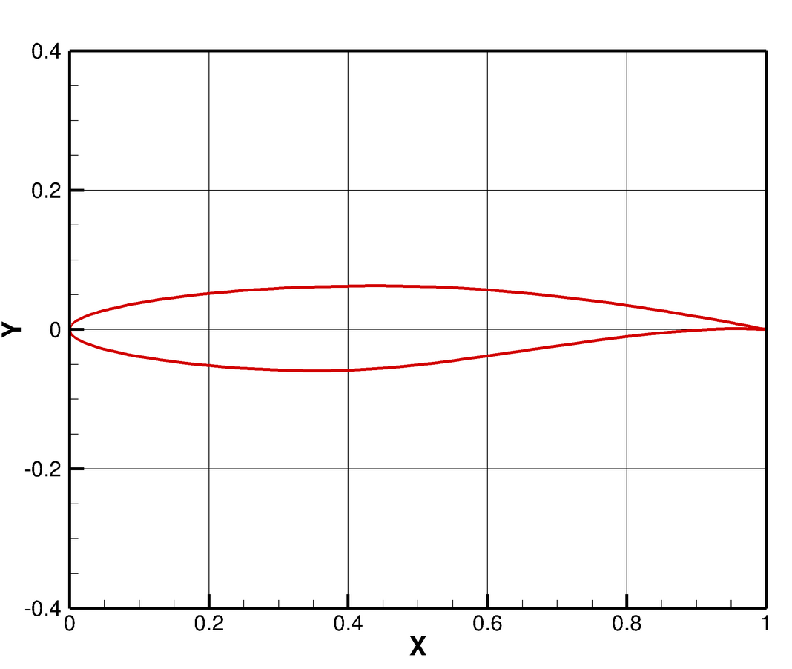
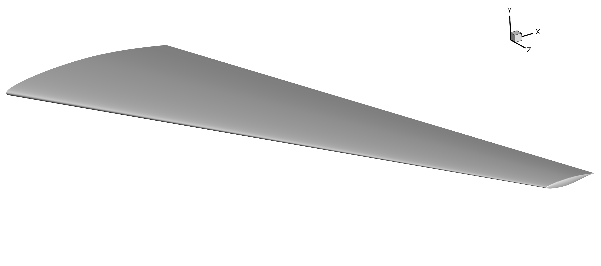

.. _aero_pygeo:

*******************
Geometry Generation
*******************

Introduction
============
The geometry definition is a necessary precursor to generate a mesh, so it comes first in this tutorial.
The native geometry file type for ICEM (our meshing software of choice) is a ".tin" file, but there are many ways to get it.
You can use any CAD software to generate an ".igs" file and then convert the ".igs" file to a ".tin" file with ICEM or pyGeo.
However, this tutorial will teach you how to generate a wing surface from airfoil data using pyGeo.
pyGeo is set up to loft a surface between a set of airfoils distributed along the span of the wing.
For more details on the options in pyGeo see the :doc:`docs <pygeo:index>`.

Files
=====
Navigate to the directory ``aero/geometry`` in your tutorial folder.
Copy the following file from the ``tutorial`` directory:

.. prompt:: bash

    cp ../../../tutorial/aero/geometry/rae2822.dat .

Create the following empty runscript in the current directory:

- ``generate_wing.py``

Dissecting the pyGeo runscript
==============================
Open the file ``generate_wing.py`` in your favorite text editor.
Then copy the code from each of the following sections into this file.

Import libraries
----------------
Numpy is used for scientific computing such as matrix/vector operations.
We need to import the pyGeo library in order to use its functions.
The pyGeo library, along with all other MACH libraries, should be importable because its code is located in a directory which is exposed to the system environment variable PYTHON_PATH.

.. literalinclude:: ../tutorial/aero/geometry/generate_wing.py
    :start-after: # rst Imports
    :end-before: # rst Airfoil file

Wing Definition
---------------
.. literalinclude:: ../tutorial/aero/geometry/generate_wing.py
    :start-after: # rst Airfoil file
    :end-before: # rst Wing definition

The wing is lofted from a set of airfoils distributed along the span of the wing.
The airfoil data files can be downloaded from online or generated from a variety of software.
The airfoil should be scaled to a unit chord with the leading edge centered at the origin.
The number of sections needed for a geometry generation is dependent on the intention of the geometry.
In general, any wing will require at least 2 sections to produce a valid geometry.
Adding more sections allows more precise wing definition, which is generally necessary for matching previously defined wing geometries.
Note that the number of sections must match the length of all the wing geometry data lists discussed below.
Also note that the number of control points should vary with the number of sections.
For cases with few sections, using a small number of control points yields the best results.
If there are a large number of sections, the number of control points needs to be increased to prevent the size of the output files from becoming unreasonably large.

For this tutorial, we use the RAE 2822 transonic airfoil as the cross-section of our wing.
A visualization of the airfoil geometry is given on Figure 1.
The coordinates of the airfoil are contained in the file ``rae2822.dat``.

    Figure 1: RAE 2822 Transonic Airfoil

The position, orientation, and scaling of the airfoil sections are stipulated in lists corresponding with the original airfoil data list.
The leading edge of each airfoil is positioned in space based on the values in the x, y, and z lists.
An offset in the x-y plane can be added to this position with the ``offset`` array before chord scaling is applied.
In this case, we don't want to apply any rotation (the rotation options shown below would be for rotation about the airfoil leading edge points and the units are degrees) or offset.

.. literalinclude:: ../tutorial/aero/geometry/generate_wing.py
    :start-after: # rst Wing definition
    :end-before: # rst Run pyGeo

Call pyGeo
----------
.. literalinclude:: ../tutorial/aero/geometry/generate_wing.py
    :start-after: # rst Run pyGeo
    :end-before: # rst Write output files

A detailed explanation of each argument is available in the :doc:`pyGeo docs <pygeo:pyGeo>`.
The final four options stipulate a rounded wingtip and a blunt trailing edge with a square tip (i.e., a square face at the trailing edge instead of a rounded face) and a thickness of 0.25 inches.

Write output files
------------------
There are three options for writing the geometry surface definition to file.

    1. Write a dat file to view wing in Tecplot.
    2. Write an IGES file. This can be converted to a TIN file in ICEM.
    3. Write a TIN file directly from pyGeo.

.. literalinclude:: ../tutorial/aero/geometry/generate_wing.py
   :start-after: # rst Write output files

Run it yourself!
================
After copying ``rae2822.dat`` to your ``aero/geometry`` folder and making the ``generate_wing.py`` script, you can now run the python file with the command

.. prompt:: bash

    python generate_wing.py

You can open ``wing.dat`` in Tecplot to view the wing surface.
The expected geometry output is shown below.

