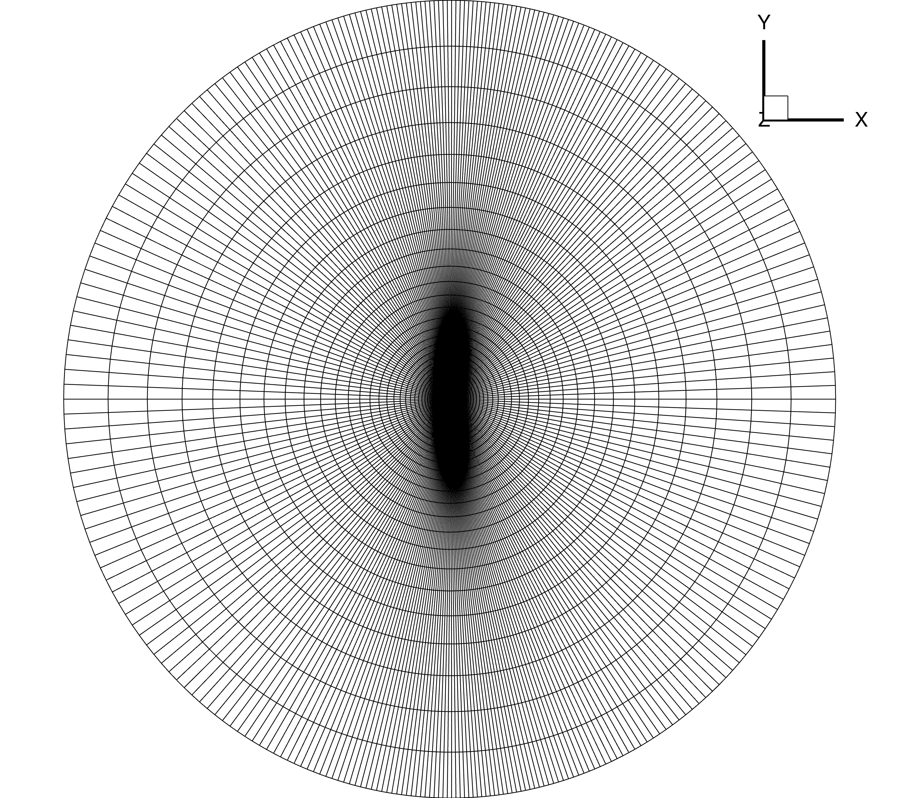
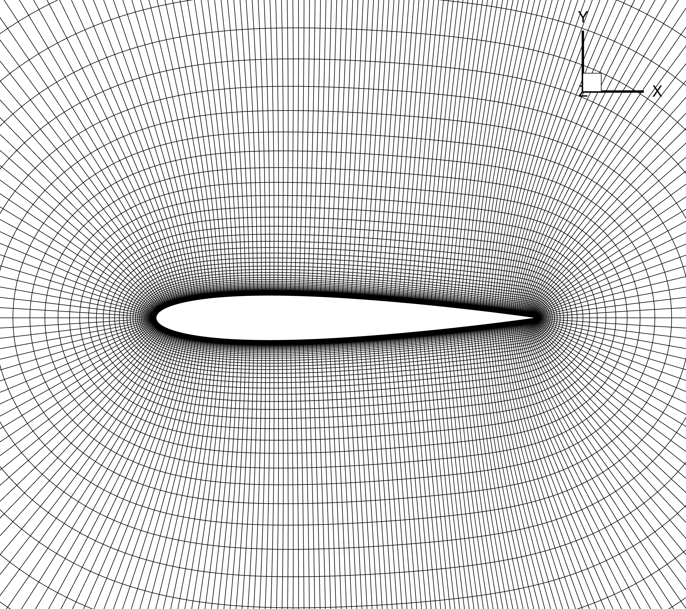

.. _airfoilanalysis_mesh:

***************
Meshing
***************

Introduction
============
Now that we have a airfoil geometry and have preprocessed it we can generate a mesh.
Our end goal is to generate a structured volume mesh around the airfoil that can be used by ADflow.
For an airfoil this is a straightforward automated process where we simply extrude the coordinates we generated using pyHyp.

.. note::
    Remember that ADflow is a 3D finite volume solver.
    Therefore, 3D meshes are needed even for 2D problems such as airfoil simulations.
    To do this, we generate a 3D mesh which is one cell wide, and apply symmetry boundary conditions on those two faces.

In this tutorial, we will use pyHyp to generate a 3D mesh in CGNS format.

Files
============
Navigate to the directory ``airfoil/meshing`` in your tutorial folder. Find the ``.xyz`` file you generated with preFoil and copy it from the ``airfoil/geometry`` folder.

.. prompt:: bash

    cp ../geometry/n0012_processed.xyz .

Create the following empty runscript in the current directory.

- ``run_pyhyp.py``

Dissecting the pyHyp runscript
================================
Open the file run_pyhyp.py in your favorite text editor. Then copy the code from each of the following sections into this file.

pyHyp runscript
++++++++++++++++++++++++++++++++
.. literalinclude:: ../tutorial/airfoil/meshing/run_pyhyp.py
    :start-after: # rst Import
    :end-before: # rst GenOptions

Import the pyHyp libraries and numpy.

Options
++++++++++++++++++++++++++++++++
We will now apply several options for pyHyp in our options dictionary.

General Options
---------------

.. literalinclude:: ../tutorial/airfoil/meshing/run_pyhyp.py
    :start-after: # rst GenOptions
    :end-before: # rst GridOptions

``inputFile``
    Name of the surface mesh file.
``unattachedEdgesAreSymmetry``
    Tells pyHyp to automatically apply symmetry boundary conditions to any unattached edges (those that do not interface with another block).
``outerFaceBC``
    Tells pyHyp which boundary condition to apply to the outermost face of the extruded mesh. Note that we do not set the inlet or outlet boundaries seperately because they are automatically handled in ADflow consistently with the free stream flow direction.
``BC``
    Tells pyHyp that, since it is a 2D problem, both sides of the domain ``jLow`` and ``jHigh``  are set to be symmetry boundary conditions. The input surface is automatically assigned to be a wall boundary.
``families``
    Name given to wall surfaces.
    If a dictionary is submitted, each wall patch can have a different name.
    This can help the user to apply certain operations to specific wall patches in ADflow.

Grid Parameters
---------------

.. literalinclude:: ../tutorial/airfoil/meshing/run_pyhyp.py
    :start-after: # rst GridOptions
    :end-before: # rst Run

``N``
    Number of nodes in off-wall direction.
    If multigrid will be used this number should be 2\ :sup:`m-1`\ (n+1), where m is the number of multigrid levels and n is the number of layers on the coarsest mesh.
``s0``
    Thickness of first off-wall cell layer.
``marchDist``
    Distance of the far-field.
``nConstantStart``
    Number of constant off-wall layers before beginning stretch.

Running pyHyp and Writing to File
++++++++++++++++++++++++++++++++

The following three lines of code extrude the surface mesh and write the resulting volume mesh to a ``.cgns`` file.

.. literalinclude:: ../tutorial/airfoil/meshing/run_pyhyp.py
    :start-after: # rst Run

Run it yourself!
++++++++++++++++++++++++++++++++
You can now run the python file with the command:

.. prompt:: bash

    python run_pyhyp.py

For larger meshes, you will want to run pyHyp as a parallel process.
This can be done with the command:

.. prompt:: bash

    mpirun -np 4 python run_pyhyp.py

where the number of processors is given after ``-np``.
You can open ``n0012.cgns`` in Tecplot to view the volume mesh.
The generated airfoil mesh should look like the following.

with a zoomed-in view:

