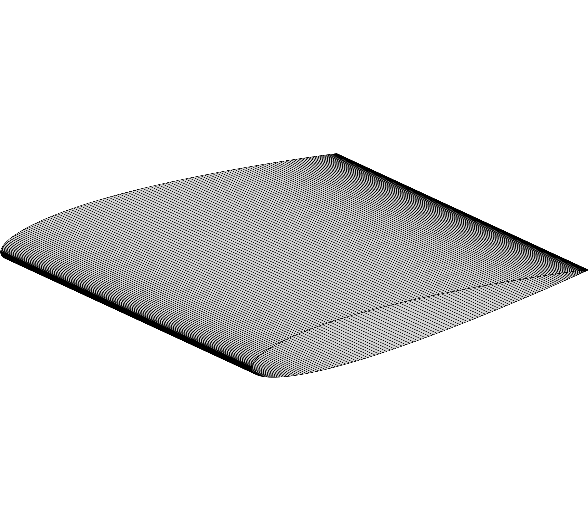

.. _airfoilanalysis_prefoil:

***************
Preprocess Geometry
***************
Before we can analyze an airfoil we need to define an airfoil geometry and preprocess it for meshing.
Airfoil geometries are defined by a set of points or coordinates in 2D space that define a closed curve.
Coordinates for most airfoils can be obtained from the `UIUC Data site <http://m-selig.ae.illinois.edu/ads/coord_database.html>`_.
The coordinates for the NACA 0012 airfoil are in the file ``n0012.dat``.

We could just use these coodinates as is to generate our mesh but then we would have no control over the cell count in the mesh or how the cells are distributed.
To fix this we will preprocess the airfoil coordiantes using preFoil which will allow us to sample new points on our airfoil at locations that we choose.
We will then export the newly sampled points as use them in the next step to generate our mesh.

Files
============
Navigate to the directory ``airfoil/geometry`` in your tutorial folder.
Download a copy of the NACA 0012 coordinates to this folder from the UIUC Data site linked above.

Dissecting the preFoil runscript
================================
Open the file run_prefoil.py in your favorite text editor. Then copy the code from each of the following sections into this file.

Import libraries
++++++++++++++++++++++++++++++++
Import the preFoil libraries and numpy.

.. literalinclude:: ../tutorial/airfoil/geometry/run_prefoil.py
    :start-after: # rst Import
    :end-before: # rst ReadCoords

Load the airfoil coordinates
++++++++++++++++++++++++++++++++
We now load the airfoil coordiantes from the file we just downloaded using ``readCoordFile`` function in preFoil's ``utils`` module.
Next, we create the airfoil object using the ``Airfoil`` class.

.. literalinclude:: ../tutorial/airfoil/geometry/run_prefoil.py
    :start-after: # rst ReadCoords
    :end-before: # rst PlotIntial

Examining the NACA 0012
++++++++++++++++++++++++++++++++
We will now create a plot of our initial coodinates.

.. literalinclude:: ../tutorial/airfoil/geometry/run_prefoil.py
    :start-after: # rst PlotIntial
    :end-before: # rst CreateTE

    Figure 1: NACA0012 Airfoil

Adding a blunt trailing edge
++++++++++++++++++++++++++++++++
We will now add a blunt trailing edge to our airfoil by cutting it off close to the original trailing edge.
Next, we normalize it's coordinates.

.. literalinclude:: ../tutorial/airfoil/geometry/run_prefoil.py
    :start-after: # rst CreateTE
    :end-before: # rst Sampling

Resampling
++++++++++++++++++++++++++++++++
We will then resample our airfoil to have 277 points which is suitable for an L2 mesh.
We use cosine sampling and the parameter ``m`` being set to :math:`\pi` tells the cosine spacing algorihtm to refine at the leading and trailing edges.
For more on sampling algorithms available in preFoil see its `documentation <https://mdolab-prefoil.readthedocs-hosted.com/en/latest/sampling.html#prefoil.sampling.cosine>`_.

.. literalinclude:: ../tutorial/airfoil/geometry/run_prefoil.py
    :start-after: # rst Sampling
    :end-before: # rst Output

Write output
++++++++++++++++++++++++++++++++
We can now write our output coordinates.
preFoil allows us to output to ``.dat`` as well as ``.xyz`` (PLOT3D) for meshing.

.. literalinclude:: ../tutorial/airfoil/geometry/run_prefoil.py
    :start-after: # rst Output
    :end-before: # rst PlotFinal

The surface mesh (``n0012_processed.xyz``) can be visualized in Tecplot.

Examining the processed NACA 0012
++++++++++++++++++++++++++++++++
We will now create a plot of our processed coodinates.

.. literalinclude:: ../tutorial/airfoil/geometry/run_prefoil.py
    :start-after: # rst PlotFinal

    Figure 2: Processed NACA0012 Airfoil