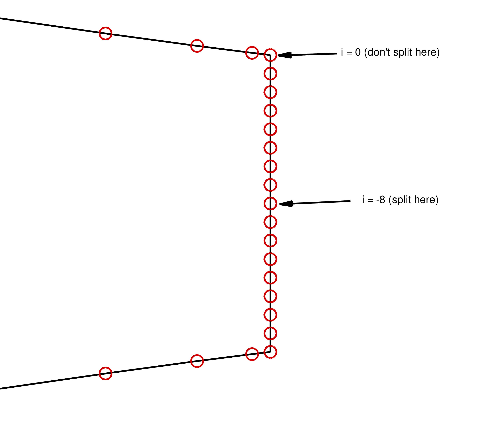
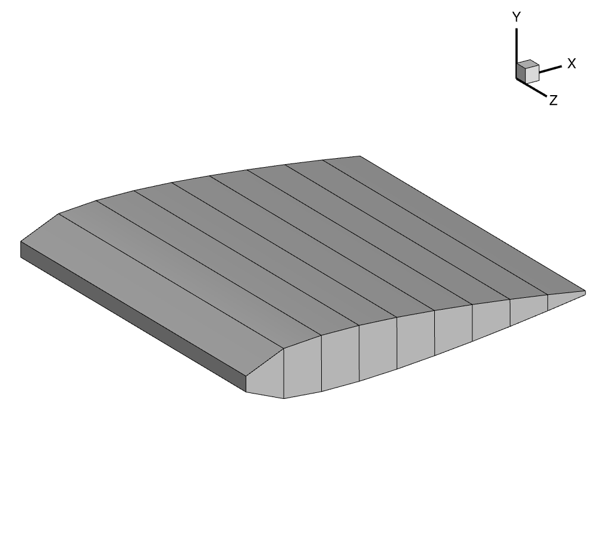
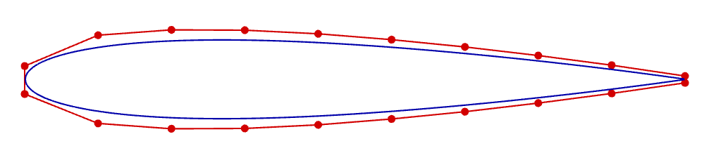

.. _airfoilopt_ffd:

*************************
Geometric Parametrization
*************************

.. warning:: The following sections assume you have completed all the sections related to geometry preprocessing and meshing in :ref:`the airfoil analysis tutorial <airfoilanalysis_overview>`.
    Be sure to complete those first before continuing.

Introduction
================================================================================
In order to optimize the shape of a geometry such as an airfoil or a wing, we need some way to translate design variables into actual changes in the shape.
We use the Free-form deformation (FFD) technique, popularized by Tom Sederberg in the world of computer-aided graphic design, as our parametrization method.
The FFD is a mapping of a region in 2D or 3D that is bounded by a set of B-splines.
Every point with the region is mapped to a new location based on the deformation of the bounding B-spline curves.
The B-splines themselves are defined by control points, so by adjusting the positions of these control points, we can have a great deal of control over any points embedded in the FFD volume (as shown in the figure below).
Since our airfoil coordinates are point-based, we can embed them in the FFD and give the optimizer control over their shape.
For more detail on the mathematical principles and implementation, refer to the following `article <https://dafoam.github.io/docs/FFD/main.pdf>`_.

.. image:: images/ffd_demo.png
   :scale: 50
   :align: center

The actual implementation of the FFD method is housed in the pygeo repository.
The specific class to look for is :doc:`DVGeometry <pygeo:DVGeometry>`.
Navigate to the DVGeometry repository to explore its capabilities
Before diving into the parametrization, however, we need to generate an FFD, which is basically a 3D grid in the PLOT3D format.
This file contains the coordinates of the FFD points around the airfoil.
These are control points that are fitted to the airfoil using B-splines, which are used to deform the airfoil.

Files
======================

The coordinates for the NACA0012 airfoil that we processed in the last tutorial are in the file ``n0012_processed.dat``.

Navigate to the directory ``airfoilopt/ffd`` in your tutorial folder.
Copy the airfoil data from ``airfoil/geometry``:

.. prompt:: bash

    cp ../../airfoil/geometry/n0012_processed.dat .

Create the following empty runscript in the current directory.

- ``run_ffd.py``

Import Packages
===============
.. literalinclude:: ../tutorial/airfoilopt/ffd/run_ffd.py
    :start-after: # rst Import
    :end-before: # rst Load

Load Airfoil
============
.. literalinclude:: ../tutorial/airfoilopt/ffd/run_ffd.py
    :start-after: # rst Load
    :end-before: # rst UpperLower

The following two functions are used to get the upper and lower points of the airfoil.
It should be noted that in airfoil geometry processing step in the previous tutorial we created a blunt trailing for the NACA0012.
As result, we can't just simply divide the airfoil's point set down the middle to get the upper and lower surfaces.
Index 0 starts on the upper surface trailing edge however we also want the upper half of the blunt trailing edge to be included in our upper surface.
Since our blunt trailing edge is 17 points long we will split at an offset of index -8.

.. literalinclude:: ../tutorial/airfoilopt/ffd/run_ffd.py
    :start-after: # rst UpperLower
    :end-before: # rst FFDBox1

    Clarification on why we split at an offset for the blunt TE airfoil

FFD Box Creation
================

The FFD box can now be set up.

.. literalinclude:: ../tutorial/airfoilopt/ffd/run_ffd.py
    :start-after: # rst FFDBox1
    :end-before: # rst FFDBox2

``nffd`` signifies the number of chordwise slices.
We pre-allocate an array of generic size (a,b,c,3) to set up an empty FFD box.
In this example, a=nffd (number of chordwise sections), b=c=2 (number of spanwise and thickness-wise sections respectively) and the final 3 is "fixed" as we are using 3D coordinates for each point.
An empty FFD box is created.
``xmargin`` and ``ymargin`` specify the closest distance from the airfoil to place the FFD box.
``xslice``, ``yupper``, and ``ylower`` store the x- and y- coordinates of the control points for each slice along the chord, taking into account the margins from the airfoil.

.. literalinclude:: ../tutorial/airfoilopt/ffd/run_ffd.py
    :start-after: # rst FFDBox2
    :end-before: # rst WriteFile

The x- and y- coordinates are transferred to the ``FFDbox`` variable.
Since the airfoil slices are the same along the z-direction, the x- and y- coordinates are copied over.
The z-coordinates are updated to 0 and 1.

Writing to File
===============

.. literalinclude:: ../tutorial/airfoilopt/ffd/run_ffd.py
    :start-after: # rst WriteFile

We now have to write our FFD box to PLOT3D format for pygeo.
The nested loop above is one typically seen for writing PLOT3D files manually.

Run it yourself!
================
You can now run the python file with the command:

.. prompt:: bash

    python run_ffd.py

The above script writes the FFD coordinates to a PLOT3D ``.xyz`` file, which will be used for optimization.

    3D view of the FFD volume

    2D view of the FFD volume, together with the embedded airfoil
