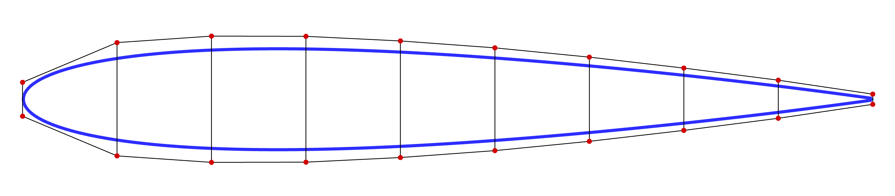

.. _airfoilopt_ffd:

*************************
Geometric Parametrization
*************************

Next, the FFD (Free-Form Deformation) file has to be generated in PLOT3D format. 
This file contains the coordinates of the FFD points around the airfoil. 
These are control points that are fitted to the airfoil using B-splines, which are used to deform the airfoil. 

The coordinates for the NACA0012 airfoil are in the file ``n0012.dat``. 

Navigate to the directory ``airfoilopt/ffd`` in your tutorial folder. 
Copy the airfoil data from ``airfoilopt/mesh``:

.. prompt:: bash

    cp ../mesh/n0012.dat . 

Create the following empty runscript in the current directory. 

- ``genFFD.py``

Import Packages
===============
.. literalinclude:: ../tutorial/airfoilopt/ffd/genFFD.py
    :start-after: # rst Import
    :end-before: # rst Load

Load Airfoil
============
.. literalinclude:: ../tutorial/airfoilopt/ffd/genFFD.py
    :start-after: # rst Load
    :end-before: # rst UpperLower

The following two functions are used to get the upper and lower points of the airfoil. 

.. literalinclude:: ../tutorial/airfoilopt/ffd/genFFD.py
    :start-after: # rst UpperLower
    :end-before: # rst FFDBox1

FFD Box Creation
================

The FFD box can now be set up. 

.. literalinclude:: ../tutorial/airfoilopt/ffd/genFFD.py
    :start-after: # rst FFDBox1
    :end-before: # rst FFDBox2

``nffd`` signifies the number of chordwise slices.
we pre-allocate an array of generic size (a,b,c,3) to set up an empty FFD box. In this example, a=nffd (number of chordwise sections), b=c=2 (number of spanwise and thickness-wise sections respectively) and the final 3 is "fixed" as we are using 3D coordinates for each point
 An empty FFD box is created.
``xmargin`` and ``ymargin`` specify the closest distance from the airfoil to place the FFD box.
``xslice``, ``yupper``, and ``ylower`` store the x- and y- coordinates of the control points for each slice along the chord, taking into account the margins from the airfoil. 

.. literalinclude:: ../tutorial/airfoilopt/ffd/genFFD.py
    :start-after: # rst FFDBox2
    :end-before: # rst WriteFile

The x- and y- coordinates are transferred to the ``FFDbox`` variable.
Since the airfoil slices are the same along the z-direction, the x- and y- coordinates are copied over. 
The z-coordinates are updated to 0 and 1.

Writing to File
===============

.. literalinclude:: ../tutorial/airfoilopt/ffd/genFFD.py
    :start-after: # rst WriteFile

Run it yourself!
================
You can now run the python file with the command:

.. prompt:: bash

    python genFFD.py

The above script writes the FFD coordinates to a PLOT3D ``.xyz`` file, which will be used for optimization.

.. figure::
    images/airfoil_ffd.png
    :width: 400
    :align: center

    3D view of the FFD volumes

    2D view of the FFD volume, together with the embedded airfoil
