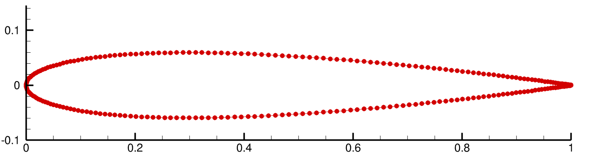
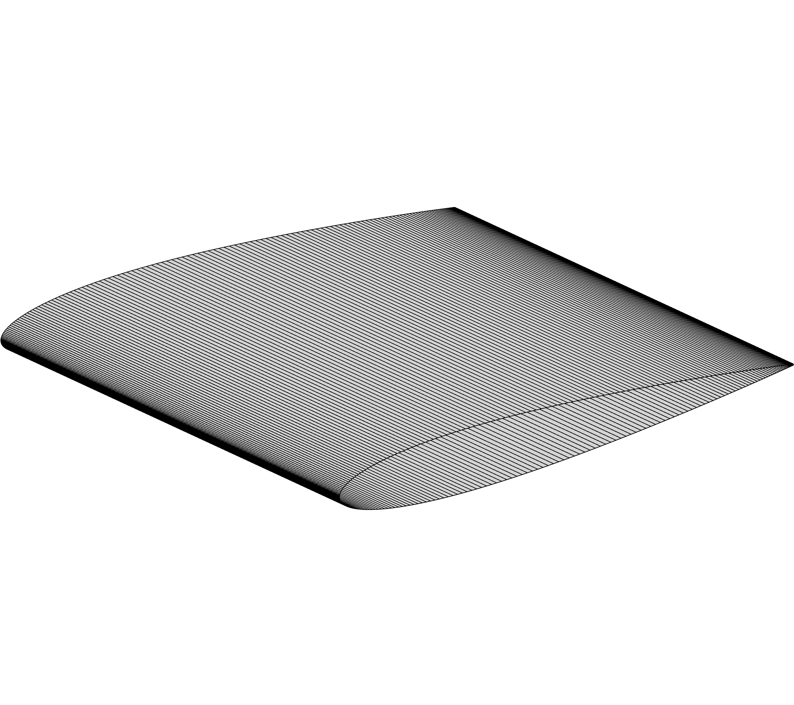
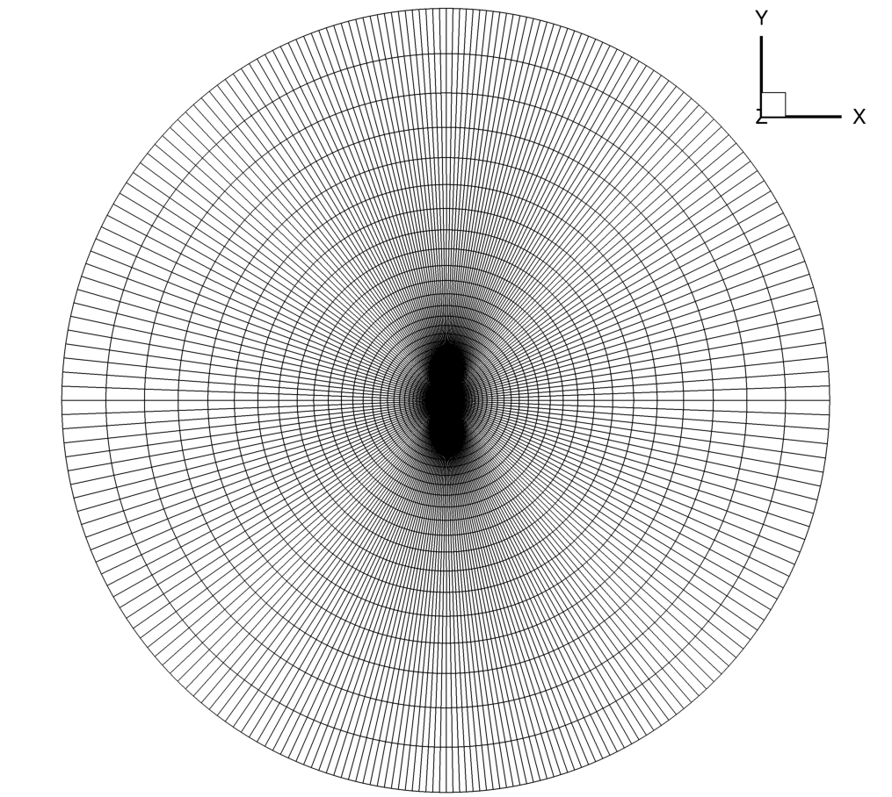
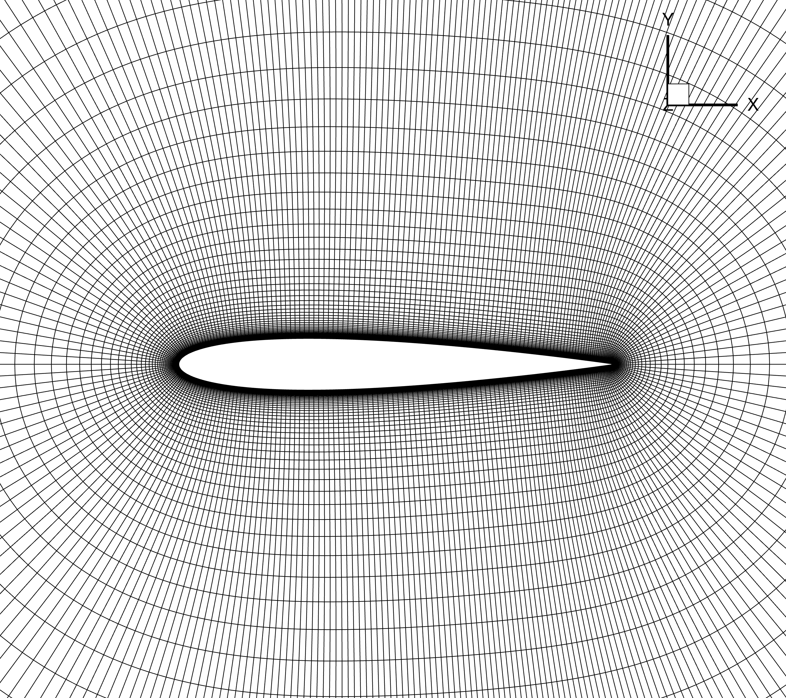

.. _airfoilopt_mesh:

***************
Mesh Generation
***************

.. note::
    Remember that ADflow is a 3D finite volume solver.
    Therefore, 3D meshes are needed even for 2D problems such as airfoil simulations.
    To do this, we generate a 3D mesh which is one cell wide, and apply symmetry boundary conditions on those two faces.

In this tutorial, we will use pyHyp to generate a 3D mesh in CGNS format.
The coordinates for the NACA0012 airfoil are in the file ``n0012.dat``.
Coordinates for most airfoils can be obtained from the `UIUC Data site <http://m-selig.ae.illinois.edu/ads/coord_database.html>`_.

The initial mesh (``n0012.dat``) can be visualized in Tecplot.

Navigate to the directory ``airfoilopt/mesh`` in your tutorial folder. Copy the airfoil data from the ``tutorial`` directory:

.. prompt:: bash

    cp ../../../tutorial/airfoilopt/mesh/n0012.dat .

Create the following empty runscript in the current directory.

- ``genMesh.py``

pyHyp runscript
===============

Import the pyHyp libraries and numpy.

.. literalinclude:: ../tutorial/airfoilopt/mesh/genMesh.py
    :language: py
    :start-after: # rst Import
    :end-before: # rst SurfMesh

Surface Mesh Generation
=======================

.. literalinclude:: ../tutorial/airfoilopt/mesh/genMesh.py
    :language: py
    :start-after: # rst SurfMesh
    :end-before: # rst GenOptions

pyHyp requires a surface mesh input before it can create a 3D mesh.
An "extruded" surface mesh can be created using the code above, which produces a PLOT3D file with extension ``.xyz``.
This meshes only the airfoil surface, and is used as the input file for pyHyp, which marches the existing mesh to the farfield.
By performing this intermediate step, the volume mesh generation is faster and higher-quality.

The intermediate mesh (``new.xyz``) can be visualized in Tecplot.

Options
=======

.. literalinclude:: ../tutorial/airfoilopt/mesh/genMesh.py
    :language: py
    :start-after: # rst GenOptions
    :end-before: # rst GridOptions

General Options
---------------

``inputFile``
    Name of the surface mesh file.
``unattachedEdgesAreSymmetry``
    Tells pyHyp to automatically apply symmetry boundary conditions to any unattached edges (those that do not interface with another block).
``outerFaceBC``
    Tells pyHyp which boundary condition to apply to the outermost face of the extruded mesh. Note that we do not set the inlet or outlet boundaries seperately because they are automatically handled in ADflow consistently with the free stream flow direction.
``BC``
    Tells pyHyp that, since it is a 2D problem, both sides of the domain ``jLow`` and ``jHigh``  are set to be symmetry boundary conditions. The input surface is automatically assigned to be a wall boundary.
``families``
    Name given to wall surfaces.
    If a dictionary is submitted, each wall patch can have a different name.
    This can help the user to apply certain operations to specific wall patches in ADflow.

.. literalinclude:: ../tutorial/airfoilopt/mesh/genMesh.py
    :language: py
    :start-after: # rst GridOptions
    :end-before: # rst Run

Grid Parameters
---------------

``N``
    Number of nodes in off-wall direction.
    If multigrid will be used this number should be 2\ :sup:`m-1`\ (n+1), where m is the number of multigrid levels and n is the number of layers on the coarsest mesh.
``s0``
    Thickness of first off-wall cell layer.
``marchDist``
    Distance of the far-field.

Running pyHyp and Writing to File
=================================

The following three lines of code extrude the surface mesh and write the resulting volume mesh to a ``.cgns`` file.

.. literalinclude:: ../tutorial/airfoilopt/mesh/genMesh.py
    :language: py
    :start-after: # rst Run

Run it yourself!
================
You can now run the python file with the command:

.. prompt:: bash

    python genMesh.py

The generated airfoil mesh should look like the following.

with a zoomed-in view:

