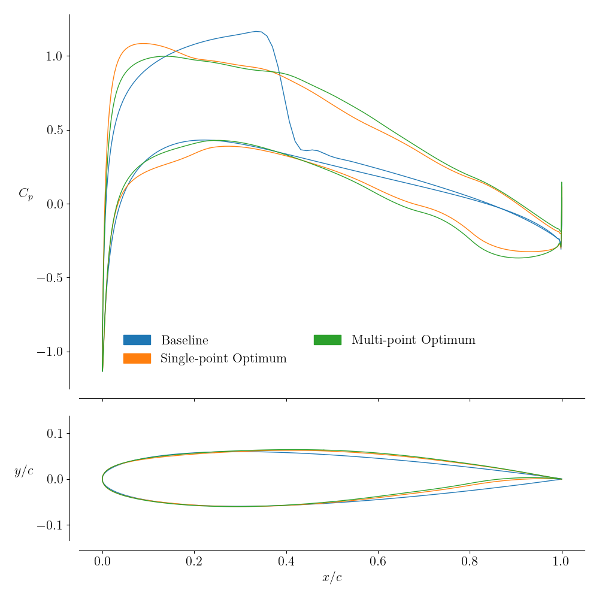

.. _airfoilopt_multipoint:

***********************
Multipoint Optimization
***********************

Introduction
============
Optimization does not have to be limited to a single flight condition. 
This section goes through the same optimization as the single point case, except with one more flight condition. 
Instead of rewriting the code from scratch, the differences in code will be pointed out.

.. note::
    Different parallelizations are possible with multipoint optimizations.
    In this tutorial, all of the processors will be used to solve the first AeroProblem, then they will all switch and solve the second AeroProblem.
    Alternatively, it's possible to solve both simultaneously by using twice the number of processors, but load balancing becomes an issue.

The optimization problem is defined as:

| *minimize*
|    average drag: :math:`\frac{1}{2} \left(C_{D,0} + C_{D,1}\right)`
| *with respect to*
|    10 shape variables
| *subject to*
|    :math:`C_{L,0} = 0.5`
|    :math:`C_{L,1} = 0.7`
|    :math:`V \ge V_0`
|    :math:`t \ge 0.1t_0`
|    :math:`\Delta z_{LETE, upper} = -\Delta z_{LETE, lower}`

Files
=====
Navigate to the directory ``airfoilopt/multipoint`` in your tutorial folder. 
Copy the FFD file, ``ffd.xyz``, and the CGNS mesh file, ``n0012.cgns``, generated previously, into the directory:

.. prompt:: bash

    cp ../mesh/n0012.cgns . 
    cp ../ffd/ffd.xyz . 

Copy the singlepoint script from the previous section to a new file in this directory:

.. prompt:: bash

    cp ../singlepoint/airfoil_opt.py airfoil_multiopt.py

Highlighting the changes required in the multipoint optimization script
=======================================================================
Open the file ``airfoil_multiopt.py`` in your favorite text editor.
Change the following sections for multipoint optimization.

Specifying parameters for the optimization
------------------------------------------
For multipoint optimization, the parameters have to be specified in lists of the same size.

.. literalinclude:: ../tutorial/airfoilopt/multipoint/airfoil_multiopt.py
    :start-after: # rst parameters (beg)
    :end-before: # rst parameters (end)

Creating processor sets
-----------------------
This is largely unchanged from the single-point case, since we use a very similar parallelization scheme.
The only difference is in defining the variable ``nGroup`` which is used later on to distinguish between the two AeroProblems.

.. literalinclude:: ../tutorial/airfoilopt/multipoint/airfoil_multiopt.py
    :start-after: # rst multipoint (beg)
    :end-before: # rst multipoint (end)

Set the AeroProblem
-------------------
For more than one AeroProblem, a list needs to be created. 
Each AeroProblem is created with the respective optimization point and appended to the list.

.. literalinclude:: ../tutorial/airfoilopt/multipoint/airfoil_multiopt.py
    :start-after: # rst aeroproblem (beg)
    :end-before: # rst aeroproblem (end)

Optimization callback functions
-------------------------------
The same for-loop needs to be added to the callback functions. 
The lines that require a call to the an AeroProblem is now put into a for-loop to iterate through all of them.

.. literalinclude:: ../tutorial/airfoilopt/multipoint/airfoil_multiopt.py
    :start-after: # rst funcs (beg)
    :end-before: # rst funcs (end)

In the ``objCon`` function, the :math:`c_l` constraint is also placed into the for-loop.

Optimization problem
--------------------
The only difference here is that we now have two different :math:`c_l` constraints, one for each point.
These are added in a loop.
In addition, we use the ``wrt`` keyword to specify the variables that affect each lift constraint.
In this case, the ``alpha`` from the other flight conditions do not impact the lift constraint, so they are set to zero.

.. literalinclude:: ../tutorial/airfoilopt/multipoint/airfoil_multiopt.py
    :start-after: # rst optprob (beg)
    :end-before: # rst optprob (end)

Run it yourself!
================
The script can be run in the same way

.. prompt:: bash

    mkdir output
    mpirun -np 4 python airfoil_multiopt.py | tee output.txt

