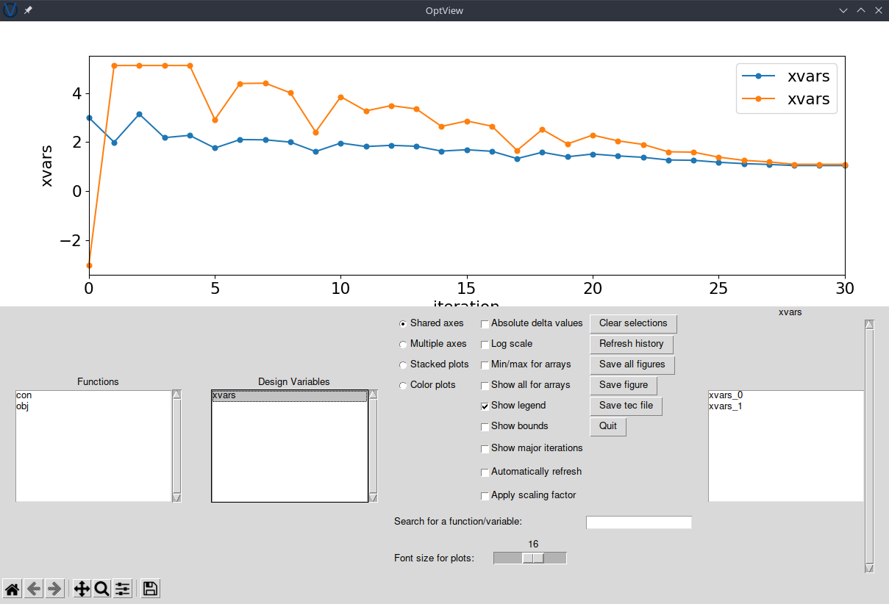
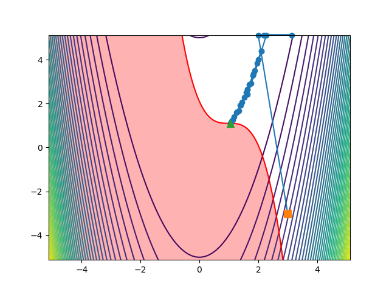

.. _airfoilopt_pyopt:

***********
Optimization with pyOptSparse
***********

Introduction
============
Although we specialize in optimization, we don't write our own optimization algorithms.
We like to work a little closer to the applications side, and we figure that the mathematicians have already done an exceptional job developing the algorithms.
In fact, there are many great optimization algorithms out there, each with different advantages.
From the user's perspective most of these algorithms have similar inputs and outputs, so we decided to develop a library for optimization algorithms with a common interface: :doc:`pyOptSparse <pyoptsparse:index>`.
pyOptSparse allows the user to switch between several algorithms by changing a single argument.
This facilitates comparison between different techniques and allows the user to focus on the other aspects of building an optimization problem.

In this section, we will go over the basic pyOptSparse optimization script and try our hand at the familiar `Rosenbrock problem <https://en.wikipedia.org/wiki/Rosenbrock_function>`_.

Files
=====
Navigate to the directory ``opt/pyoptsparse`` in your tutorial folder.
Create the following empty runscript in the current directory:

- ``rosenbrock.py``

Optimization Problem Definition
===============================
We will be solving a constrained Rosenbrock problem defined in the following manner:

| *minimize*
|    :math:`100(x_1 - x_0^2 )^2 + (1 - x_0)^2`
| *with respect to*
|    :math:`x_0, x_1`
| *subject to*
|    :math:`0.1 - (x_0 - 1)^3 - (x_1 - 1) \le 0`

Dissecting the pyOptSparse runscript
====================================
Open the file ``rosenbrock.py`` in your favorite text editor.
Then copy the code from each of the following sections into this file.

Import libraries
----------------
.. literalinclude:: ../tutorial/opt/pyoptsparse/rosenbrock.py
    :start-after: # rst Imports
    :end-before: # rst Command line arguments

First we import everything from pyOptSparse.
Additionally we import ``argparse`` to enable the use of command line arguments.

Command line arguments
----------------------
.. literalinclude:: ../tutorial/opt/pyoptsparse/rosenbrock.py
    :start-after: # rst Command line arguments
    :end-before: # rst Callback function

We often set up scripts with the command line arguments to allow us to make subtle changes to the optimization without having to modify the script.
In this case we set up a single command line argument to choose the optimizer that we will use to solve the optimization problem.

Define the callback function
-----------------------------
.. literalinclude:: ../tutorial/opt/pyoptsparse/rosenbrock.py
    :start-after: # rst Callback function
    :end-before: # rst Sensitivity function

For any optimization problem, pyOptSparse needs a way to query the functions of interest at a given point in the design space.
This is done with callback functions.
The callback function receives a dictionary with the design variables and returns a dictionary with the computed functions of interest.
The names of the design variables (``xvars``) and functions of interest (``obj`` and ``con``) are user-defined, as you will see in the next few steps.

Define the sensitivity function
-------------------------------
.. literalinclude:: ../tutorial/opt/pyoptsparse/rosenbrock.py
    :start-after: # rst Sensitivity function
    :end-before: # rst Optimization problem

The user-defined sensitivity function allows the user to provide efficiently computed derivatives to the optimizer.
In the absence of user-provided derivatives, pyOptSparse can also compute finite difference derivatives, but we generally avoid that option.
The sensitivity function receives both the dictionary of design variables (``xdict``) and the previously computed dictionary of functions of interest (``funcs``).
The function returns a dictionary with derivatives of each of the functions in ``funcs`` with respect to each of the design variables in ``xdict``.
For a vector variable (like ``xvars``), the sensitivity is provided as a Jacobian.

Instantiate the optimization problem
------------------------------------
.. literalinclude:: ../tutorial/opt/pyoptsparse/rosenbrock.py
    :start-after: # rst Optimization problem
    :end-before: # rst Add objective

The Optimization class holds all of the information about the optimization problem.
We create an instance of this class by providing the name of the problem and the callback function.

Indicate the objective function
-------------------------------
.. literalinclude:: ../tutorial/opt/pyoptsparse/rosenbrock.py
    :start-after: # rst Add objective
    :end-before: # rst Add design variables

Although we have already set the callback function for the optimization problem, the optimizer does not know which function of interest it should be minimizing.
Here we tell the optimizer the name of the objective function.
This should correspond with one of the keys in the ``funcs`` dictionary that is returned by the callback function.

Add design variables
--------------------
.. literalinclude:: ../tutorial/opt/pyoptsparse/rosenbrock.py
    :start-after: # rst Add design variables
    :end-before: # rst Add constraints

Now we need to add the design variables to the problem, which is done with a call to :meth:`addVarGroup() <pyoptsparse:pyoptsparse.pyOpt_optimization.Optimization.addVarGroup>`.

Add constraints
---------------
.. literalinclude:: ../tutorial/opt/pyoptsparse/rosenbrock.py
    :start-after: # rst Add constraints
    :end-before: # rst Instantiate optimizer

We complete the optimization problem set-up by adding the constraints, using the function :meth:`addCon() <pyoptsparse:pyoptsparse.pyOpt_optimization.Optimization.addCon>`.

Set up the optimizer
--------------------
We now have a fully defined optimization problem, but we haven't said anything about choosing an optimizer.
The optimizer is set up with the following lines of code.
The options dictionary can be modified to fine-tune the optimizer, but if it is left empty, default values will be used.

.. literalinclude:: ../tutorial/opt/pyoptsparse/rosenbrock.py
    :start-after: # rst Instantiate optimizer
    :end-before: # rst Solve

Solve the problem
-----------------
Finally, we can solve the problem.
We give the optimizer the optimization problem, the sensitivity function, and optionally, a location to save an optimization history file.
The ``sens`` keyword also accepts ``'FD'`` to indicate that the user wants to use finite difference for derivative computations.

.. literalinclude:: ../tutorial/opt/pyoptsparse/rosenbrock.py
    :start-after: # rst Solve
    :end-before: # rst Plot

Run it yourself!
================
Try running the optimization.

.. prompt:: bash

    python rosenbrock.py

Terminal output
---------------
::

    Optimization Problem -- Rosenbrock function
    ================================================================================
        Objective Function: userfunc

        Solution:
    --------------------------------------------------------------------------------
        Total Time:                    0.0516
        User Objective Time :       0.0002
        User Sensitivity Time :     0.0002
        Interface Time :            0.0476
        Opt Solver Time:            0.0035
        Calls to Objective Function :      31
        Calls to Sens Function :           26

    Objectives
        Index  Name            Value
            0  obj     2.371563E-03

    Variables (c - continuous, i - integer, d - discrete)
        Index  Name      Type      Lower Bound            Value      Upper Bound     Status
            0  xvars_0      c    -5.120000E+00     1.048645E+00     5.120000E+00
            1  xvars_1      c    -5.120000E+00     1.099885E+00     5.120000E+00

    Constraints (i - inequality, e - equality)
        Index  Name Type          Lower           Value           Upper    Status  Lagrange Multiplier (N/A)
            0  con    i  -1.000000E+20   -5.669922E-08    0.000000E+00         u    9.00000E+100

    --------------------------------------------------------------------------------

The optimizer (SLSQP) also writes out an output file ``SLSQP.out`` that contains additional information.

Visualization with OptView
--------------------------
pyOptSparse comes with a simple GUI to view the optimization history called OptView.
You can run it with the command

.. prompt:: bash

    optview opt.hst

You can also load the history file in python to make your own plots, such as the one below, showing the path the optimiser took to the solution:

.. literalinclude:: ../tutorial/opt/pyoptsparse/rosenbrock.py
    :start-after: # rst Plot

