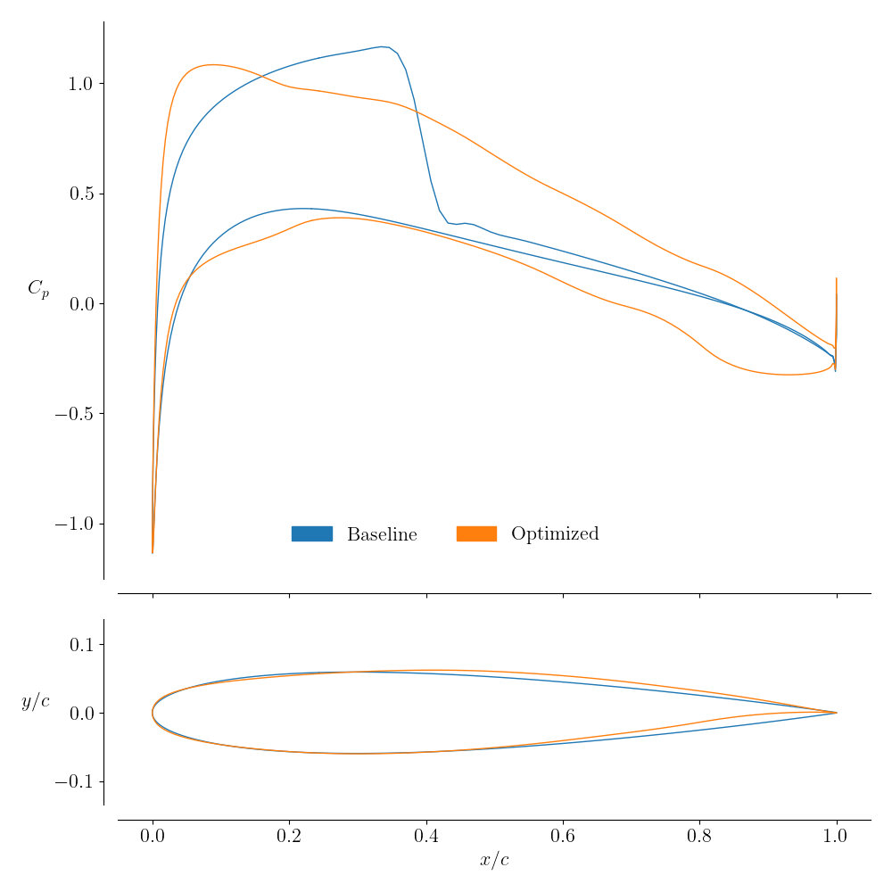

.. _airfoilopt_singlepoint:

*************************
Single Point Optimization
*************************

Introduction
============
We will now proceed to optimizing a NACA0012 airfoil for a given set of flow conditions. It is very similar to a wing optimization.
The optimization problem is defined as:

| *minimize*
|    :math:`C_D`
| *with respect to*
|    10 shape variables
| *subject to*
|    :math:`C_L = 0.5`
|    :math:`V \ge V_0`
|    :math:`t \ge 0.1t_0`
|    :math:`\Delta z_{LETE, upper} = -\Delta z_{LETE, lower}`

The shape variables are controlled by the FFD points specified in the FFD file.

Files
=====

Navigate to the directory ``airfoilopt/singlepoint`` in your tutorial folder. 
Copy the FFD file, ``ffd.xyz``, and the CGNS mesh file, ``n0012.cgns``, generated previously, into the directory:

.. prompt:: bash

    cp ../mesh/n0012.cgns . 
    cp ../ffd/ffd.xyz . 

Create the following empty runscript in the current directory:

- ``airfoil_opt.py``

Dissecting the aerodynamic optimization script
==============================================
Open the file ``airfoil_opt.py`` in your favorite text editor.
Then copy the code from each of the following sections into this file.

Import libraries
----------------
.. literalinclude:: ../tutorial/airfoilopt/singlepoint/airfoil_opt.py
    :start-after: # rst Imports (beg)
    :end-before: # rst Imports (end)

Adding command line arguments
-----------------------------
This is a convenience feature that allows the user to pass in command line arguments to the script.
Four options are provided:

-  Output directory
-  Optimizer to be used
-  Grid file to be used
-  Optimizer options

.. literalinclude:: ../tutorial/airfoilopt/singlepoint/airfoil_opt.py
    :start-after: # rst args (beg)
    :end-before: # rst args (end)

Specifying parameters for the optimization
------------------------------------------
Several conditions for the optimization are specified at the beginning of the script. 
These include the coefficient of lift constraint value, Mach number, and altitude to indicate flow conditions. 

.. literalinclude:: ../tutorial/airfoilopt/singlepoint/airfoil_opt.py
    :start-after: # rst parameters (beg)
    :end-before: # rst parameters (end)

The angle of attack serves as the initial value for the optimization and should not affect the optimized result.

Creating processor sets
-----------------------

Allocating sets of processors for different analyses can be helpful for multiple design points, but this is a single-point optimization, so only one point is added. 

.. literalinclude:: ../tutorial/airfoilopt/singlepoint/airfoil_opt.py
    :start-after: # rst multipoint (beg)
    :end-before: # rst multipoint (end)

ADflow set-up
-------------

The ADflow set-up looks similar to the aerodynamic analysis script.
 
.. literalinclude:: ../tutorial/airfoilopt/singlepoint/airfoil_opt.py
    :start-after: # rst adflow (beg)
    :end-before: # rst adflow (end)

As it is, the options specified above allow for a good convergence of NACA0012 airfoil analysis, but may not converge for other airfoils. 
Some useful options to adjust are:

``nCycles``
    If the analysis doesn't converge, this can be increased.

``nkswitchtol``
    If the analysis stops converging during NK (Newton-Krylov), this might mean that it is still outside of the radius of convergence of the NK method. The parameter should then be lowered.

``NKSubSpaceSize``
    Decreasing this parameter will decrease memory usage when in the NK range. Only change this if there are memory issues when dealing with larger meshes.

``writeSurfaceSolution`` and ``writeVolumeSolution``
    If you want to view the surface or volume solutions at the end of each analysis, these parameters can be set to True.

We also use ``addSlices`` to write the airfoil coordinates and :math:`c_p` distribution to a text file.

Set the AeroProblem
-------------------

We add angle of attack as a design variable and set up the AeroProblem using given flow conditions.

.. literalinclude:: ../tutorial/airfoilopt/singlepoint/airfoil_opt.py
    :start-after: # rst aeroproblem (beg)
    :end-before: # rst aeroproblem (end)

Geometric parametrization
-------------------------

The set-up for DVGeometry is simpler for an airfoil since it doesn't involve span-wise variables such as twist, dihedral, or taper.

.. literalinclude:: ../tutorial/airfoilopt/singlepoint/airfoil_opt.py
    :start-after: # rst dvgeo (beg)
    :end-before: # rst dvgeo (end)

The local design variable ``shape`` is added.

Geometric constraints
---------------------

Note: This section is also the same as the corresponding section in aircraft optimization.

We can set up constraints on the geometry with the DVConstraints class, also found in the pyGeo module. 
There are several built-in constraint functions within the DVConstraints class, including thickness, surface area, volume, location, and general linear constraints. 
The majority of the constraints are defined based on a triangulated surface representation of the wing obtained from ADflow.

The volume and thickness constraints are set up by creating a 2D grid of points which is projected through the planform of the wing. 
For the volume constraint, the 2D grid is transformed into a 3D grid bounded by the surface of the wing. 
The volume is computed by adding up the volumes of the cells that make up the 3D grid. For the thickness constraints, the nodes of the 2D grid are projected to the upper and lower surface of the wing. 
The thickness for a given node is the difference between its upper and lower projections.

The LeTe constraints (short for Leading edge/Trailing edge) are linear constraints based on the FFD control points. 
When we have both twist and local shape variables, we want to prevent the local shape variables from creating a shearing twist. 
This is done by constraining that the upper and lower nodes on the leading and trailing edges must move in opposite directions.

.. literalinclude:: ../tutorial/airfoilopt/singlepoint/airfoil_opt.py
    :start-after: # rst dvcon (beg)
    :end-before: # rst dvcon (end)

The parameters ``lower`` and ``upper`` are thickness or volume bounds relative to the original airfoil. 
For example, the lower bound of 0.1 in the thickness constraint means that the optimized airfoil can be no thinner than 10% of the original airfoil.

Mesh warping set-up
-------------------

.. literalinclude:: ../tutorial/airfoilopt/singlepoint/airfoil_opt.py
    :start-after: # rst warp (beg)
    :end-before: # rst warp (end)

Optimization callback functions
-------------------------------

Note: This section is also the same as the corresponding section in aircraft optimization.

First we must set up a callback function and a sensitivity function for each processor set.
In this case cruiseFuncs and cruiseFuncsSens belong to the cruise processor set.
Then we need to set up an objCon function, which is used to create abstract functions of other functions.
This should be similar for all single-point optimizations.

.. literalinclude:: ../tutorial/airfoilopt/singlepoint/airfoil_opt.py
    :start-after: # rst funcs (beg)
    :end-before: # rst funcs (end)

cruiseFuncs
~~~~~~~~~~~
The input to ``cruiseFuncs`` is the dictionary of design variables.
First, we pass this dictionary to DVGeometry and AeroProblem to set their respective design variables.
Then we solve the flow solution given by the AeroProblem with ADflow.
Finally, we fill the ``funcs`` dictionary with the function values computed by DVConstraints and ADflow.
The call ``checkSolutionFailure`` checks ADflow to see if there was a failure in the solution (could be due to negative volumes or something more sinister).
If there was a failure it changes the ``fail`` flag in ``funcs`` to ``True``.
The ``funcs`` dictionary is the required return.

cruiseFuncsSens
~~~~~~~~~~~~~~~
The inputs to ``cruiseFuncsSens`` are the design variable and function dictionaries.
Inside ``cruiseFuncsSens`` we populate the ``funcsSens`` dictionary with the derivatives of each of the functions in ``cruiseFuncs`` with respect to all of its dependence variables.

objCon
~~~~~~
The main input to the ``objCon`` callback function is the dictionary of functions (which is a compilation of all the ``funcs`` dictionaries from each of the design points).
Inside ``objCon``, the user can define functionals (or functions of other functions).

Optimization problem
--------------------

Note: This section is also the same as the corresponding section in aircraft optimization.

To set up the optimization problem, we incorporate multiPointSparse. 
When creating the instance of the Optimization problem, ``MP.obj`` is given as the objective function. 
multiPointSparse will take care of calling both ``cruiseFuncs`` and ``objCon`` to provide the full funcs dictionary to pyOptSparse.

Both AeroProblem and DVGeometry have built-in functions to add all of their respective design variables to the optimization problem. 
DVConstraints also has a built-in function to add all constraints to the optimization problem. 
The user must manually add any constraints that were defined in objCon.

Finally, we need to tell multiPointSparse which callback functions belong to which processor set. 
We also need to provide it with the objCon and the optProb. 
The call optProb.printSparsity() prints out the constraint Jacobian at the beginning of the optimization.

.. literalinclude:: ../tutorial/airfoilopt/singlepoint/airfoil_opt.py
    :start-after: # rst optprob (beg)
    :end-before: # rst optprob (end)

Run optimization
----------------
.. literalinclude:: ../tutorial/airfoilopt/singlepoint/airfoil_opt.py
    :start-after: # rst optimizer

Run it yourself!
================

To run the script, use the ``mpirun`` and place the total number of processors after the ``-np`` argument

.. prompt:: bash

    mkdir output
    mpirun -np 4 python airfoil_opt.py | tee output.txt

The command ``tee`` saves the text outputs of the optimization to the specified text file.
You can follow the progress of the optimization using OptView, as explained in :ref:`pyOptSparse <opt_pyopt>`.

