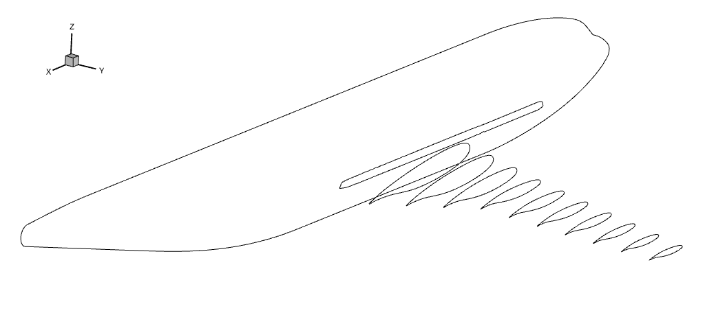
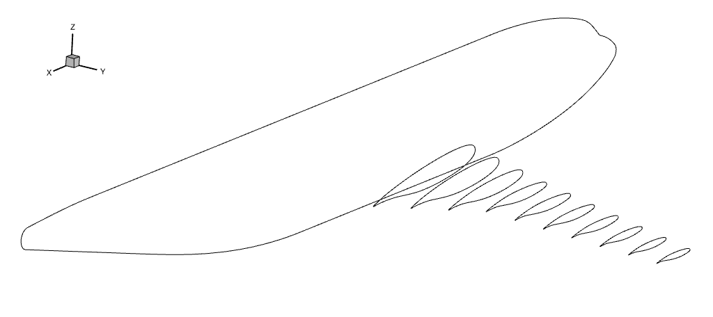

.. _intersection_analysis:

Aerodynamic Analysis
====================

For the rest of this tutorial, we will use ``INPUT/cfd/dlr-f6_vol.cgns`` as the CFD volume mesh.
This is an overset mesh that includes the fuselage, wing, and wing-fuselage collar meshes.
We start with running aerodynamic analysis.
The aerodynamic analysis script for a wing-fuselage configuration is largely the same as for a wing, as shown in ``aero_run.py``.

.. literalinclude:: ../tutorial/intersection/aero_run.py

One difference is that we use the ``cutCallback`` option when setting up ADflow.
This ensures that cells on the negative side of the y-axis are blanked.

.. literalinclude:: ../tutorial/intersection/SETUP/setup_adflow.py
   :start-after: # rst cutCallback (start)
   :end-before: # rst cutCallback (end)

The full setup scripts are in ``SETUP/setup_aeroproblem.py`` and ``SETUP/setup_adflow.py``.

Surface Families
----------------

For multi-component geometries, it is often convenient to define custom surface families in ADflow.
In this example, we create a ``wing_full`` family that combines the wing and wing collar meshes.
The resulting surface family comprises the entire wing surface.
This is useful for plotting the lift distribution and slices along the wing.

.. literalinclude:: ../tutorial/intersection/SETUP/setup_adflow.py
   :start-after: # rst families (start)
   :end-before: # rst families (end)

If we do not specify a ``groupName``, ADflow will use the ``allWalls`` family by default.
As the name suggests, this is a family that includes all wall surfaces.
For the fuselage slice, using ``allWalls`` is fine because we are taking a slice close to the symmetry plane where only the fuselage surface is present.
For the wing slices, using ``allWalls`` can result in a slice near the wing root that contains both the wing and fuselage, as shown below.

    Slices using only ``allWalls``

Using the custom ``wing_full`` family, we obtain a slice at the wing root that contains only the wing.

    Slices using ``wing_full`` for the wing slices
