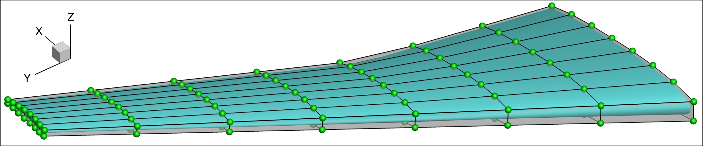
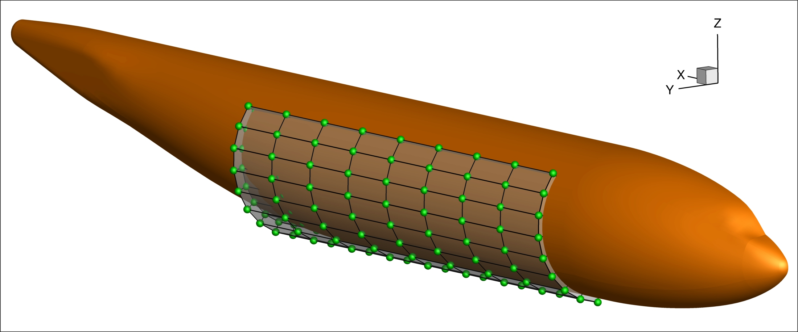
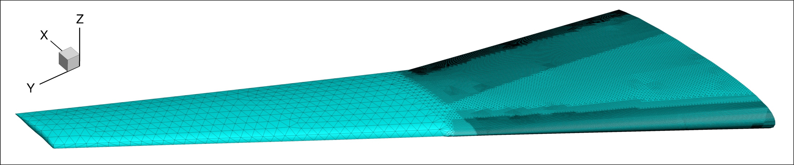
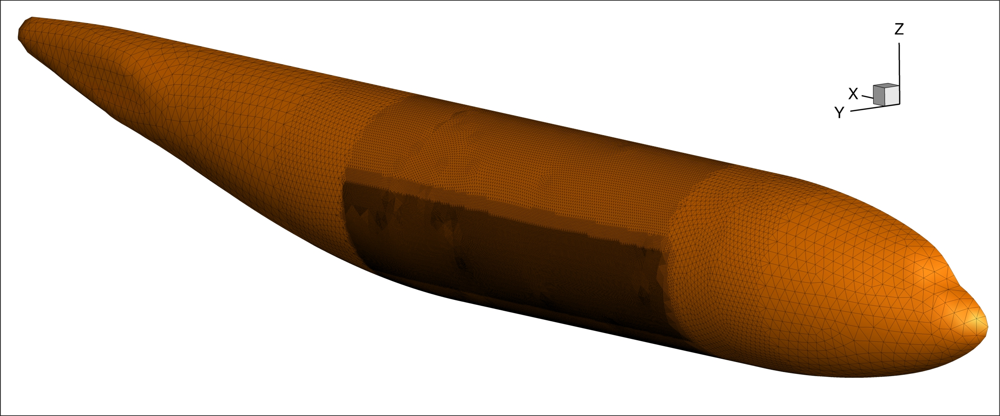
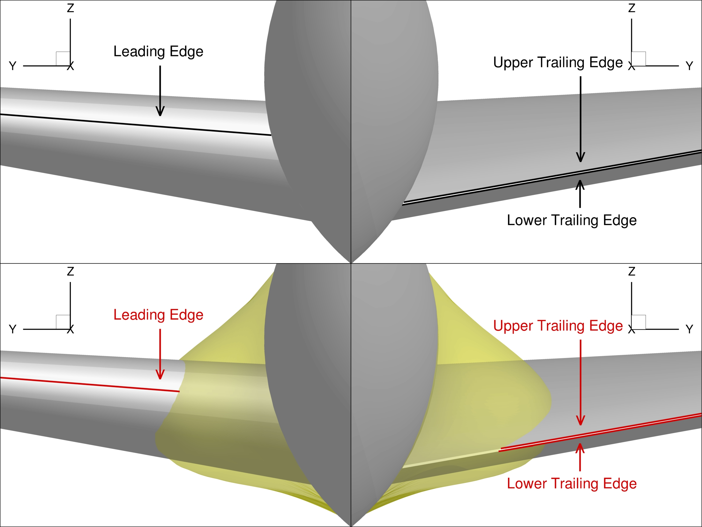
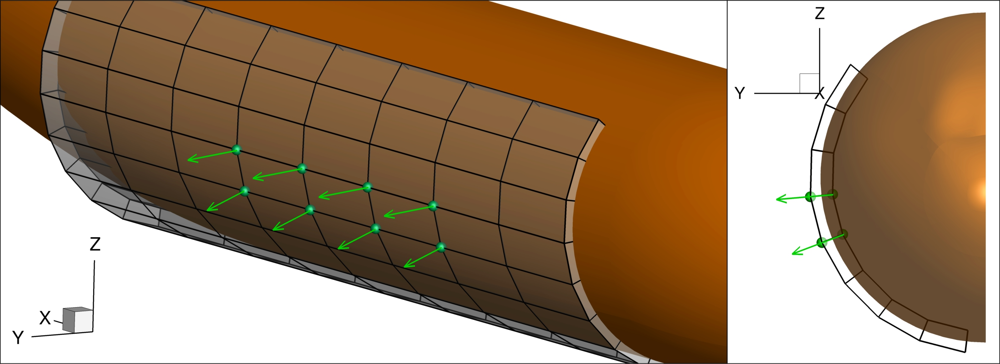

.. _intersection_geo:

Geometry Parameterization
=========================

This section will show you how to use :class:`DVGeometryMulti <pygeo:pygeo.parameterization.DVGeoMulti.DVGeometryMulti>` to set up a component-based geometry parameterization.
This will be the bulk of the work when optimizing with component intersections.

Component FFDs
--------------

For the DLR-F6 configuration, we will have two components: the wing and the fuselage.
We first need to create FFDs for each component, as shown below.

    Wing geometry and FFD control points

    Fuselage geometry and select FFD control points

The fuselage FFD control points shown here are from only one volume of the entire fuselage FFD.
We will define the fuselage design variables on this volume.
In general, a component FFD must fully embed the component.

The geometry setup is defined in ``SETUP/setup_dvgeo.py``.
We start by defining the path to the FFD files.

.. literalinclude:: ../tutorial/intersection/SETUP/setup_dvgeo.py
   :start-after: # rst ffd
   :end-before: # rst tri

Triangulated surfaces
---------------------

Each component also needs a triangulated surface mesh.
Triangulated surfaces are used to perform surface projections, compute intersections, and remesh curves.
The triangulated surfaces should be fine enough to accurately capture the surface curvature in areas of interest.
As a result, they are often much finer than the CFD surface meshes near component intersections.
Instructions for generating triangulated surface meshes using ICEM CFD are outlined in the :ref:`pySurf <pysurf:triangulated_meshes>` docs.

    Wing triangulated surface

    Fuselage triangulated surface

Similar to the FFD files, we define the path to the triangulated surface files in the setup script.

.. literalinclude:: ../tutorial/intersection/SETUP/setup_dvgeo.py
   :start-after: # rst tri
   :end-before: # rst featureCurves

Feature curves
--------------

Feature curves are used to preserve the mesh topology around important geometric features.
Points on feature curves will remain on the feature curves after deformation.
For a wing, we will usually define features curves on the leading and trailing edges, as shown below.

    Wing feature curves before and after deformation

Feature curves must be defined in the CGNS file for the triangulated surface mesh.
We collect the names of the relevant curves as the keys for a dictionary called ``featureCurves`` that will then be passed to DVGeometryMulti.
The values are the marching directions for each curve.
For the wing feature curves, we use ``2``, which means that the curve is remeshed in the positive y-direction.
We also define two feature curves on the fuselage symmetry plane.
These have a marching direction of ``None``, which means that the entire curve is remeshed.

.. literalinclude:: ../tutorial/intersection/SETUP/setup_dvgeo.py
   :start-after: # rst featureCurves
   :end-before: # rst curveEpsDict

We also define a ``curveEpsDict`` dictionary containing curve projection tolerances.
The keys of the dictionary are the curve names and the values are distances.
All points within the specified distance from the curve are considered to be on the curve.
In addition to the feature curves, we also define a tolerance for the intersection curve.

.. literalinclude:: ../tutorial/intersection/SETUP/setup_dvgeo.py
   :start-after: # rst curveEpsDict
   :end-before: # rst objects

DVGeometryMulti API
-------------------

We can now define the DVGeometryMulti object that will handle geometric operations during the optimization.
First, we use the FFD file paths we defined eariler to instantiate a DVGeometry object for each component FFD.
We then instantiate a DVGeometryMulti object.

.. note::
   If you are doing a multipoint problem, you must pass the ``comm`` object to DVGeometryMulti, that is, ``DVGeometryMulti(comm)``.
   Failure to do so may result in inaccurate derivatives.

.. literalinclude:: ../tutorial/intersection/SETUP/setup_dvgeo.py
   :start-after: # rst objects
   :end-before: # rst components

To this DVGeometryMulti object, we add the component DVGeometry objects using :meth:`addComponent <pygeo:pygeo.parameterization.DVGeoMulti.DVGeometryMulti.addComponent>`.
We define the list ``comps`` because accessing the entries of the list is less error prone than repeating the same string throughout the code.
We also pass the path to the triangulated surface file for each component and a scale factor.
Our triangulated surface meshes are defined in millimeters, whereas the CFD mesh is defined in metres.
We account for this difference by setting the scale factor equal to 0.001.

.. literalinclude:: ../tutorial/intersection/SETUP/setup_dvgeo.py
   :start-after: # rst components
   :end-before: # rst intersection

Finally, we define the intersection between the wing and fuselage using :meth:`addIntersection <pygeo:pygeo.parameterization.DVGeoMulti.DVGeometryMulti.addIntersection>`.
Here, we use the feature curve dictionaries we defined earlier.
You can find descriptions for each parameter in the :class:`DVGeometryMulti <pygeo:pygeo.parameterization.DVGeoMulti.DVGeometryMulti>` API documentation.

.. literalinclude:: ../tutorial/intersection/SETUP/setup_dvgeo.py
   :start-after: # rst intersection
   :end-before: # rst wing dvs

Wing design variables
---------------------

We can define design variables for the wing in the same way as for a wing-only optimization.
These design variables must then be added to the component DVGeometry object, not the DVGeometryMulti object.
The horizontal and vertical displacement variables are less conventional but follow the same ideas as a more conventional global design variable like twist.

.. literalinclude:: ../tutorial/intersection/SETUP/setup_dvgeo.py
   :start-after: # rst wing dvs
   :end-before: # rst fuse dvs

Fuselage design variables
-------------------------

We also define fuselage design variables using a few fuselage control points near the wing-fuselage intersection.
We want these points to move normal to the fuselage surface, as shown below.

    A few fuselage control points move normal to the fuselage surface

We use ``PointSelect`` to select which FFD control points should be able to move.
We then define local section design variables using these points.

.. literalinclude:: ../tutorial/intersection/SETUP/setup_dvgeo.py
   :start-after: # rst fuse dvs
   :end-before: # rst end

Defining local section design variables involves selecting the local 0, 1, 2 axis directions.
For the FFD volume of interest, setting ``secIndex="k"`` defines the 2-direction in the circumferential direction.
By default, ``orient0`` is ``None``, which results in the 0-direction pointing along the length of the fuselage.
This leaves the 1-direction as the radial direction.
By default, ``axis`` is ``1``, so the shape deformations are defined in the radial direction as expected.
See :meth:`addLocalSectionDV <pygeo:pygeo.parameterization.DVGeo.DVGeometry.addLocalSectionDV>` for details on how each direction is defined in general.

If we wanted to give the optimizer more freedom in changing the fuselage shape, we could add local shape variables in the y and z directions instead of specifying the normal direction.
This can be done by calling :meth:`addLocalDV <pygeo:pygeo.parameterization.DVGeo.DVGeometry.addLocalDV>` once with ``axis="y"`` and once with ``axis="z"``.

Geometric constraints
---------------------

Geometric constraints are defined in ``SETUP/setup_dvcon.py``.
When using wing shape variables, we define geometric constraints similar to a wing-only optimization.
However, there are some differences because we are dealing with multiple FFDs.

For leading edge and trailing edge constraints, we must pass the ``comp`` argument.
This defines which FFD the constraint is being applied to.

.. literalinclude:: ../tutorial/intersection/SETUP/setup_dvcon.py
   :start-after: # rst LE/TE (start)
   :end-before: # rst LE/TE (end)

For thickness constraints, we can pass the ``compNames`` argument.
This is not strictly required, but it reduces the computations required by DVGeometryMulti when adding and updating the point set.

.. literalinclude:: ../tutorial/intersection/SETUP/setup_dvcon.py
   :start-after: # rst thickness (start)
   :end-before: # rst thickness (end)
