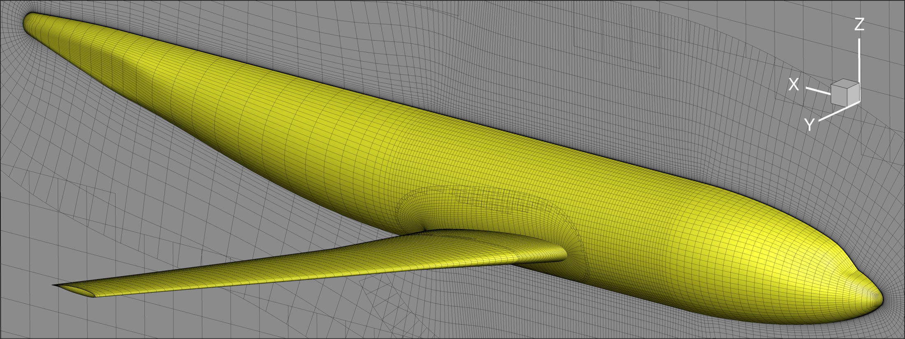

.. _intersection_overview:

Optimization with Component Intersections
=========================================

.. important::
    This tutorial is provided as a reference only.
    DVGeoMulti, the underlying code, is a research code.
    As such, it is highly experimental and support for it is not guaranteed.

Overview
--------
This is a tutorial for generating collar meshes and performing aerodynamic shape optimization with component intersections.
We use the DLR-F6 configuration as the example case.

    DLR-F6 configuration

This tutorial requires :doc:`pySurf <pysurf:index>` in addition to the standard MACH-Aero modules.
Before getting started, download the input files by running:

.. prompt:: bash

    ./get-input-files.sh

Directory Structure
-------------------
::

    intersection
    |-- INPUT
    |   |-- cfd
    |       |-- dlr-f6_vol.cgns
    |   |-- ffd
    |       |-- dlr-f6_fuse.xyz
    |       |-- dlr-f6_wing.xyz
    |   |-- tri
    |       |-- dlr-f6_fuse.cgns
    |       |-- dlr-f6_wing.cgns
    |-- SETUP
    |   |-- setup_aeroproblem.py
    |   |-- setup_adflow.py
    |   |-- setup_dvgeo.py
    |   |-- setup_dvcon.py
    |   |-- setup_idwarp.py
    |-- aero_opt.py
    |-- aero_run.py
    |-- get-input-files.sh
    |-- meshing
    |   |-- surface
    |       |-- dlr-f6_fuse.cgns
    |       |-- dlr-f6_wing.cgns
    |       |-- dlr-f6_fuse.igs
    |       |-- dlr-f6_wing.igs
    |       |-- dlr-f6_fuse.tin
    |       |-- dlr-f6_wing.tin
    |   |-- volume
    |       |-- collar_surf.cgns
    |       |-- run_pyhyp.py

.. toctree::
   :maxdepth: 1
   :caption: Table of Contents

   intersection_surface_collar
   intersection_volume_collar
   intersection_analysis
   intersection_geo
   intersection_opt
