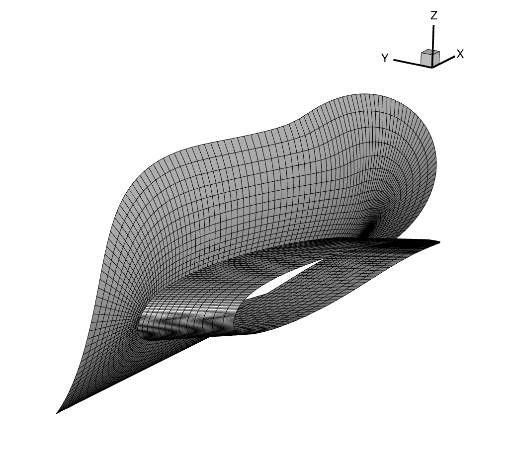
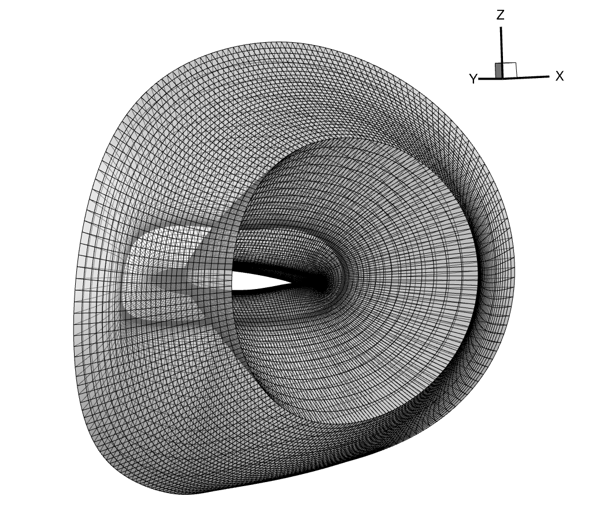

.. _intersection_volume_meshes:

Volume Collar Meshing
=====================

Collar meshes are one of the most challenging cases to extrude with hyperbolic meshing methods like :doc:`pyHyp <pyHyp:index>`.
Getting the extrusion to work with no negative quality cells or negative volumes may require extensive tuning of options.
The most common issue is grid lines crossing at the concave corner of the collar mesh.

Many of the default pyHyp options are tuned for wings or convex geometries.
Some options that may help with extruding collar meshes are:

* Increasing ``epsE``, ``epsI``, ``theta`` well beyond what is used for wings.
  These options are the most relevant for preventing grid lines from crossing.
  The example later in this page provides good starting points for values to use.
* Modifying ``slExp``.
  Increasing or decreasing this value slightly can help in cases when increasing dissipation alone does not help with grid lines crossing.
  The value should usually be between 0.1 and 0.3.
* Decreasing ``volSmoothIter``.
  Alternatively, you can use a volume smoothing schedule (``volSmoothSchedule``).
  Using fewer volume smoothing iterations near the wall will usually increase cell quality.
* Increasing ``volCoef``.
  Setting a value closer to 1.0 will help mesh quality away from the wall.
  This should be combined with decreasing ``volSmoothIter`` or using a smoothing schedule to ensure that volume smoothing near the wall is kept low.
* Decreasing ``volBlend``.
  Global volume blending usually does not improve collar meshes.
  Setting this close to zero (such as between 1e-6 and 1e-9) will result in better quality near the trailing edge.

More information about these options can be found in the :ref:`pyHyp options documentation <pyhyp:pyhyp_options>`.

We will now demonstrate collar mesh extrusion for the DLR-F6 configuration.
The relevant files are located in ``meshing/volume``.
The surface mesh shown below, ``collar_surf.cgns``, is a wing-fuselage collar generated in Pointwise.

    Wing-fuselage surface collar mesh

We extrude this surface mesh with pyHyp using the ``run_pyhyp.py`` script.

.. literalinclude:: ../tutorial/intersection/meshing/volume/run_pyhyp.py

In this example, using default dissipation and volume smoothing options would have still produced a valid volume mesh.
This surface collar mesh is relatively easy to extrude for two reasons.
First, the mesh is relatively coarse.
Finer meshes are usually more difficult to extrude.
Second, the fuselage collar block was generated using Pointwise's hyperbolic surface marching feature.
This will almost always produce higher quality meshes than manual meshing, especially at the trailing edge intersection.

The extruded volume mesh should look like the figure below.
To gain some intuition about collar mesh extrusion, try modifying the pyHyp options and see how this changes the volume mesh.

    Wing-fuselage volume collar mesh

.. note::

    Refer to the :ref:`MACH-Aero overset tutorial <mach-aero:overset_overview>` for overset theory and guidelines on assembling complete overset volume meshes.
    In addition, the tandem wing tutorial has tips on :ref:`visualizing overset connectivity <overset_ihcc>`.
