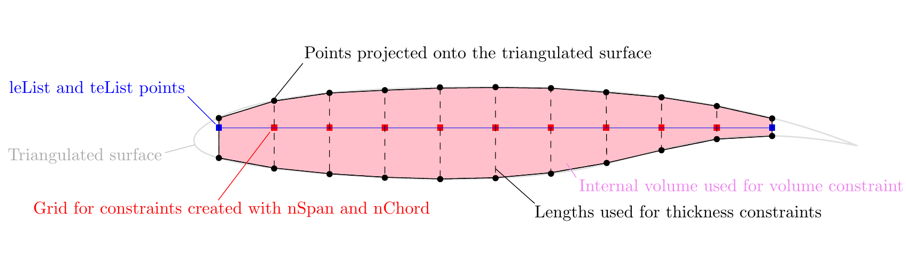
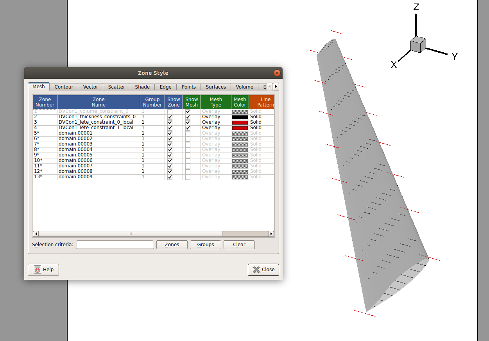
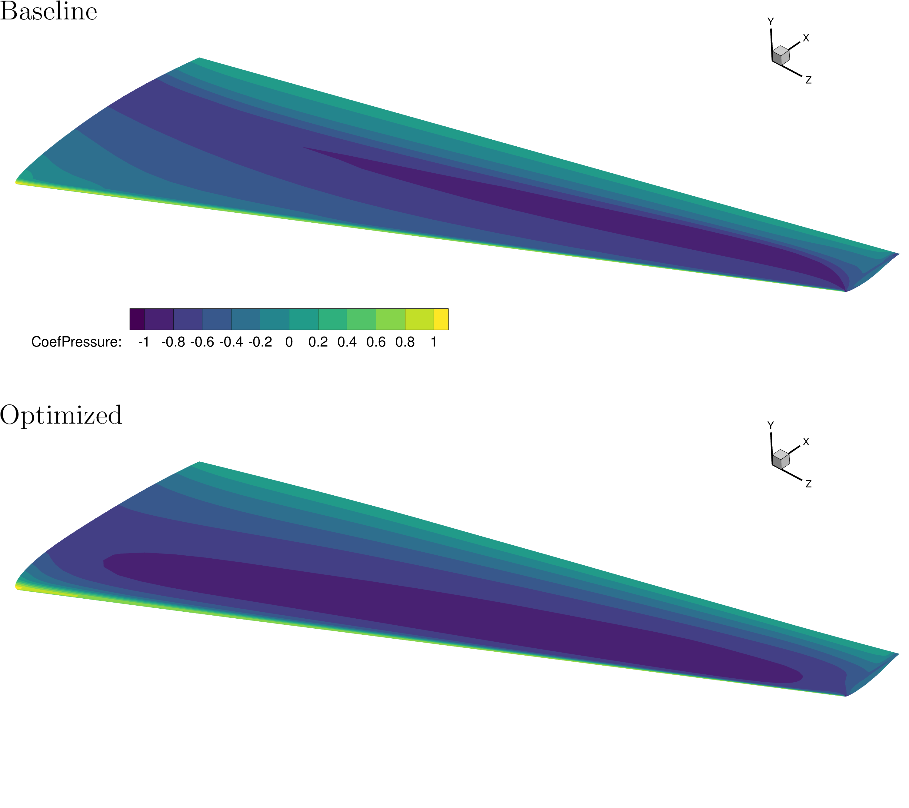
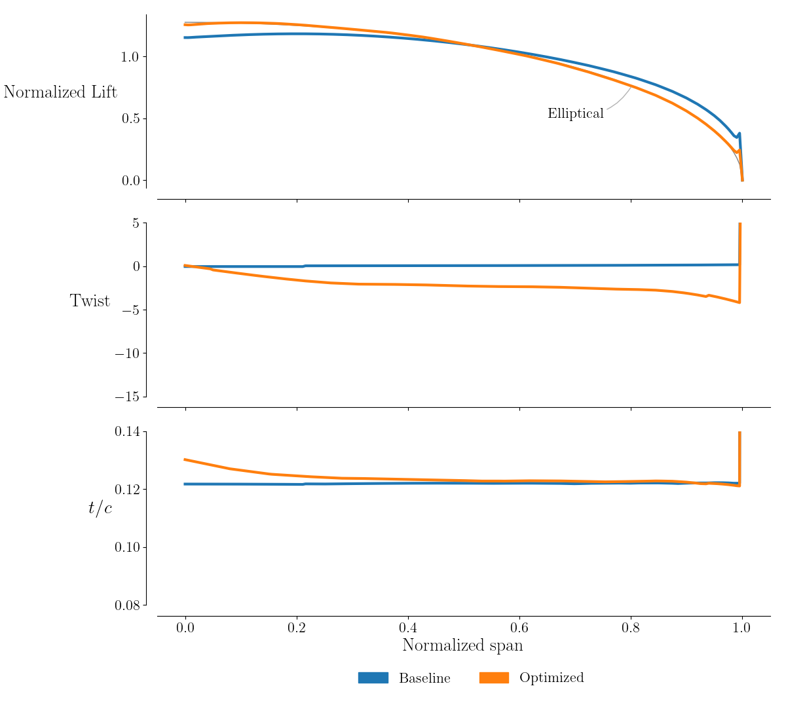
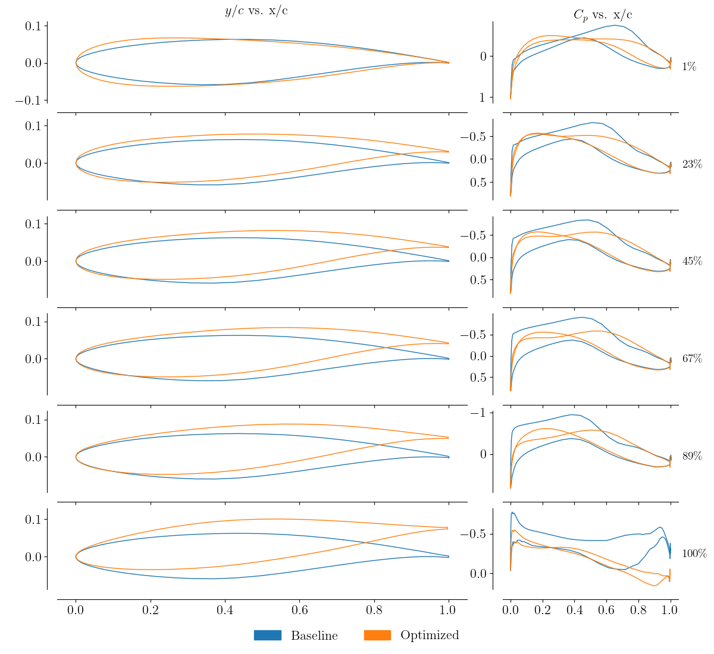

.. _opt_aero:

************************
Aerodynamic Optimization
************************

Introduction
============
We will now demonstrate how to optimize the aerodynamic shape of a wing.
We will be combining aspects of all of the following sections: :ref:`aero_adflow`, :ref:`opt_pyopt`, and :ref:`opt_ffd`.
The optimization problem is defined as

| *minimize*
|    :math:`C_D`
| *with respect to*
|    7 twist variables
|    96 shape variables
|    1 angle of attack
| *subject to*
|    :math:`C_L = 0.5`

Files
=====
Navigate to the directory ``opt/aero`` in your tutorial folder.
Copy the following files to this directory:

.. prompt:: bash

    cp ../ffd/ffd.xyz .
    cp ../../aero/meshing/volume/wing_vol.cgns .

Create the following empty runscript in the current directory:

- ``aero_opt.py``

Dissecting the aerodynamic optimization script
==============================================
Open the file ``aero_opt.py`` in your favorite text editor.
Then copy the code from each of the following sections into this file.

Import libraries
----------------
.. literalinclude:: ../tutorial/opt/aero/aero_opt.py
    :start-after: # rst Imports (beg)
    :end-before: # rst Imports (end)

The multipoint library is the only new library to include in this script.

Adding command line arguments
-----------------------------
This is a convenience feature that allows the user to pass in command line arguments to the script.
Two options are provided:

-  specifying the output directory
-  specifying the optimizer to be used

.. literalinclude:: ../tutorial/opt/aero/aero_opt.py
    :start-after: # rst args (beg)
    :end-before: # rst args (end)

Creating processor sets
-----------------------
The multiPointSparse class allows us to allocate sets of processors for different analyses.
This can be helpful if we want to consider multiple design points, each with a different set of flow conditions.
In this case, we create a processor set for cruise cases, but we only add one point.

.. literalinclude:: ../tutorial/opt/aero/aero_opt.py
    :start-after: # rst multipoint (beg)
    :end-before: # rst multipoint (end)

If we want to add more points, we can increase the quantity ``nMembers``.
We can choose the number of processors per point with the argument ``memberSizes``.
We can add another processor set with another call to ``addProcessorSet``.
The call ``createCommunicators`` returns information about the current processor's set.

ADflow set-up
-------------
The set-up for adflow should look the same as for the aerodynamic analysis script.
We add a single lift distribution with 200 sampling points.

.. literalinclude:: ../tutorial/opt/aero/aero_opt.py
    :start-after: # rst adflow (beg)
    :end-before: # rst adflow (end)

Set the AeroProblem
-------------------
.. literalinclude:: ../tutorial/opt/aero/aero_opt.py
    :start-after: # rst aeroproblem (beg)
    :end-before: # rst aeroproblem (end)

The only difference in setting up the AeroProblem is that now we add angle-of-attack as a design variable.
Any of the quantities included in the initialization of the AeroProblem can be added as design variables.

Geometric parametrization
-------------------------
The set-up for DVGeometry should look very familiar (if not, see :ref:`opt_ffd`).
We include twist and local variables in the optimization.
After setting up the DVGeometry instance we have to provide it to ADflow with the call ``setDVGeo``.

.. literalinclude:: ../tutorial/opt/aero/aero_opt.py
    :start-after: # rst dvgeo (beg)
    :end-before: # rst dvgeo (end)

Geometric constraints
---------------------
We can set up constraints on the geometry with the DVConstraints class, also found in the pyGeo module.
There are several built-in constraint functions within the DVConstraints class, including thickness, surface area, volume, location, and general linear constraints.
The majority of the constraints are defined based on a triangulated-surface representation of the wing obtained from ADflow.

.. note:: The triangulated surface is created by ADflow (or DAfoam) using the wall surfaces defined in the CFD volume mesh. The resolution is similar to the CFD surface mesh, and users do not need to provide this triangulated mesh themselves. Optionally, this can also be defined with an external file, see the docstrings for :meth:`setSurface() <pygeo:pygeo.DVConstraints.setSurface>`. This is useful if users want to have a different resolution on the triangulated surface (finer or coarser) compared to the CFD mesh, or if DVConstraints is being used without ADflow (or DAfoam).

The volume and thickness constraints are set up by creating a uniformly spaced 2D grid of points, which is then projected onto the upper and lower surface of a triangulated-surface representation of the wing.
The grid is defined by providing four corner points (using ``leList`` and ``teList``) and by specifying the number of spanwise and chordwise points (using ``nSpan`` and ``nChord``).

.. note:: These grid points are projected onto the triangulated surface along the normals of the ruled surface formed by these grid points. Typically, ``leList`` and ``teList`` are given such that the two curves lie in a plane. This ensures that the projection vectors are always exactly normal to this plane. If the surface formed by ``leList`` and ``teList`` is not planar, issues can arise near the end of an open surface (i.e., the root of a wing) which can result in failing intersections.

By default, ``scaled=True`` for ``addVolumeConstraint()`` and ``addThicknessConstraints2D()``, which means that the volume and thicknesses calculated will be scaled by the initial values (i.e., they will be normalized).
Therefore, ``lower=1.0`` in this example means that the lower limits for these constraints are the initial values (i.e., if ``lower=0.5`` then the lower limits would be half the initial volume and thicknesses).

.. warning:: The ``leList`` and ``teList`` points must lie completely inside the wing.

.. literalinclude:: ../tutorial/opt/aero/aero_opt.py
    :start-after: # rst dvconVolThick (beg)
    :end-before: # rst dvconVolThick (end)

For the volume constraint, the volume is computed by adding up the volumes of the prisms that make up the projected grid as illustrated in the following image (only showing a section for clarity).
For the thickness constraints, the distances between the upper and lower projected points are used, as illustrated in the following image.
During optimization, these projected points are also moved by the FFD, just like the wing surface, and are used again to calculate the thicknesses and volume for the new designs.
More information on the options can be found in the :doc:`pyGeo docs <pygeo:index>` or by looking at the pyGeo source code.

The LeTe constraints (short for Leading edge/Trailing edge constraints) are linear constraints based on the FFD control points.
When we have both twist and local shape variables, we want to prevent the local shape variables from creating a shearing twist.
This is done by constraining the upper and lower FFD control points on the leading and trailing edges to move in opposite directions.
Note that the LeTe constraint is not related to the ``leList`` and ``teList`` points discussed above.

.. literalinclude:: ../tutorial/opt/aero/aero_opt.py
    :start-after: # rst dvconLeTe (beg)
    :end-before: # rst dvconLeTe (end)

In this script ``DVCon.writeTecplot`` will save a file named ``constraints.dat`` which can be opened with Tecplot to visualize and check these constraints.
Since this is added here, before the commands that run the optimization, the file will correspond to the initial geometry.
The following image shows the constraints visualized with the wing surface superimposed.
This command can also be added at the end of the script to visualize the final constraints.

Mesh warping set-up
-------------------
.. literalinclude:: ../tutorial/opt/aero/aero_opt.py
    :start-after: # rst warp (beg)
    :end-before: # rst warp (end)

Optimization callback functions
-------------------------------
First we must set up a callback function and a sensitivity function for each processor set.
In this case ``cruiseFuncs`` and ``cruiseFuncsSens`` belong to the ``cruise`` processor set.
Then we need to set up an objCon function, which is used to create abstract functions of other functions.

.. literalinclude:: ../tutorial/opt/aero/aero_opt.py
    :start-after: # rst funcs (beg)
    :end-before: # rst funcs (end)

Now we will explain each of these callback functions.

cruiseFuncs
~~~~~~~~~~~
The input to ``cruiseFuncs`` is the dictionary of design variables.
First, we pass this dictionary to DVGeometry and AeroProblem to set their respective design variables.
Then we solve the flow solution given by the AeroProblem with ADflow.
Finally, we fill the ``funcs`` dictionary with the function values computed by DVConstraints and ADflow.
The call ``checkSolutionFailure`` checks ADflow to see if there was a failure in the solution (could be due to negative volumes or something more sinister).
If there was a failure it changes the ``fail`` flag in ``funcs`` to ``True``.
The ``funcs`` dictionary is the required return.

cruiseFuncsSens
~~~~~~~~~~~~~~~
The inputs to ``cruiseFuncsSens`` are the design variable and function dictionaries.
Inside ``cruiseFuncsSens`` we populate the ``funcsSens`` dictionary with the derivatives of each of the functions in ``cruiseFuncs`` with respect to all of its dependence variables.

objCon
~~~~~~
The main input to the ``objCon`` callback function is the dictionary of functions (which is a compilation of all the ``funcs`` dictionaries from each of the design points).
Inside ``objCon``, the user can define functionals (or functions of other functions).
For instance, to maximize L/D, you could define the objective function as::

    funcs['obj'] = funcs['cl'] / funcs['cd']

The ``objCon`` function is processed within the multipoint module and the partial derivatives of any functionals with respect to the input functions are automatically computed with the complex-step method.
This means that the user doesn't have to worry about computing analytic derivatives for the simple functionals defined in ``objCon``.
The ``printOK`` input is a boolean that is False when the complex-step is in process.

Optimization problem
--------------------
Setting up the optimization problem follows the same format as before, only now we incorporate multiPointSparse.
When creating the instance of the Optimization problem, ``MP.obj`` is given as the objective function.
multiPointSparse will take care of calling both ``cruiseFuncs`` and ``objCon`` to provide the full ``funcs`` dictionary to pyOptSparse.

Both AeroProblem and DVGeometry have built-in functions to add all of their respective design variables to the optimization problem.
DVConstraints also has a built-in function to add all constraints to the optimization problem.
The user must manually add any constraints that were defined in ``objCon``.

Finally, we need to tell multiPointSparse which callback functions belong to which processor set.
We also need to provide it with the objCon and the optProb.
The call ``optProb.printSparsity()`` prints out the constraint Jacobian at the beginning of the optimization.

.. literalinclude:: ../tutorial/opt/aero/aero_opt.py
    :start-after: # rst optprob (beg)
    :end-before: # rst optprob (end)

Run optimization
----------------
To finish up, we choose the optimizer and then run the optimization.

.. literalinclude:: ../tutorial/opt/aero/aero_opt.py
    :start-after: # rst optimizer

.. note::
    The complete set of options for ``SNOPT`` can be found in :ref:`the pyOptSparse documentation <pyoptsparse:snopt>`.
    It is useful to remember that you can include major iterations information in the history file by providing the proper options.
    It has been observed that the ``_print`` and ``_summary`` files occasionally fail to be updated, possibly due to unknown hardware issues on GreatLakes.
    The problem is not common, but if you want to avoid losing this information, you might back it up in the history file.
    This would allow you monitor the optimization even if the ``_print`` and ``_summary`` files are not being updated.
    Note that the size of the history file will increase due to this additional data.

Run it yourself!
================
To run the script, use the ``mpirun`` and place the total number of processors after the ``-np`` argument

.. prompt:: bash

    mpirun -np 4 python aero_opt.py

You can follow the progress of the optimization using OptView, as explained in :ref:`opt_pyopt`.

Terminal output
---------------
An important step of verifyting the optimization setup is to check the sparsity structure of the constraint Jacobian::

    +-------------------------------------------------------------------------------+
    |                   Sparsity structure of constraint Jacobian                   |
    +-------------------------------------------------------------------------------+
                                             alpha_wing (1)   twist (7)   local (96)
                                            +---------------------------------------+
             DVCon1_volume_constraint_0 (1) |              |     X     |      X     |
                                            -----------------------------------------
       DVCon1_thickness_constraints_0 (100) |              |     X     |      X     |
                                            -----------------------------------------
      DVCon1_lete_constraint_0_local(L) (8) |              |           |      X     |
                                            -----------------------------------------
      DVCon1_lete_constraint_1_local(L) (8) |              |           |      X     |
                                            -----------------------------------------
                            cl_con_wing (1) |       X      |     X     |      X     |
                                            +---------------------------------------+

Postprocessing the solution output
==================================
All output is found in the ``output`` directory.
The naming scheme of the files follows in general ``<name>_<iter>_<type>.<ext>``, where the ``<name>`` is aeroproblem, ``<iter>`` is the function evaluation number, ``<type>`` is the solution type (surface, volume, lift, slices, ect.), and ``<ext>`` is the file extension.
The solution files (``.dat``, ``.cgns`` or ``.plt``) can be viewed in the Tecplot.
A contour plot of the pressure coefficient compared with the surface solution from the :ref:`aero_adflow` is shown below.

Similarly, as done in :ref:`aero_adflow`, the lift and slice files (``.dat``) are used to compare the spanwise normalized lift, compared to elliptical lift, the twist distribution, and t/c.
For the slice file, here the normalized airfoil shape and pressure coefficient are shown.
The optimized design achieves an elliptical lift distribution, and shows a more even and gradual pressure distribution as shown by the contour and section plots.
Further, the optimized twist distribution, as expected, demonstrates higher lift in the outboard section of the wing.

Finally the optimization history can be viewed either by parsing the database or using OptView.
Here the former is done showing the major iterations of the history, objective, and some of the design variables and constraints.
To produce the figure, run the accompanying postprocessing script as shown below.

.. prompt:: bash

    python plot_optHist.py --histFile output/opt.hst --outputDir output/

.. figure:: images/aero_wing_opt_hist.png
    :scale: 45
    :align: center
    :alt: Optimization history
    :figclass: align-center
