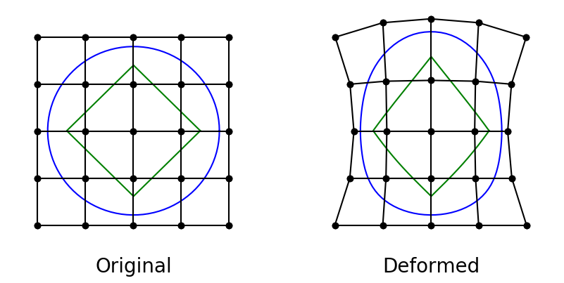
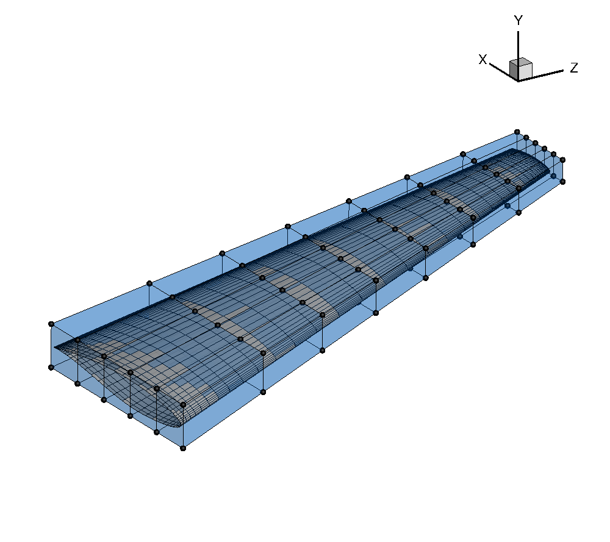
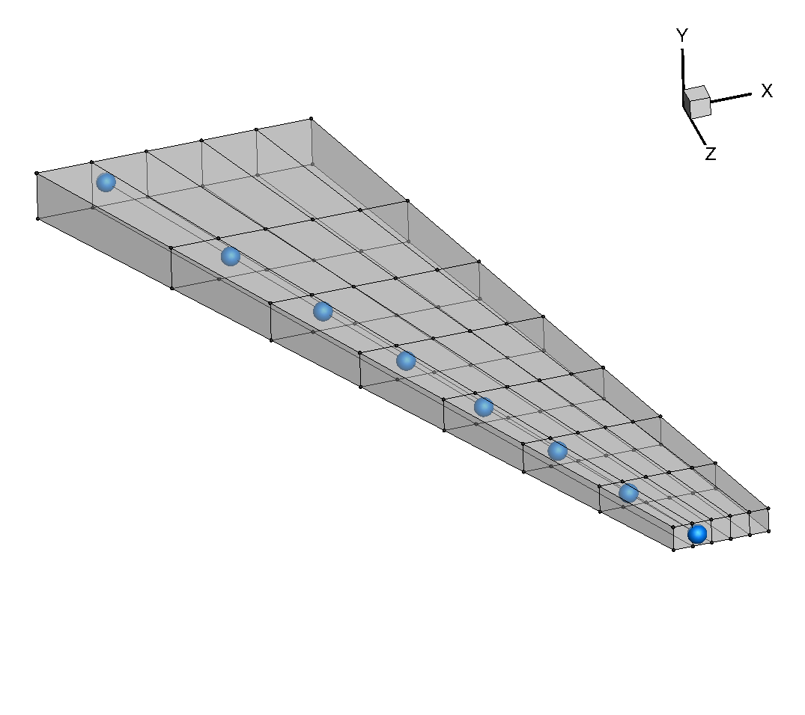
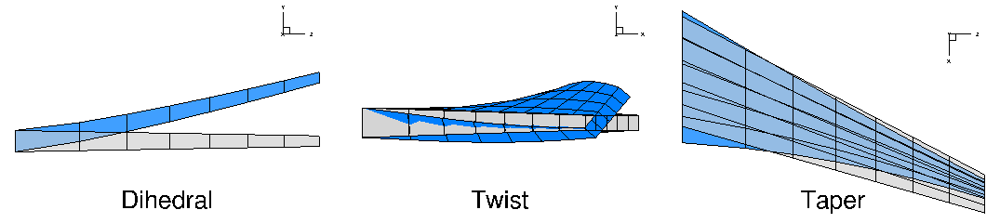
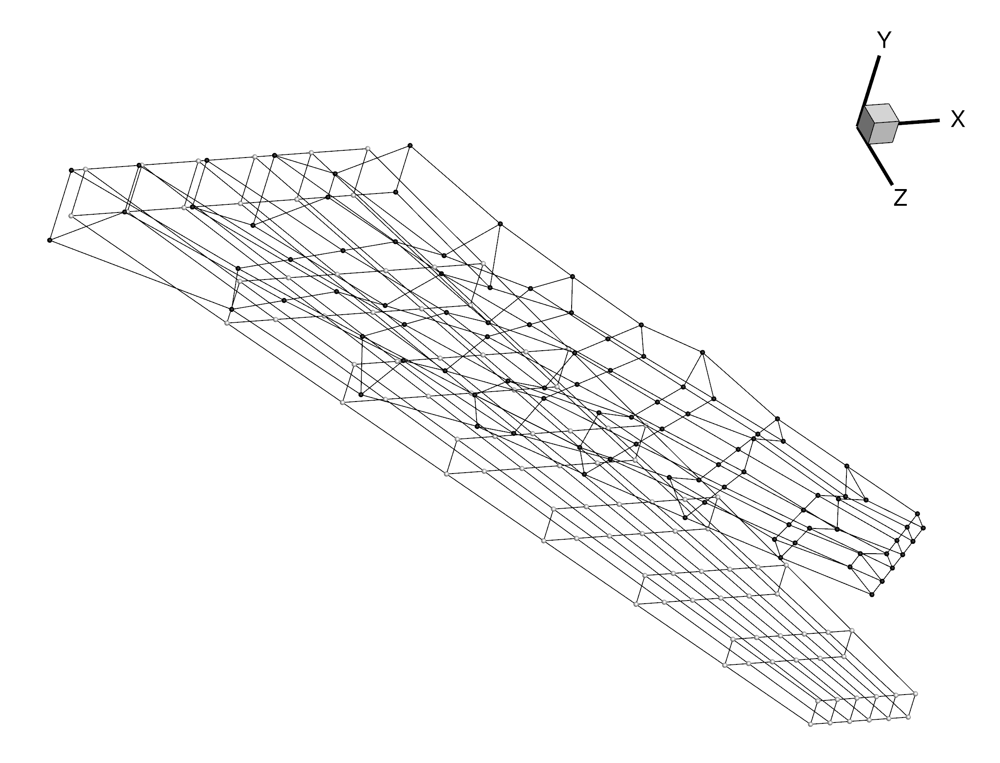
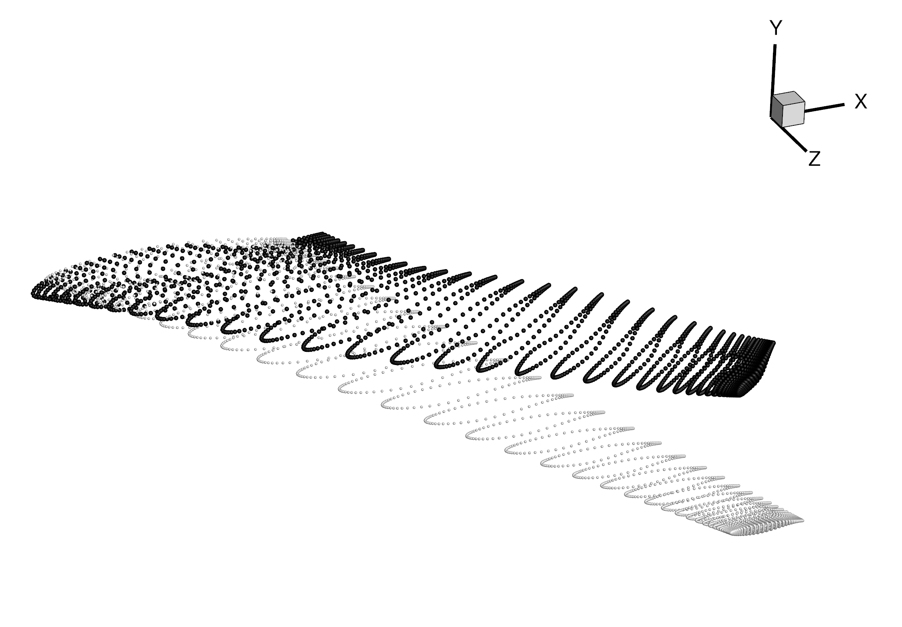

.. _opt_ffd:

*************************
Geometric Parametrization
*************************

Introduction
================================================================================
In order to optimize the shape of a geometry such as an airfoil or a wing, we need some way to translate design variables into actual changes in the shape.
We use the Free-form deformation (FFD) technique, popularized by Tom Sederberg in the world of computer-aided graphic design, as our parametrization method.
The FFD is a mapping of a region in 2D or 3D that is bounded by a set of B-splines.
Every point with the region is mapped to a new location based on the deformation of the bounding B-spline curves.
The B-splines themselves are defined by control points, so by adjusting the positions of these control points, we can have a great deal of control over any points embedded in the FFD volume (as shown in the figure below).
Since both our CFD meshes and finite element models are point-based, we can embed them in the FFD and give the optimizer control over their shape.

The actual implementation of the FFD method is housed in the pyGeo repository, which we were already introduced to in the very beginning of the tutorial.
The specific file to look for is ``pygeo/DVGeometry.py``.
Before diving into the parametrization, however, we need to generate an FFD, which is basically a 3D grid in the plot3d format.

Files
================================================================================
Navigate to the directory ``opt/ffd`` in your tutorial folder.
Copy the following files from the MACH-Aero repository::

    $ cp MACH-Aero/tutorial/opt/ffd/simple_ffd.py .

Also copy the volume mesh from the MACH-Aero repository::

    $ cp MACH-Aero/tutorial/aero/analysis/wing_vol.cgns .

Create the following empty runscript in the current directory:

- ``parametrize.py``

Creating an FFD volume
======================
As mentioned above, the actual definition of an FFD volume is simply a 3D grid of points.
We can create this by hand in a meshing software like ICEM, or for very simple cases, we can generate it with a script.
There is also a function `write_wing_FFD_file` in `pygeo/geo_utils.py` that you can use to generate a simple FFD by specifying slices and point distributions.
For this tutorial, we are dealing with a relatively simple wing geometry---straight edges, no kink, no dihedral---so we will just use the script approach.
This script is not very generalizable though, so it is not part of the MACH library.
I will explain briefly how it works, but I won't give it the same attention as the other scripts we use in this tutorial.

Open the script ``simple_ffd.py`` in your favorite text editor.

Specify bounds of FFD volume
----------------------------
We need to define the dimensions of the grid at the root and the tip, and the script will interpolate between them to obtain the full 3D grid.
We also need to specify the number of control points we want along each dimension of the FFD grid.

.. literalinclude:: ../tutorial/opt/ffd/simple_ffd.py
    :start-after: # rst Dimensions
    :end-before: # rst Compute

Compute FFD nodes
-----------------
This next section just computes the nodes of the FFD grid based on the information we have provided.
The vector ``span_dist`` gives the spanwise distribution of the FFD sections, which can be varied based by the user.
Here we use a distribution that varies from wider spacing at the root to narrower spacing at the tip.

.. literalinclude:: ../tutorial/opt/ffd/simple_ffd.py
    :start-after: # rst Compute
    :end-before: # rst Write

Write to file
-------------
Finally we write to file, using the plot3d format.

.. literalinclude:: ../tutorial/opt/ffd/simple_ffd.py
    :start-after: # rst Write

Generate the FFD
----------------
Run the script with the command::

    $ python simple_ffd.py

Visualizing the FFD
-------------------
The wing surface mesh should fit inside the FFD volume.
We can check this by viewing the mesh and the FFD volume in Tecplot.

Setting up a geometric parametrization with DVGeometry
======================================================
Open the file ``parametrize.py`` in your favorite text editor.
Then copy the code from each of the following sections into this file.

Import libraries
----------------
.. literalinclude:: ../tutorial/opt/ffd/parametrize.py
    :start-after: # rst Import libraries
    :end-before: # rst Create DVGeometry object

As mentioned in the introduction, the geometric parametrization code is housed in the DVGeometry class which resides in the pyGeo module.
So to begin with, we import DVGeometry from pyGeo.
We also import IDWarp so that we can use one of its functions to obtain surface coordinates from our volume mesh.

Instantiate DVGeometry
----------------------
All that is needed to create an instance of the DVGeometry class is an FFD file in the plot3d format.
Usually we call the DVGeometry instance ``DVGeo``.

.. literalinclude:: ../tutorial/opt/ffd/parametrize.py
    :start-after: # rst Create DVGeometry object
    :end-before: # rst Create reference axis

Define the variables
--------------------
As explained in the introduction, the shape embedded inside the FFD is controlled by the movement of the control points which define the FFD volume.
Although the most general parametrization would give the optimizer complete control over the x, y, and z coordinates of the FFD control points, in practice this is currently impractical.
There are an infinite number of shapes that could be created by adjusting the positions of all the control points, but the majority of these shapes are nonphysical or bad designs.
We can reduce the design space to eliminate the undesirable shapes by parametrizing the geometry with more intuitive design variables.
For instance, in wing design, we commonly compartmentalize the parametrization into a local and a global definition.
The local definition refers to the shape of the airfoil cross-section at a given spanwise position of the wing.
The local airfoil shape can be controlled by the independent adjustment of FFD control points perpendicular to the local cross-sectional plane.
On the other hand, the global definition of the wing would be in terms of parameters such as span, sweep, dihedral, and twist.
These parameters can be controlled by moving groups of FFD control points simultaneously in a certain fashion.
DVGeometry gives us the flexibility to maintain both global and local control over the design shape.
First we will explain the global variables and then the local variables.

Reference Axis
~~~~~~~~~~~~~~
The first step in defining the global design variables is to set up a reference axis.
The reference axis is a B-spline embedded in the FFD volume.
For a wing, we can generate this reference axis simply by stating the fraction of the chord length at which it should be placed and the index of the FFD volume along which it should extend.

.. literalinclude:: ../tutorial/opt/ffd/parametrize.py
    :start-after: # rst Create reference axis
    :end-before: # rst Dihedral

In this example, the reference axis is placed at the quarter-chord along the spanwise direction with control points defined at each section of FFD control points.
The name of the reference axis is "wing".
The call to ``addRefAxis`` returns the number of control points in the reference axis B-spline.
The reference axis can also be defined explicitly by giving a pySpline curve object to DVGeometry.

What role does the reference axis play in the definition of global variables?
In the initialization step, each FFD control point is projected onto the reference axis and given a parametric position based on that projection.
The reference axis is a B-spline defined by control points, and DVGeometry is set up to automatically apply any change in the position of the reference axis control points to the FFD control points based on their parametric projected position along the reference axis.
Beyond controlling the position of the reference axis control points, there are also built-in functions to handle the rotation and scaling of the FFD volume along the reference axis.
The user can tailor the global design variables to the design problem at hand through the use of callback functions.
We will go through a few examples.

Dihedral
~~~~~~~~
.. literalinclude:: ../tutorial/opt/ffd/parametrize.py
    :start-after: # rst Dihedral
    :end-before: # rst Twist

For every callback function, the required inputs are ``val``, which contains the design variable array, and ``geo``, which will contain the DVGeo object.
In this example, we first extract the coordinates of the reference axis control points with the function ``extractCoef``.
Then we loop through the control points, starting with the 2nd station, and add a displacement in the y-direction (which in this case creates dihedral).
We start at the 2nd control point because the position of the root of the wing should remain fixed.
Finally, we restore the new control point coordinates to DVGeo with the call ``restoreCoef``.

Twist
~~~~~
.. literalinclude:: ../tutorial/opt/ffd/parametrize.py
    :start-after: # rst Twist
    :end-before: # rst Taper

The twist function makes use of the built-in rotation functions in DVGeometry.
In the callback function, we loop through a dictionary containing the values of rotation about the z-axis for the "wing" reference axis.
We set a rotation value (in degrees) for all of the reference control points except the first.
We exclude the first control point because we already provide the optimizer with an angle-of-attack variable to control the global incidence of the wing.
Twisting about the x and y axes is provided through the ``rot_x`` and ``rot_y`` dictionaries.

Taper
~~~~~
.. literalinclude:: ../tutorial/opt/ffd/parametrize.py
    :start-after: # rst Taper
    :end-before: # rst Add global dvs

Here we define a taper variable, which controls the chord length of the root and tip airfoils and does a linear interpolation for the chords in between.
First, we extract the normalized position of the reference axis control points with the call ``extractS``.
This gives a vector from 0 to 1 with the relative positions of the control points.
Then we compute the slope of the chord function between the root and tip airfoils.
Finally, we loop through all of the control points and set a scaling factor in the ``scale_x`` dictionary progressing linearly from ``val[0]`` at the root to ``val[1]`` at the tip.
The ``scale_x`` dictionary is used in another built-in function which will scale the FFD volume in the x-direction.
Additional scaling dictionaries include ``scale_y``, ``scale_z``, and ``scale``, of which the latter scales uniformly in all directions.

.. note:: 

    Be aware that ``scale_x``, ``scale_y``, ``scale_z``, and ``scale`` are sectional attributes and only work on scaling planes perpendicular to the reference axis, i.e. do not have any effect along the spanwise axis of your FFD grid. In this example, if you use ``scale`` you will see that the wing gets `inflated` along the x and y axis, but the wing span remains identical.

    Planform variables such as span, and sweep should only ever be done by moving the ref axis control points. This can be done using the :meth:`.extractCoef() <pygeo:pygeo.DVGeometry.extractCoef>` and :meth:`.restoreCoef() <pygeo:pygeo.DVGeometry.restoreCoef>` (as done here for dihedral angle) and possibly normalizing the section / control points displacement w.r.t. the baseline FFD grid.

Adding global variables
~~~~~~~~~~~~~~~~~~~~~~~
We have now defined the callback functions for the global design variables, but we have yet to add the variables themselves.
This is done with the call ``addGeoDVGlobal``.

.. literalinclude:: ../tutorial/opt/ffd/parametrize.py
    :start-after: # rst Add global dvs
    :end-before: # rst Add local dvs

We must provide a variable name, initial value, callback function, bounds, and scaling factor.
The ``value`` input must be the size of the design variable vector, but the bounds and scaling factor can be scalars if they are to be applied uniformly to the entire design variable group.

Adding local variables
~~~~~~~~~~~~~~~~~~~~~~
Local variables are not nearly as complicated because they are simply displacements of the FFD control points in a given direction.
There are two options for defining local design variables.
Only one of these should be used at one time.

.. literalinclude:: ../tutorial/opt/ffd/parametrize.py
    :start-after: # rst Add local dvs
    :end-before: # rst Embed points

The first, ``addGeoDVLocal``, allows displacement along one of the global coordinate axes (x, y, or z).
The other options, ``addGeoDVSectionLocal``, defines the displacement direction based on the plane of the FFD section to which the given control point belongs.
On a wing with a winglet, the latter option is more useful because it allow control of the airfoil sections along the axis of the winglet, which has a different orientation than the main wing.
This function requires the input ``secIndex`` which gives the FFD index along which the section planes should be computed (in this case, that is the same as the direction of the reference axis).
The user can also choose the axis of the section's local coordinate system along which the points will be translated (``axis=1`` chooses the direction perpendicular to the wing surface).

Test the design variables
-------------------------
In a normal optimization script, the foregoing code is sufficient to set up the geometric parametrization.
However, in this script we want to test the behavior of the variables we have defined.
The following snippets of code allow us to manually change the design variables and view the results.

Embed points
~~~~~~~~~~~~
First we have to embed at least one point set in the FFD.
Normally, ADflow automatically embeds the surface mesh nodes in the FFD, but here we will embed surface coordinates obtained using IDWarp's ``getSurfaceCoordinates`` function (just for this example without ADflow).

.. literalinclude:: ../tutorial/opt/ffd/parametrize.py
    :start-after: # rst Embed points
    :end-before: # rst Change dvs

Change the design variables
~~~~~~~~~~~~~~~~~~~~~~~~~~~
We can retrieve a dictionary with the current state of all of the variables with the call ``getValues()``.
To adjust the variables, simply change the values in each variable array.
Once this is done, you can return the new values with the call ``setDesignVars``.

.. literalinclude:: ../tutorial/opt/ffd/parametrize.py
    :start-after: # rst Change dvs
    :end-before: # rst Update

Write deformed FFD to file
~~~~~~~~~~~~~~~~~~~~~~~~~~
The ``update`` function actually computes the new shape of the FFD and the new locations of the embedded points.
We can view the current shape of the FFD by calling ``writePlot3d``.
We can also view the updated surface coordinates by calling ``writePointSet``.

.. literalinclude:: ../tutorial/opt/ffd/parametrize.py
    :start-after: # rst Update

Run it yourself!
================
Once you have generated the FFD with ``simple_ffd.py`` you can try out different design variables by running
::

    $ python parametrize.py

You can view the results in Tecplot.

The following shows the deformed (darker points) and undeformed FFD grids (visualized by selecting ``Scatter`` and ``Mesh`` under ``Show zone layers`` in tecplot, then changing the ``Symbol shape`` to ``Sphere`` under ``Zone Style...``).

The following shows the deformed (darker points) and undeformed surface coordinates.

Experiment with creating new global design variables like span or sweep.
