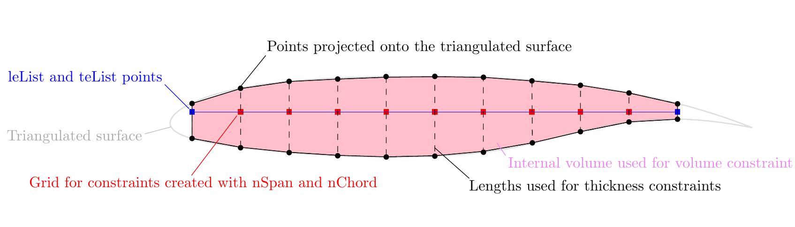

.. _opt_aero_pack:

***************************************************
Aerodynamic Optimization with Packaging Constraints
***************************************************

Introduction
============

Like :ref:`opt_aero`, this case demonstrates the aerodynamic shape optimization of a wing.
Unlike the simpler geometric constraints found in that case, this optimization uses a a spatial integration, or packaging, constraint.
This constraint and its applications are detailed in these papers: `[1] <http://www.umich.edu/~mdolaboratory/pdf/Brelje2020a.pdf>`__, `[2] <http://www.umich.edu/~mdolaboratory/pdf/Brelje2019c.pdf>`__, `[3] <http://www.umich.edu/~mdolaboratory/pdf/Brelje2021a.pdf>`__, and `[4] <https://www.researchgate.net/profile/Hannah_Hajdik/publication/371071558_Combined_systems_packaging_and_aerodynamic_shape_optimization_of_a_full_aircraft_configuration/links/6470ef476fb1d1682b0d13bb/Combined-systems-packaging-and-aerodynamic-shape-optimization-of-a-full-aircraft-configuration.pdf>`__. 

Unlike the other geometric constraints which are calculated in :doc:`pyGeo <pygeo:index>`, the spatial integration constraint is calculated in GeoGrad.
Geograd is a Fortran package which must be installed separately but is available on the Docker image :ref:`dockerInstructions`.

Delete thickness and volume constraints?

| *minimize*
|    :math:`C_D`
| *by varying*
|    7 twist variables
|    96 shape variables
|    1 angle of attack
| *subject to*
|    :math:`C_L = 0.5`
|    :math:`V \ge V_0`
|    :math:`t \ge t_0`
|    :math:`\Delta z_\text{LETE, upper} = -\Delta z_{LETE, lower}`
|    :math:`KS_{\{textmin dist}} \< 0`
|    :math:`\text{intersection length} \< 0`

Files
=====
Navigate to the directory ``opt/aero`` in your tutorial folder.
Copy the following files to this directory:

.. prompt:: bash

    cp ../opt/ffd/ffd.xyz .
    cp ../aero/meshing/volume/wing_vol.cgns .
    cp ../opt/aero/aero_opt.py .

Dissecting the aerodynamic optimization script
==============================================

Imports
-------
.. literalinclude:: ../tutorial/packopt/aero_opt_pack.py
    :start-after: # rst dvconVolThick (beg)
    :end-before: # rst dvconVolThick (end)

The same imports are needed as for the base optimization with the addition of 

.. promt:: python
    from stl import mesh

Pointset setup
-------------------
.. literalinclude:: ../tutorial/packopt/aero_opt_pack.py
    :start-after: # rst dvconVolThick (beg)
    :end-before: # rst dvconVolThick (end)

This is changed slightly from the original script to add an option to :meth:`~pygeo:pygeo.constraints.DVCon.DVConstraints.setSurface`

.. promt:: python
    addToDVGeo=True

Packaging constraint setup
--------------------------
.. literalinclude:: ../tutorial/packopt/aero_opt_pack.py
    :start-after: # rst dvconTriSurf (beg)
    :end-before: # rst dvconTriSurf (end)

This adds the constraint to the optimization problem.
The points from the STL are imported to add to ``DVCon`` as a surface.
Then the constraint can be added with the call to :meth:`~pygeo:pygeo.constraints.DVCon.DVConstraints.addTriangulatedSurfaceConstraint`.

The options used in this case mean that external surface, the first ``surface`` and ``DVGeo name`` is made up of the aerodynamic mesh and our main ``DVGeo`` object.
The internal object, the second set of options, is made up of the cylinder surface we created and does not have a ``DVGeo`` object attached to it.
This means that the cylinder does not have the ability to deform in this case but it is possible to have a separate ``DVGeo`` object and design variables added to it.

The rest of the options affect the math of the constraint.
``rho`` determines how tight the packaging is.
Higher values lead to tighter packaging but a more ill-conditioned problem.
``max_perim`` allows a certain amount of intersection between the two objects.

The options for this constraint are further explained in the function docstring.
