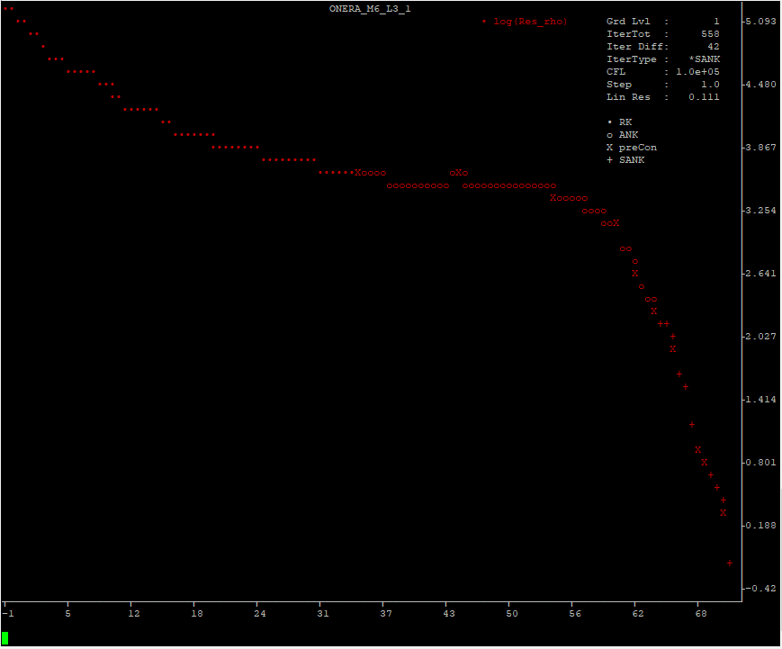
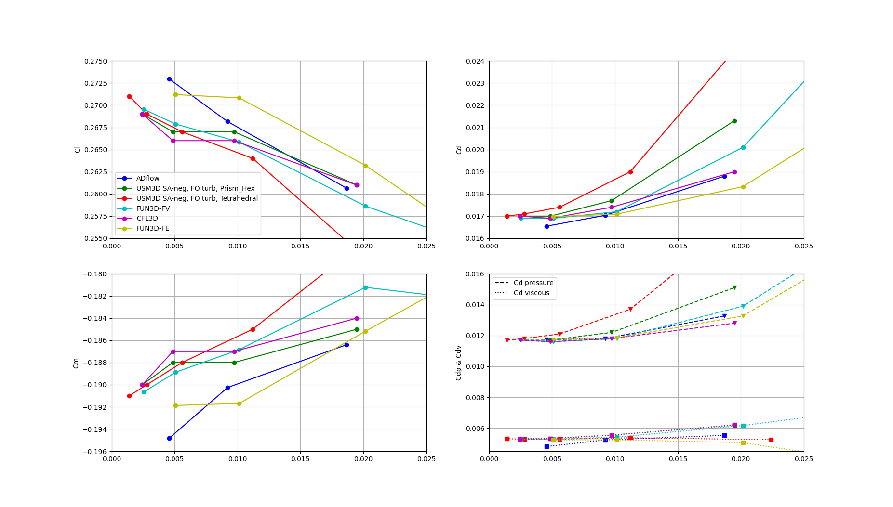

.. _overset_analysis:

*******************************************************
CFD Analysis
*******************************************************

Introduction
============

This part will help guide you through the analysis part. We will setup the run script and let ADflow compute the
solution. From :cite:`nasaM6real` and :cite:`nasaM6SA`
we know the flow conditions:

+--------------------+---------+
| AoA                | 3.06°   |
+--------------------+---------+
| Mach               | 0.8395  |
+--------------------+---------+
| Reynolds Number    | 11.71e6 |
+--------------------+---------+
| Reynolds Ref Length| 0.646m  |
+--------------------+---------+
| Temperature        | 300° K  |
+--------------------+---------+

There is a convenience package for ADflow called
`adflow_util <https://github.com/DavidAnderegg/adflow_util>`_\. It allows to plot the ADflow state variables live in the console and
handles some annoying stuff like creating the ``output`` folder for ADflow automatically. It also makes it easy
to sweep a variable, for example ``alpha``. This utility will be used here, but the regular python API,
that is detailed in other tutorials, would work as well.

For simplicity, only the calculation on the ``L3`` mesh is covered. The other meshes might require slightly different ADflow options.

Files
=====
Navigate to the directory ``overset/analysis`` in your tutorial folder and create an empty file called
``run_adflow_L3.py``. If you did not create the volume mesh on the previous page, you will also have to
copy the mesh file:

.. prompt:: bash

    cp tutorial/overset/analysis/ONERA_M6_L3.cgns .

If you want to use ``adflow_util`` download and install it:

.. prompt:: bash

    pip install git+https://github.com/DavidAnderegg/adflow_util.git

ADflow
======

Setup the Script
----------------

First we have to import ``adflow_util``:

.. literalinclude:: ../tutorial/overset/analysis/run_adflow_L3.py
   :start-after: # rst Imports (beg)
   :end-before: # rst Imports (end)

Then we define a variable for the level we want to use. This makes it easier to switch, if we want to:

.. literalinclude:: ../tutorial/overset/analysis/run_adflow_L3.py
   :start-after: # rst Level (beg)
   :end-before: # rst Level (end)

``adflow_util`` takes 3 different dictionaries as input. One sets some ``adflow_util``-specific options,
one sets the boundary conditions, as ``AeroProblem`` would and the last one is the regular ``ADflow`` options dict.
Lets set the ``adflow_util`` options first:

.. literalinclude:: ../tutorial/overset/analysis/run_adflow_L3.py
   :start-after: # rst Options (beg)
   :end-before: # rst Options (end)

name
  This sets the name for the analysis. It defines how the various output files are named.

surfaceFamilyGroups
  This defines how the various surface families should be assembled. The ``key`` sets the family name and
  the ``array`` defines the various surfaces the family is made off.

All adflow_util options can be found `here <https://github.com/DavidAnderegg/adflow_util/blob/master/adflow_util/adflow_util.py#L52>`_\.

Now we define the ``AeroProblem`` options:

.. literalinclude:: ../tutorial/overset/analysis/run_adflow_L3.py
   :start-after: # rst AeroOptions (beg)
   :end-before: # rst AeroOptions (end)

Here we set the various flow parameters. It is exactly the same as you would set in ``baseclasses.AeroProblem``.
But we could, for example, set alpha as an array of variables. In that case, ``adflow_util`` would handle everything else
for us.

Now, let's set the ``ADflow`` options:

.. literalinclude:: ../tutorial/overset/analysis/run_adflow_L3.py
   :start-after: # rst SolverOptions (beg)
   :end-before: # rst SolverOptions (end)

Some things to note:

outputsurfacefamily
    We choose ``wall`` which we defined earlier as consisting of ``near_wing`` and ``near_tip``. This will
    write out only the wing as our surface solution.

zippersurfacefamily
    This tells ADflow which surfaces it should use to construct the geometry on which the forces are integrated.

surfacevariables & volumevariables
    Here it is very important to add ``blank``. This way we know which cells we can hide in the postprocessor as
    the 'blanked' cells still show up in the solution.

.. note:: To only view computed cells, add a filter to your post-processor in a way, that only cells where
          ``blank`` is bigger than 0 are shown.

And lastly, we plug everything into ``adflow_util``:

.. literalinclude:: ../tutorial/overset/analysis/run_adflow_L3.py
   :start-after: # rst Run (beg)
   :end-before: # rst Run (end)

Simply Run the Script
---------------------
To run the script, proceed as usual:

.. prompt:: bash

    python run_adflow_L3.py

If you want to run in parallel, start it with MPI:

.. prompt:: bash

    mpirun -np 4 python run_adflow_L3.py

Plot the Iterations in realtime
-------------------------------
If you want to have a graphical representation of all the ADflow variables, ``adflow_util`` comes in handy as well.
It has an additional package called ``adflow_plot``. If you installed it using pip, you can simply start it this way:

.. prompt:: bash

    adflow_plot -i run_adflow_L3.py

If you want to run in parallel:

.. prompt:: bash

    adflow_plot -i run_adflow_L3.py -np 4

This is simply an overlay, which starts the adflow script in the background and parses it's ``stdout``. At startup
you will see the regular adflow-ouput. But as soon as the calculation starts, you'll see a plot of ``resRho``:

    ``adflow_plot`` output.

At the bottom is a console where you can define which variables you want to see. As terminals usually have a low
number of 'pixels', it is also possible to show only a limited number of iterations. Simply type ``help`` or ``h``
and hit ``Enter``. You will get a list of all available commands. To quit, simply type ``q`` and confirm with ``y``.

Output files
------------
In addition to the expected volume and surface files from adflow, there will also be a file called ``ONERA_M6_L3.out``.
It is from ``adflow_util`` and looks like this:
::

    ONERA_M6_L3

    Aero Options
    --------------  ---------------------
    alpha           3.06
    mach            0.8395
    reynolds        11720000.0
    reynoldsLength  0.646
    T               300
    xRef            0.0
    areaRef         0.7575
    chordRef        0.646
    evalFuncs       cl, cd, cmy, cdp, cdv
    --------------  ---------------------

    RESULTS
            cd         cdp         cdv          cl          cmy    totalRes    iterTot
    ----------  ----------  ----------  ----------  -----------  ----------  ---------
    0.01879813  0.01326940  0.00552873  0.26064807  -0.18639411  0.00011945         82

It gives us a nice summary of the input and output values. If we had a sweep variable defined, the multiple
points would be listed here too.

Results
=======

For validation purposes, ADflow was run with all meshes and the results were plotted against various different solvers from :cite:`nasaM6SA`. As you can see,
ADflow lies right in the middle:

    Grid Convergence of ADflow in comparison to various other solvers.

