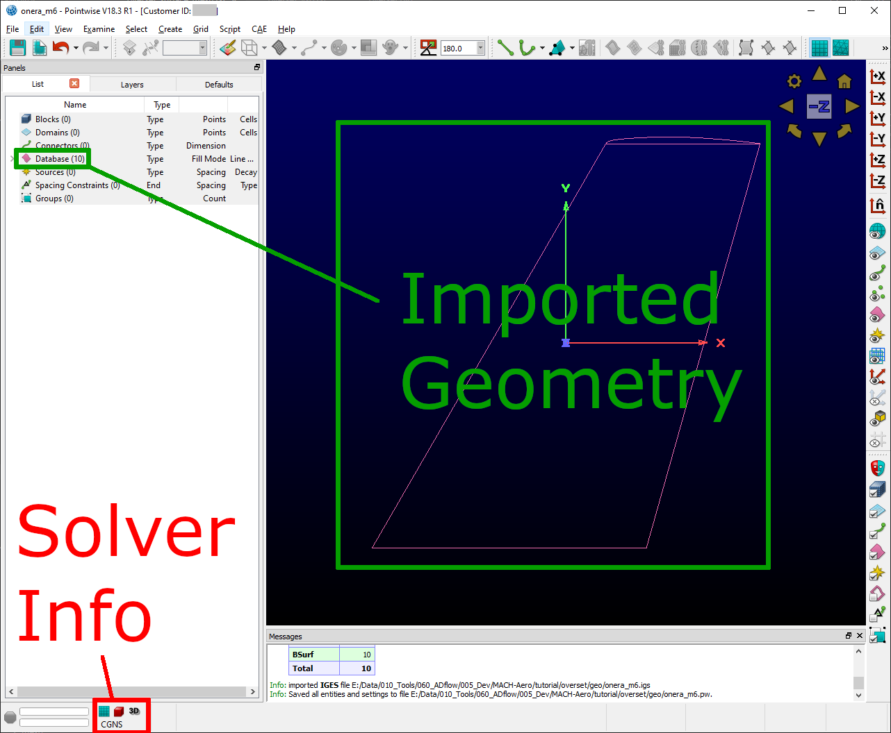
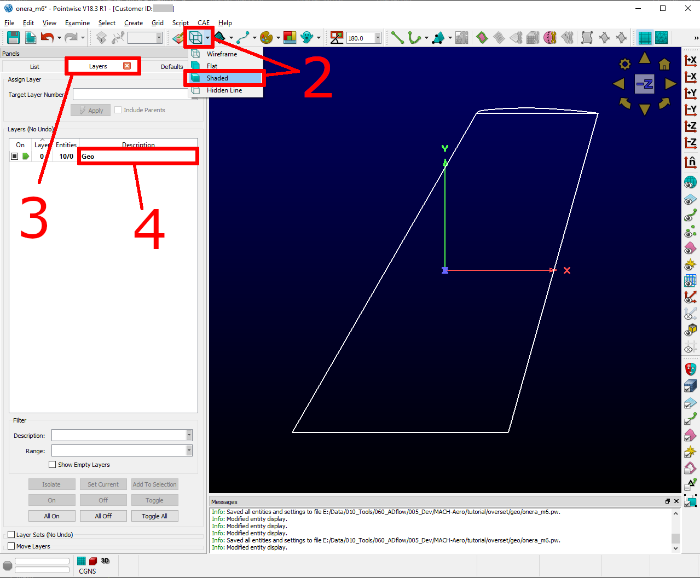
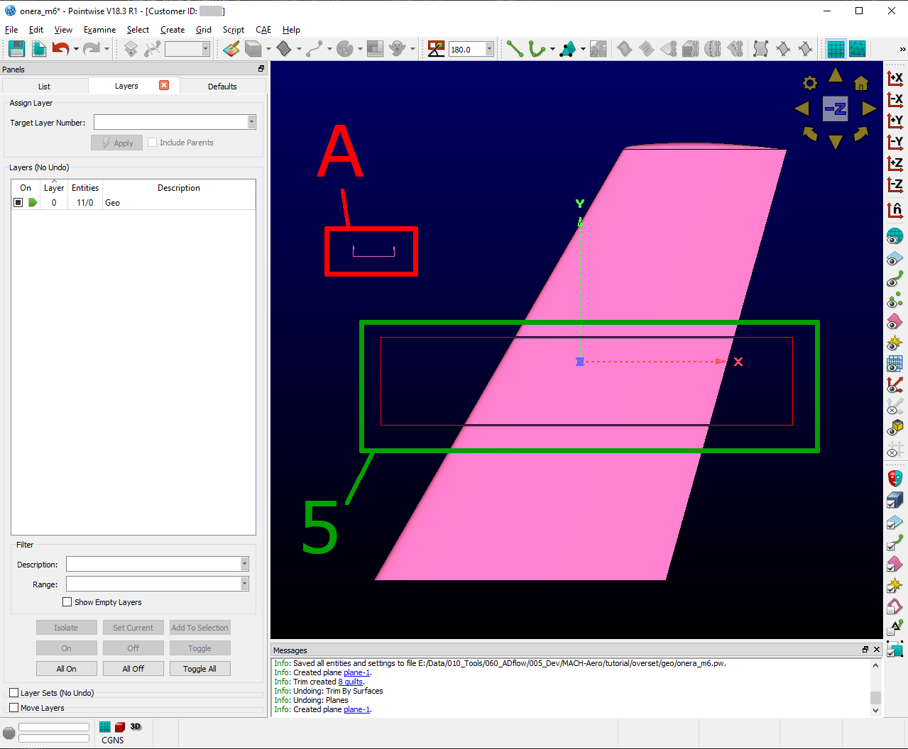
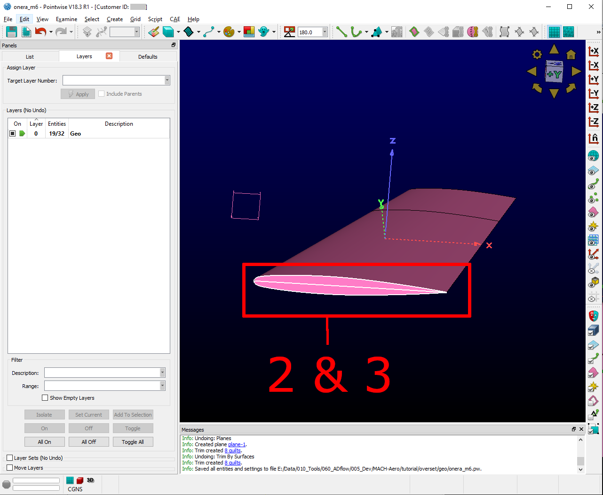
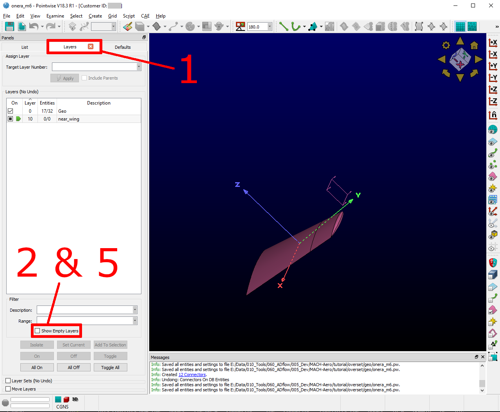

.. _overset_surface_mesh:

*********************************
Surface mesh with Pointwise
*********************************

Now that we have a geometry, we can start meshing it. We are using Pointwise to generate the surface mesh. 
Once this is done, we hyperbolically extrude it into a 3D mesh on the next tutorial page. This is not a full 
blown tutorial, more a walk through. If you want to learn more about it, I can highly recommend their 
`youtube channel <https://www.youtube.com/user/CFDMeshing>`_\. You dont have to use Pointwise to generate 
an overset mesh. ICEM or an other mesher would work aswell.

Meshing strategy
================
Before we start meshing, we have to know how many meshes we create and where they overlap. For this tutorial,
3 different meshes are proposed: ``near_wing``, ``near_tip`` and ``far``. The following picture should give an overview:

.. figure:: images/overset_m6_mesh_fields.png
    :width: 500
    :align: center 

    The three overset meshes.

Now we should estimate the cell count of the mesh. For the purpose of a grid convergence study (GCS) and debugging
it makes sense to have differently refined meshes. To limit the amount of work, we will create the finest mesh and
coarsen it multiple times. 

Usually, the finest mesh is called ``L0`` (level 0) and should have approx 60M cells for this geometry. If every 2 cells 
are combined in each direction, we get a coarser mesh called ``L1``. This usually goes to ``L2`` for production and ``L3`` for 
debugging purposes. Additionally, there could be an intermediate level starting at ``L0.5``. It requires a different 
surface mesh that is sqrt(2) coarser than ``L0``. In this tutorial, we will start at ``L1`` (~8M cells) and end at ``L3`` 
(~0.125M cells).

Pointwise overview
==================
If you start Pointwise, it should look something like in the next picture.

1. Object, Layer and Default control
2. Solver information
3. Selection control
4. View control
5. Fast meshing controls

.. figure:: images/overset_pointwise_overview.png
    :width: 600
    :align: center 

    Pointwise Overview.

You can control the main view with the following key- and mous combinations:

zoom
  Rotate your ``mousewheel``. The zoom zenters around your ``mouse pointer``.

rotate
  Press ``ctrl`` and your ``right mousebutton`` while moving your mouse.

move
  Press ``shift`` and your ``right mousebutton`` while moving your mouse.

Setup Pointwise
===============
Before we actually begin meshing, we have to set some standard values and import our geometry. At first, we set some
tolerances for Pointwise

1. Click on ``File`` -> ``Properties``
2. Set ``Model Size`` to ``1``. This should only be in the order of magnitude
3. Set ``Node`` to ``1e-6``. The value of ``Connector`` should automatically jump to ``1e-6`` aswell
4. ``OK``

Now we have to choose the proper solver. In my case it is ``CGNS`` with ``adf`` support. If you have compiled the 
MACH-Framework with ``hdf5`` support, you can skip the last step.

1. Click ``CAE`` -> ``Select Solver``
2. Make Sure ``CGNS`` is selected. 
3. Click ``OK``.
4. Click ``CAE`` -> ``Set Dimension`` -> ``2D`` (A surface mesh can be fully placed in 3D, but is here called  2D)
5. Click ``CAE`` -> ``Set Solver Attributes`` (If you have ``hdf5`` support, you can stop here)
6. Select ``adf`` for ``CGNS File Type``
7. Click ``Close``

Now we can import the ``.iges`` file we created in the previous tutorial.

1. Click ``File`` -> ``Import`` -> ``Database``
2. Select your ``.iges`` File -> ``open``
3. Make sure nothing but ``Units`` and ``From File`` is selected
4. Click ``OK``
5. You will recieve a warning that some entities could not be converted. Just ignore it and click ``YES``

After those steps, the window should look like this (you should probably save at this point):

    Pointwise after setup.

In Pointwise, this is are the most important labels:

Block
    This is a 3 dimensional Mesh
Domain
    This is a 2 dimensional Mesh
Connector
    A line constraining the extend of a ``Block`` or ``Domain``
Database
    An imported geometry
Spacing Constraint
    This controls how the ``nodes`` lie on a ``Connector``. The ``Connector`` controlls the ``nodes`` in a ``Domain`` or ``Block``

Preparing the Database
======================

To make our live a bit easier in the comming mesh work, we first prepare the database a bit (take a look at the next 
picture to help guide you).

1. Select the whole ``database``. Just draw a rectangle arount it while your ``left mousebutton`` is pressed
2. Click ``Wireframe`` -> ``Shaded``
3. Click on ``Layers``
4. Doubleclick on ``Description`` and enter ``Geo``

    Prepare the database #1.

Because we have two overlapping meshes (``near_wing`` and ``near_tip``), we have to cut the database at an appropriate place.
This will indicate where the ``near_tip`` mesh will start. The ``near_wing`` mesh will go right to the tip of the wing. But 
because ADflow uses an ``Implicit Hole Cuttin Scheme`` we only have to make sure, that the ``near_tip`` mesh is slightly smaller
than the ``near_wing`` mesh. This will ensure, that the overlapping region is approximately where we cut the database. In this
way we can make sure, the solver does not have to interpolate in a critical region (like the wing tip for example).

1. Click on ``Create`` -> ``Planes``
2. Choose ``Constant X, Y or Z``
3. Select ``Y`` and enter a value of ``0.9``
4. Click ``OK`` (Your view should now look like detail ``A`` in the following picture)
5. Select only the ``upper``, ``lower`` and ``trailing edge`` surface by drawing a rectangle with your ``left mousebutton``
6. Click ``Edit`` -> ``Trim by Surfaces``
7. Select your freshly created plane (detail ``A``)
8. Make sure ``Tolerance`` and ``Advanced`` is unselected
9. Click ``Imprint`` (Your geometry should now have a different color towards the tip)
10. Click ``OK``

    Cut the database.

Now we are doing some cleaning up and delete some unneeded surfaces.

1. Rotate your view with pressing ``ctrl`` and ``your right mousebutton`` while moving your mouse until you have a good view
on the root surfaces.
2. Select the first ``root surface``
3. Press ``ctrl`` while selecting the seccond ``root surface``
4. Press ``del`` on your keyboard to delete them

    Delete the root surfaces.

Creating the ``near_wing`` surface mesh
=======================================
We create the mesh ``near_wing`` in a new layer to keep everything orderly.

1. Click ``Layers`` 
2. Select ``Show Empty Layers``
3. Click with rour ``right mousebutton`` on layer ``10`` -> ``Set Current``
4. Doubleclick with your ``left mousebutton`` on the ``Description`` of layer ``10`` and enter ``near_wing``
5. Unselect ``Show Empty Layers``

    Create a new layer for ``near_wing``.

Because we want to coarsen our mesh multiple times, it is important to think about how many nodes we should have on a 
connector. They should always be amultiple of 