.. _overset_surface_mesh:

*********************************
Surface mesh with Pointwise
*********************************

Now that we have a geometry, we can start meshing it. We are using Pointwise to generate the surface mesh. 
Once this is done, we hyperbolically extrude it into a 3D mesh on the next tutorial page. This is not a full 
blown tutorial, more a walk through. If you want to learn more about it, I can highly recommend their 
`youtube channel <https://www.youtube.com/user/CFDMeshing>`_\. You dont have to use Pointwise to generate 
an overset mesh. ICEM or an other mesher would work aswell.

Meshing strategy
================
Before we start meshing, we have to know how many meshes we create and where they overlap. For this tutorial,
3 different meshes are proposed: ``near_wing``, ``near_tip`` and ``far``. The following picture should give an overview:

.. figure:: images/overset_m6_mesh_fields.png
    :width: 500
    :align: center 

    The three overset meshes.

Now we should estimate the cell count of the mesh. For the purpose of a grid convergence study (GCS) and debugging
it makes sense to have differently refined meshes. To limit the amount of work, we will create the finest mesh and
coarsen it multiple times. 

Usually, the finest mesh is called ``L0`` (level 0) and should have approx 60M cells for this geometry. If every 2 cells 
are combined in each direction, we get a coarser mesh called ``L1``. This usually goes to ``L2`` for production and ``L3`` for 
debugging purposes. Additionally, there could be an intermediate level starting at ``L0.5``. It requires a different 
surface mesh that is sqrt(2) coarser than ``L0``. In this tutorial, we will start at ``L1`` (~8M cells) and end at ``L3`` 
(~0.125M cells).


Pointwise overview
==================
If you start Pointwise, it should look something like in the next picture.

1. Object, Layer and Default control
2. Solver information
3. Selection control
4. View control
5. Fast meshing controls

.. figure:: images/overset_pointwise_overview.png
    :width: 600
    :align: center 

    Pointwise Overview.

You can control the main view with the following key- and mous combinations:

zoom
  Rotate your ``mousewheel``. The zoom zenters around your ``mouse pointer``.

rotate
  Press ``ctrl`` and your ``right mousebutton`` while moving your mouse.

move
  Press ``shift`` and your ``right mousebutton`` while moving your mouse.


Setup Pointwise
===============
Before we actually begin meshing, we have to set some standard values and import our geometry. At first, we set some
tolerances for Pointwise

1. Click on ``File`` -> ``Properties``
2. Set ``Model Size`` to ``1``. This should only be in the order of magnitude
3. Set ``Node`` to ``1e-6``. The value of ``Connector`` should automatically jump to ``1e-6`` aswell
4. ``OK``

Now we have to choose the proper solver. In my case it is ``CGNS`` with ``adf`` support. If you have compiled the 
MACH-Framework with ``hdf5`` support, you can skip the last step.

1. Click ``CAE`` -> ``Select Solver``
2. Make Sure ``CGNS`` is selected. 
3. Click ``OK``.
4. Click ``CAE`` -> ``Set Dimension`` -> ``2D`` (A surface mesh can be fully placed in 3D, but is here called  2D)
5. Click ``CAE`` -> ``Set Solver Attributes`` (If you have ``hdf5`` support, you can stop here)
6. Select ``adf`` for ``CGNS File Type``
7. Click ``Close``

Now we can import the ``.iges`` file we created in the previous tutorial.

1. Click ``File`` -> ``Import`` -> ``Database``
2. Select your ``.iges`` File -> ``open``
3. Make sure nothing but ``Units`` and ``From File`` is selected
4. Click ``OK``
5. You will recieve a warning that some entities could not be converted. Just ignore it and click ``YES``

After those steps, the window should look like this (you should probably save at this point):

.. figure:: images/overset_pointwise_after_import.png
    :width: 600
    :align: center 

    Pointwise after setup.

In Pointwise, this is are the most important labels:

Block
    This is a 3 dimensional Mesh
Domain
    This is a 2 dimensional Mesh
Connector
    A line constraining the extend of a ``Block`` or ``Domain``
Database
    An imported geometry
Spacing Constraint
    This controls how the ``nodes`` lie on a ``Connector``. The ``Connector`` controlls the ``nodes`` in a ``Domain`` or ``Block``


Prepare the Database
======================

To make our live a bit easier in the comming mesh work, we first prepare the database a bit (take a look at the next 
picture to help guide you).

1. Select the whole ``database``. Just draw a rectangle arount it while your ``left mousebutton`` is pressed
2. Click ``Wireframe`` -> ``Shaded``
3. Click on ``Layers``
4. Doubleclick on ``Description`` and enter ``Geo``

.. figure:: images/overset_pointwise_dat1.png
    :width: 600
    :align: center 

    Prepare the database #1.


Because we have two overlapping meshes (``near_wing`` and ``near_tip``), we have to cut the database at an appropriate place.
This will indicate where the ``near_tip`` mesh will start. The ``near_wing`` mesh will go right to the tip of the wing. But 
because ADflow uses an ``Implicit Hole Cuttin Scheme`` we only have to make sure, that the ``near_tip`` mesh is slightly smaller
than the ``near_wing`` mesh. This will ensure, that the overlapping region is approximately where we cut the database. In this
way we can make sure, the solver does not have to interpolate in a critical region (like the wing tip for example).

1. Click on ``Create`` -> ``Planes``
2. Choose ``Constant X, Y or Z``
3. Select ``Y`` and enter a value of ``0.9``
4. Click ``OK`` (Your view should now look like detail ``A`` in the following picture)
5. Select only the ``upper``, ``lower`` and ``trailing edge`` surface by drawing a rectangle with your ``left mousebutton``
6. Click ``Edit`` -> ``Trim by Surfaces``
7. Select your freshly created plane (detail ``A``)
8. Make sure ``Tolerance`` and ``Advanced`` is unselected
9. Click ``Imprint`` (Your geometry should now have a different color towards the tip)
10. Click ``OK``

.. figure:: images/overset_pointwise_cut_database.png
    :width: 600
    :align: center 

    Cut the database.


Now we are doing some cleaning up and delete some unneeded surfaces.

1. Rotate your view with pressing ``ctrl`` and ``your right mousebutton`` while moving your mouse until you have a good view
on the root surfaces.
2. Select the first ``root surface``
3. Press ``ctrl`` while selecting the seccond ``root surface``
4. Press ``del`` on your keyboard to delete them

.. figure:: images/overset_pointwise_del_root.png
    :width: 600
    :align: center 

    Delete the root surfaces.


Create the ``near_wing`` surface mesh
=======================================
We create the mesh ``near_wing`` in a new layer to keep everything orderly.

1. Click ``Layers`` 
2. Select ``Show Empty Layers``
3. Click with rour ``right mousebutton`` on layer ``10`` -> ``Set Current``
4. Doubleclick with your ``left mousebutton`` on the ``Description`` of layer ``10`` and enter ``near_wing``
5. Unselect ``Show Empty Layers``

.. figure:: images/overset_pointwise_near_layer.png
    :width: 600
    :align: center 

    Create a new layer for ``near_wing``.


Because we want to coarsen our mesh multiple times, it is important to think about how many nodes we should have on a 
connector (Apart from that it is allways good to be multi-grid-friendly). To calculate the number of nodes (:math:`N`) per connector, we
use this formula:

.. math::

    N=2^n m + 1

Where :math:`n` is the ``number of refinements + 1`` and :math:`m` is an ``integer``. To save some work, we will set the default number 
of nodes for a connector to ``145``. This means, we will not have to change the node number in the chord-wise direction.

1. Click ``Defaults``
2. Make sure ``Connector`` is checked
3. Select ``Dimension`` and enter ``145``
4. Select the ``upper`` and ``lower`` surface of the wing
5. Click ``Connectors on Database Entities``
6. Click on ``Layers`` and uncheck the ``Geo`` layer
7. Select the ``two connectors`` in the middle of the wing (Detail A) and delete them. They showed up because we split the database
8. Select the ``6 spanwise connectors`` (Detail B)
9. Click ``Edit`` -> ``Join``

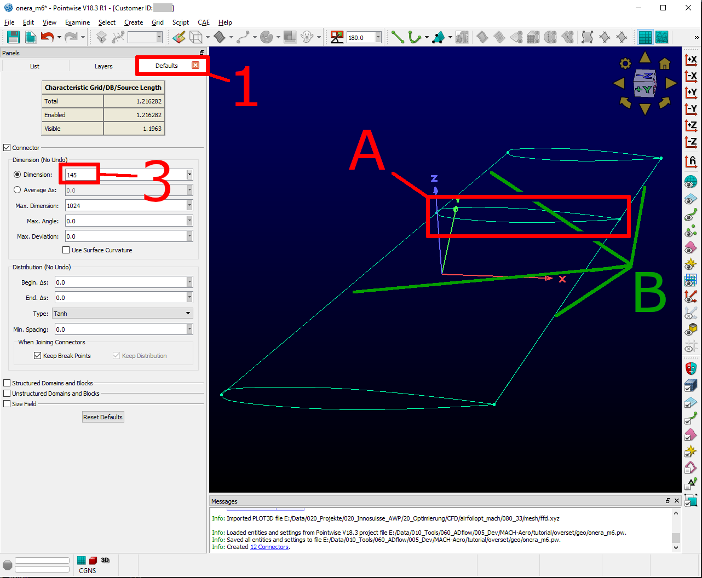

    Create the connectors for the ``near_wing`` mesh.

When creating the connectors, we left out the TE. We did this because there were 2 surfaces from OpenVSP. It is less work for us,
if we manually create two connectors.

1. Click ``Defaults``
2. Select ``Dimension`` and enter ``17``
3. Click ``2 Point Curves``
4. Close the ``root trailing edge`` (make sure your pointer becomes a cross-hair before you click. This way you are sure the new connector lies on the closest point)
5. Close the ``tip trailing edge``
6. Press ``OK``

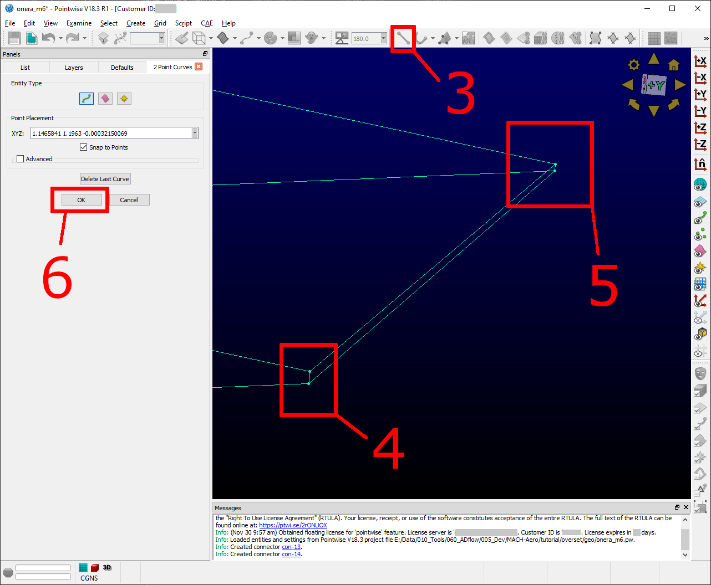

    Close the trailing edge.

Now we initialize the surface mesh.

1. Select ``everything``
2. Click ``Assemble Domains``
3. Select ``everything``
4. Click on the ``small arrow pointing down`` next to ``Wireframe``
5. Click on ``Hiden Line``

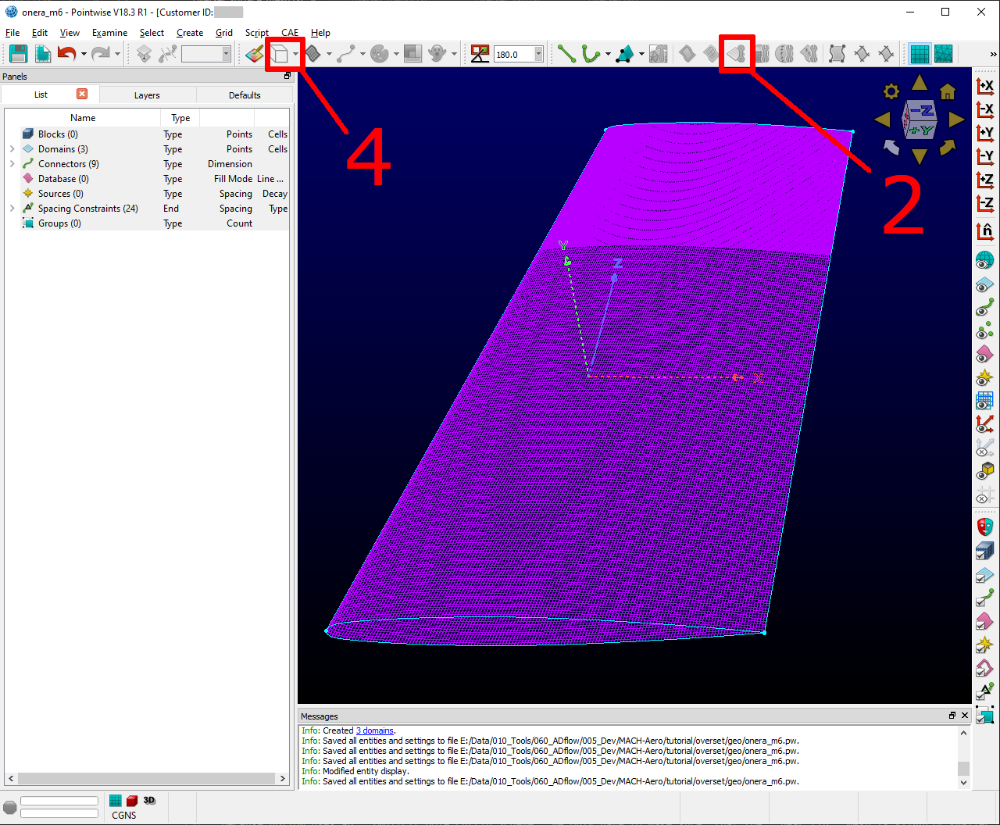

    Initialize the ``near_wing`` mesh.

Now we have to ``size`` the LE (Leading Edge) and TE (Trailing Edge) connectors. Also we have to adjust the ``spacing``.

1. Click on ``All Masks On/Off``
2. Click on ```Connectors``
3. Select the ``LE`` and ``TE`` ``Connectors`` by drawing a rectangle like it is showen
4. Click on the ``inputfield`` next to ``Dimension``, enter ``73`` and press ``enter``

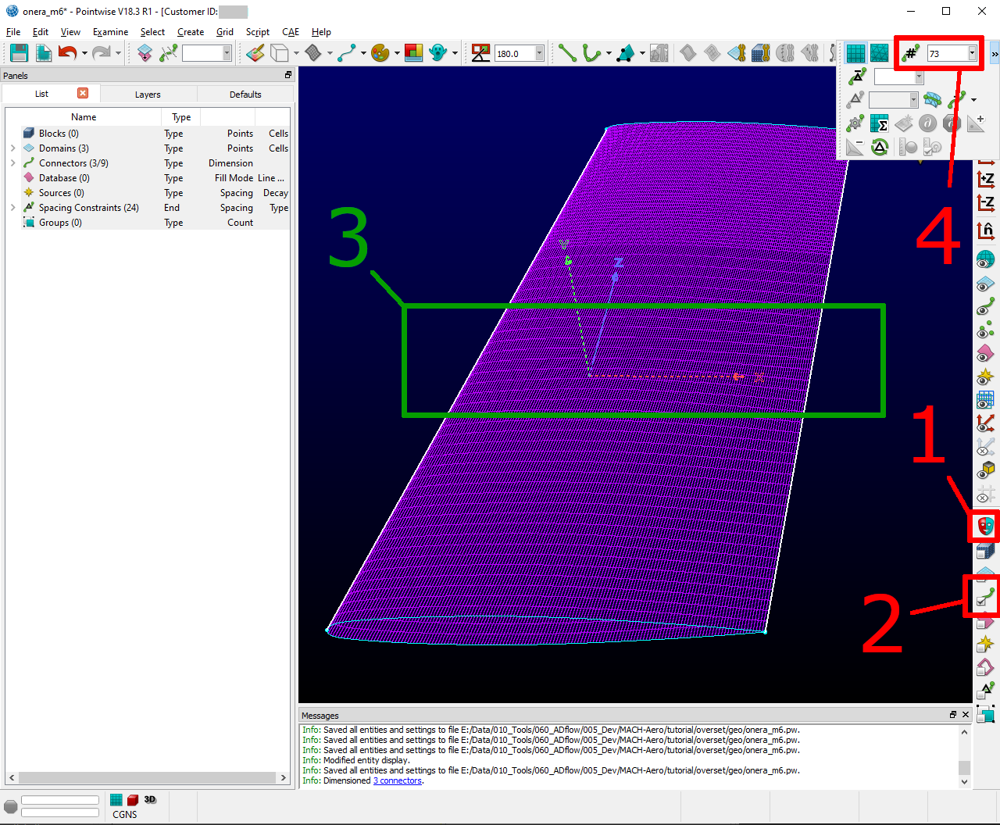

    Dimension the LE & TE connectors.

The surface mesh is now allmost complete. We only have to distribute the nodes on it properly by changing the ``spacing``. 
Usually all Points are distributed according to ``Tanh``. But because we split up the database in the previous steps, 
we have to remove the so called ``break point`` at that location.

1. Selecte the ``LE`` and ``TE`` connectors again.
2. Click on ``Grid`` -> ``Distribute``
3. Click on ``Break Points``
4. Click on ``Delete all Break Points``
5. Click on ``OK``

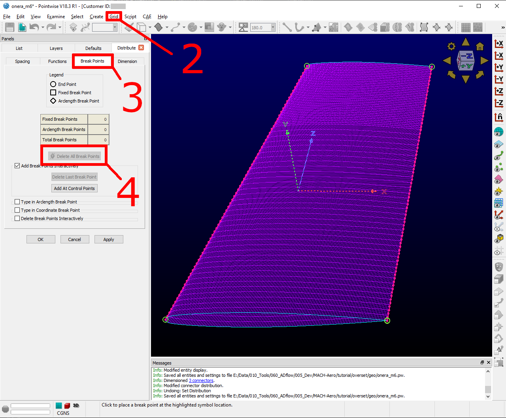

    Delete unneeded Break Points.

1. Click on ``All Masks On/Off``
2. Click on ``Spacing Constraints``
3. Select the 2 spacing constraints at the ``LE`` of the ``root`` (A)
4. Click the field next to ``Spacing`` and enter ``0.0003``. Then hit ``enter``
5. Select the 2 spacing constraints at the ``TE root`` (B)
6. Apply ``7.15e-5`` for spacing
7. Select the 2 spacing constraints at the ``LE tip'' (C)
8. Apply ``0.00016`` for spacing
9. Select the 2 spacing constraints at the ``TE tip`` (D)
10. Apply ``4e-5`` for spacing
11. Select the 3 spacing constraints at the ``tip`` (E)
12. Apply ``0.0025`` for spacing
13. Select the 3 spacing constraints at the ``root`` (F)
14. Apply ``0.04`` as spacing

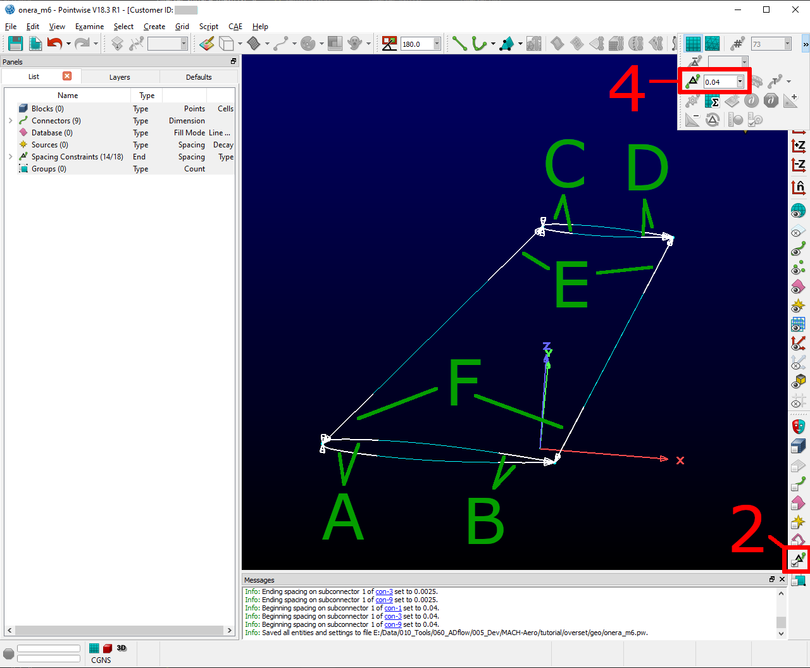

    Apply the propper spacing.

The mesh ``near_wing`` is now complete. We will export it later.


Create the ``near_tip`` surface mesh
======================================

Now we will create the ``near_tip`` mesh. Let's start with creating a new layer and hide everything unnecessairy.

1. Click on ``Layers``
2. Check ``Show Empty Layers``
3. Rightlick on Layter ``20`` -> ``Set Current``
4. Uncheck ``Show Empty Layers``
5. Check Layer ``0`` so the database is visible
6. Hide the mesh ``near_wing`` by unchecking layer ``10``

Now we will create the connectors. 

1. Click on ``Defaults`` -> enter ``201`` for ``Dimension``
2. Select everything from the tip to the cut we made earlier
3. Click ``Connectors on Database Entities``
4. Click on ``Layers`` -> uncheck layer ``0``. You should now see only the connectors we created

Let's clean up the generated connectors at the tip TE.

1. Zoom intot the ``tip TE``
2. Select the ``5`` shown ``connectors`` (A)
3. Delete them
4. Select and delete the remaining ``pole`` (the point with a circle around) (B)
5. Select the ``2`` ``connectors`` that define the outer tip (C)
6. Click ``Edit`` -> ``Join``
7. Select the ``newly joined`` connector (C)
8. Enter ``65`` For ``Dimension`` and hit ``enter``
9. Click on ``Defaults`` and enter ``65`` for ``Dimension``
10. Click on ``2 Point Curves``
11. Close the ``TE`` again (D)

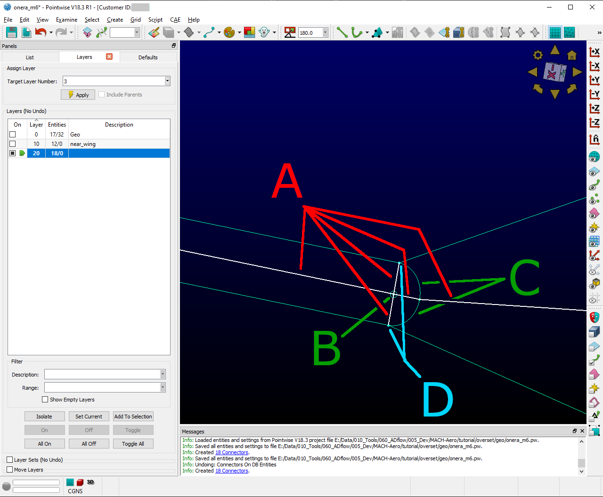

    Clean up the ``tip TE``.

Next we clean up the root TE.

1. Select the ``2`` ``connectors`` that define the TE (A)
2. Delete them
3. Click on ``2 Point Curves``
4. Close the Tip again (B)

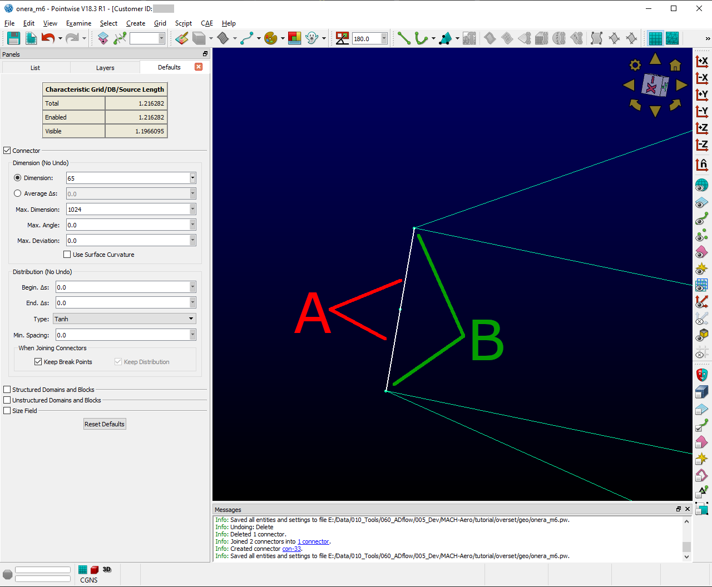

    Clean up the ``root TE``.

The last thing to clean up is the ``tip LE``.

1. Select the ``3`` shown ``connectors`` (A)
2. Click on the ``arrow pointing down`` next to ``show``
3. Click ``Hide``
4. Selecte and delete the remaining ``pole`` (B)
5. Click on ``View`` -> ``Show Hidden``
6. Select the ``3`` ``connectors`` (A)
7. Click on the ``arrow pointing down`` next to ``Hide``
8. CLick on ``Show``

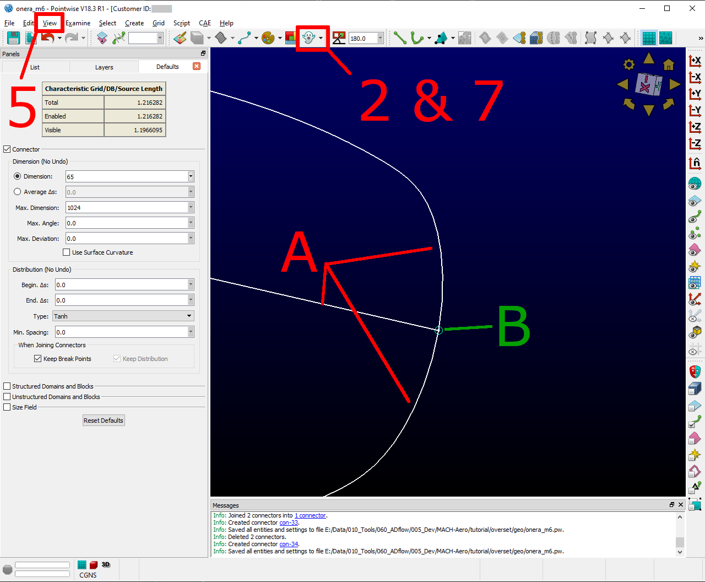

    Clean up the ``tip LE``.

Now we will dimension the remaining connectors and space the nodes properly.

1. Select the ``3`` shown connectors (A)
2. Enter ``97`` for ``Dimension`` and hit ``enter``
3. Click ``All Masks On/Off``
4. Click ``Spacing Constraints``
5. Select the ``2`` spacing constraints at the ``root LE`` (B)
6. Apply ``0.0008`` for spacing
7. Select the ``2`` spacing constraints at the ``tip LE`` (C)
8. Apply ``0.0008`` for spacing
9. Select the ``2`` spacing constraints at the ``root TE`` (D)
10. Apply ``1.3e-5`` as spacing
11. Select the ``2`` spacing constraints at the ``tip TE`` (E)
12. Apply ``1.3e-5`` as spacing
13. Select the ``3`` spacing constraints at the ``root`` (F)
14. Apply ``0.01`` as spacing
15. Select the ``1`` spacing constarint at the ``tip LE`` (G)
16. Apply ``0.0005`` as spacing
17. Select the ``2`` spacing constraints at the ``tip TE`` (H)
18. Apply ``1.56e-5`` as spacing

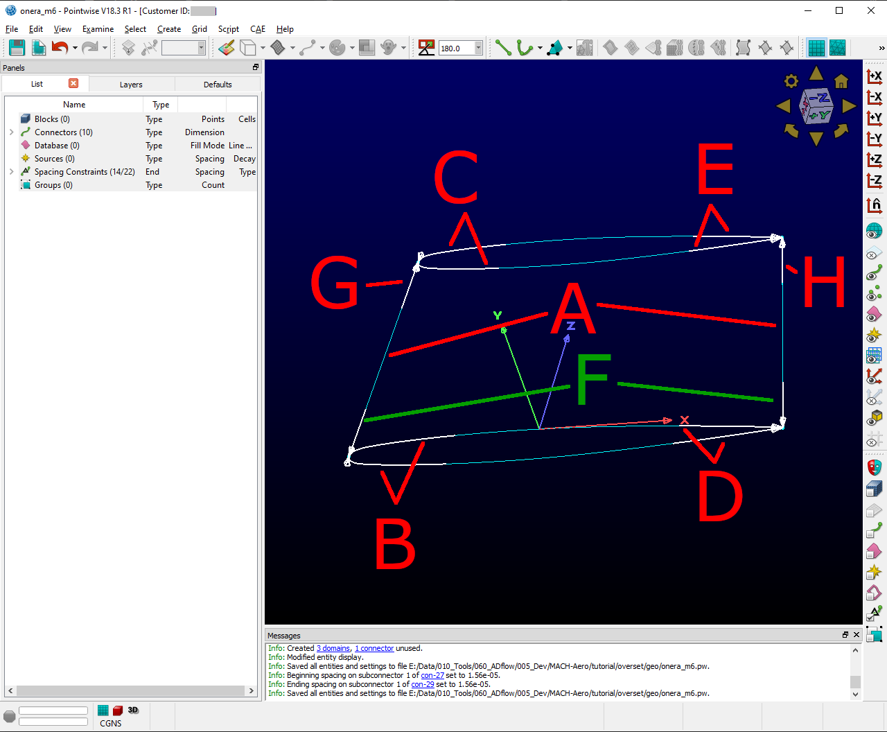

    Apply spacing constraints for the ``near_tip`` mesh.

Next, we split the connectors at the tip to allow a topology where we can achive a decent quality mesh. 

1. Select the ``tip top`` connector (A)
2. Click ``Edit`` -> ``Split``
3. Make sure ``Advanced`` is checked
4. Enter ``17`` for ``IJK`` and hit ``enter``
5. Click ``OK``
6. Select the ``tip bottom`` connector (B)
7. Click ``Edit`` -> ``Split```
8. Enter ``185`` for ``IJK`` and hit ``enter``
9. Click ``OK``
10. Click on ``2 Point Curves``
11. Connect the ``2`` new ``points`` (A) to (B)

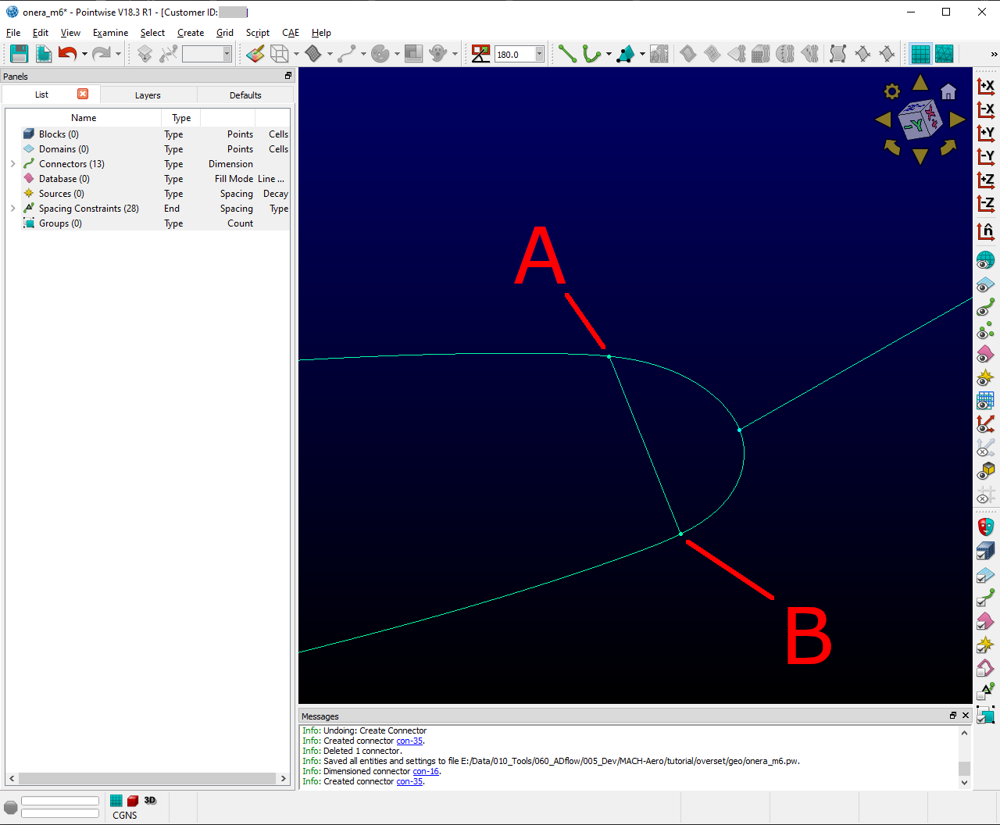

    Split the ``tip`` connectors.

Since our tip is rounded, we have to ``project`` the newly created connector on to our database.

1. Select the ``newly`` created ``connector`` (A)
2. Click on ``Edit`` -> ``Project``
3. Click on ``Layers``
4. Check layer ``0`` (``Geo``)
5. Click on ``Project``
6. Make sure ``Targed Database Selection`` is checked
7. Click ``Begin``
8. Select the ``upper`` and ``lower`` tip surface (hold down ``ctrl``) (B)
9. Click ``End``
10. Click ``Project``
11. Click ``OK``

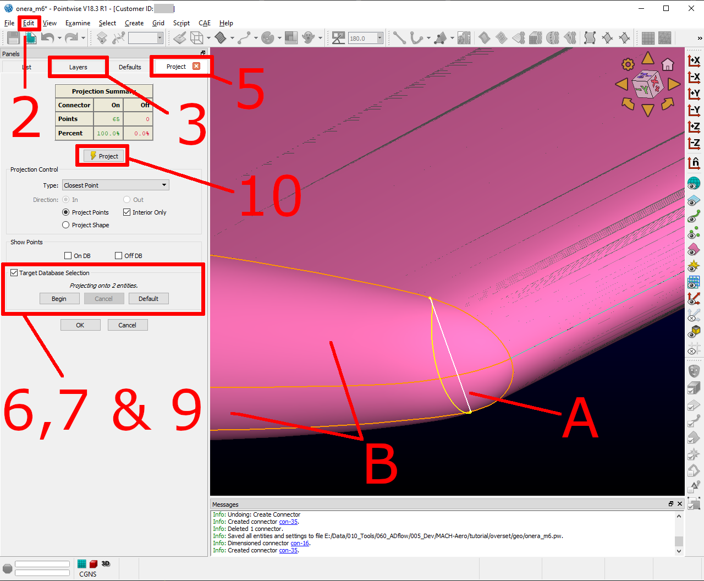

    Project the connector on to the database.

Now we actually start meshing.

1. Click on ``Layers``
2. Uncheck layer ``0`` (``Geo``)
3. Select the ``newly`` created ``connector`` (A)
4. Click on the ``arrow pointing down`` next to ``Tanh Distribution``
5. Click on ``Equal``
6. Click ``Edit`` -> ``Split``
7. Enter ``17`` for ``IJK`` and hit ``enter``
8. Enter ``49`` for ``IJK`` and hit ``enter``
9. Click ``OK``
10. Click on ``Create`` -> ``Assemble Special`` -> ``Domain``
11. Select ``1`` ``connector`` (B)
12. Click ``Next Edge``
13. Select ``2`` ``connectors`` (C)
14. Click ``Next Edge``
15. Click ``OK``

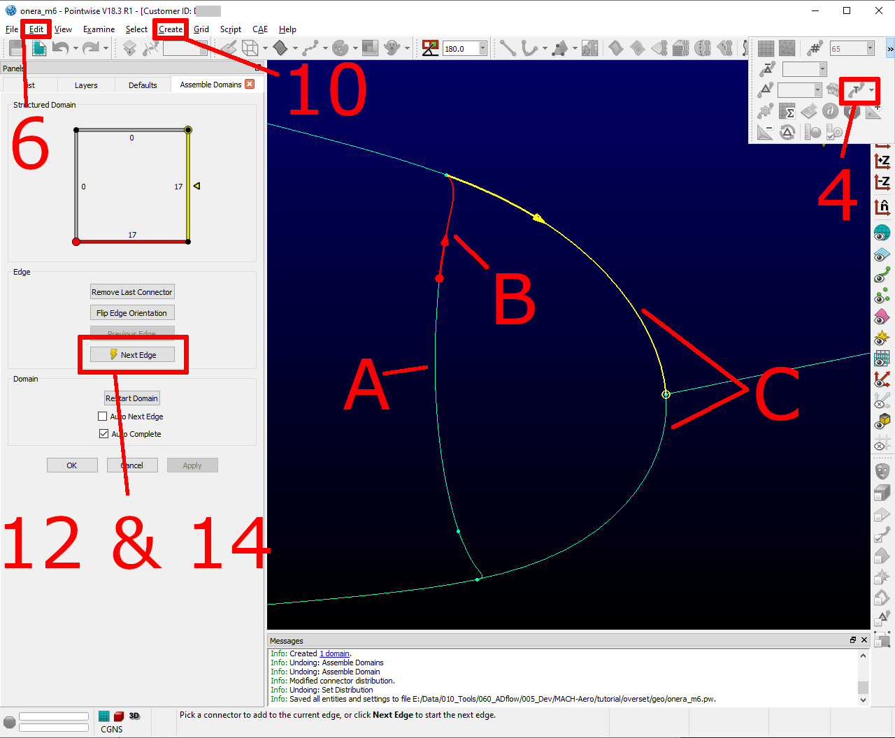

    Assemble the mesh at the ``LE tip``.

Next, we mesh the rest.

1. Download `this Script <https://raw.githubusercontent.com/pointwise/Semicircle/master/Semicircle.glf>`_ and save it somewhere
2. Select the ``2`` connectors that form the semi-circle (A)
3. Click ``Script`` -> ``Execute``
4. Look for the ``script`` you just downloaded and ``open`` it.
5. Select ``all`` connectors
6. Click ``Assemble Domains``

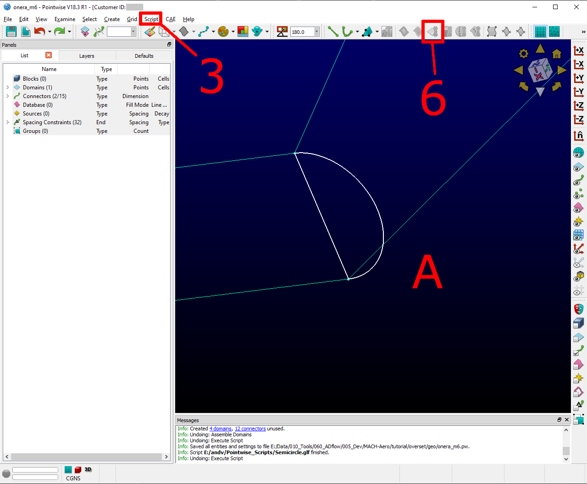

    Mesh the ``semi-circle``  at the TE.

The last step is to make sure, that the skewed elements at the tip are smoothed. As ``Assemble Domains`` didn't work
for the most outer mesh, we will delete this domain first, and create it manually again.

1. Select ``all`` domains
2. Click ``Hidden Line``
3. Select the ``outer most`` domain and delete it (A)
4. Select all ``9`` connectors, that define the last remaining domain
5. Click ``Assemble Domain``
6. Select the ``newly`` created ``domain`` and click ``Hidden Line``
7. Selct the ``2`` domains that define the ``tip`` (A & B)
8. Click ``Grid`` -> ``Solve``
9. Click on ``Edge Attributes``
10. Make sure ``Boundary Conditions`` is checked and set the ``Type`` to ``Floating``
11. Click on ``Attributes``
12. Make sure ``Surface Shape`` is checked and set ``Shape`` to ``Database``
13. Click on ``Begin`` and make sure, the tip is selected (it should be)
14. Click on ``End``
15. Make sure ``Solution Algorithm`` is checked and set ``Solver Engine`` to ``Successive Over Relaxation``
16. Set ``Relaxation Factor`` to ``Nominal``
17. Click on ``Solve``
18. Enter ``50`` for ``Iterations`` and hit ``Run``
19. Click ``OK``

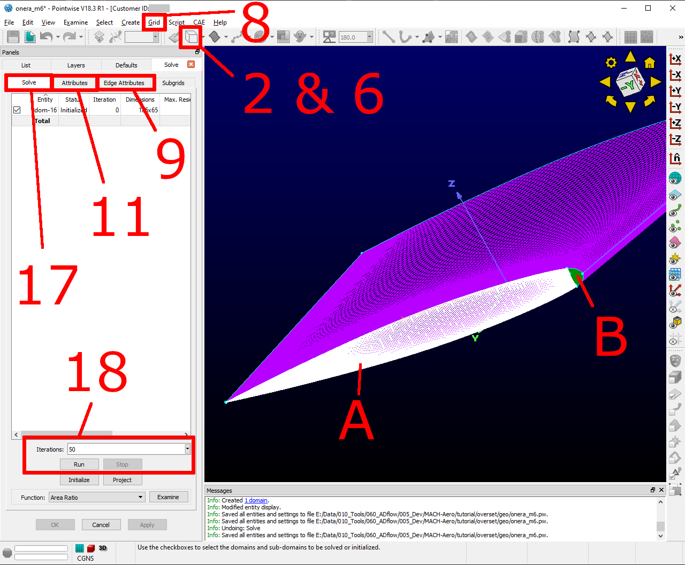

    Finish the ``near_tip`` mesh.

Lets check the quality of the created mesh. The most important metrics are ``Area Ratio`` and ``Skewness Equiangle