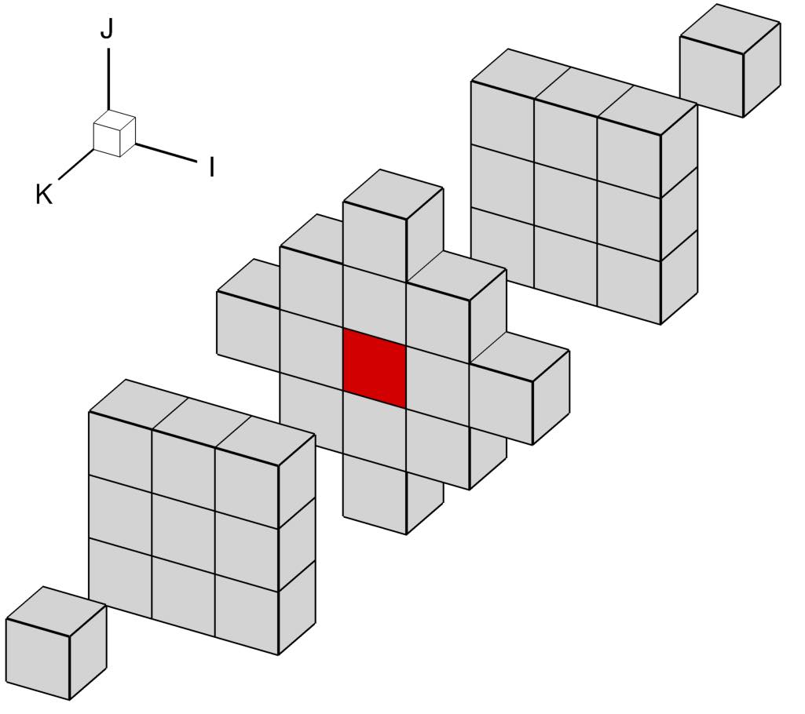

.. _overset_theory:

##############
Overset Theory
##############

Overset Mesh
============

ADflow uses structured meshes.
For simple geometries, a valid structured mesh can be obtained by the multiblock structured mesh approach.
However, it can be difficult or even impossible to generate a high quality multiblock mesh for complex geometries.

To mitigate this problem, the overset approach (also called chimera-patch) was implemented in ADflow.
Overset meshes can be viewed as an *unstructured* network of overlapping *structured* meshes.
Instead of having one big structured mesh, the fluid domain is split up into separate, overlapping meshes.
Information is interpolated among overlapping meshes at every solver iteration.

.. figure:: images/overset_guide_3.jpg
    :align: center
    :width: 450

    A simple 2-D overset mesh. The nearfield mesh of the airfoil is red, and the background mesh is black.

..
    src: overset_guide.pdf page 3

The boundary conditions for this example is set as follows:

.. figure:: images/overset_guide_4.jpg
    :align: center
    :width: 600

    The boundary-condition information for the simple overset example.

..
    src: overset_guide.pdf page 4

Cells assume different tasks in an overset mesh:

* Compute cells: Active cells that are relevant to the solution as they represent the volume. The PDEs are enforced on these cells.
* Blanked cells: Inactive cells that are inside bodies or overlapped by better quality cells.
* Interpolated cells (Receivers): Cells that inherit state variables from donor cells belonging to other overlapping meshes.

The *compute cells* in an overset mesh for a more complicated configuration look like this:

.. figure:: images/overset_Overview.jpg
    :align: center

    Example of a farfield mesh embedding multiple nearfield meshes for the CFD mesh of NASA's STARC-ABL concept.
..
    src: https://openmdao.org/wp-content/uploads/2018/06/bli_16_9_clean.jpg

More about the overset implementation in ADflow can be found in `this paper <http://www.umich.edu/~mdolaboratory/pdf/Kenway2017a.pdf>`__.

.. note::

    Because the solver has to interpolate in the overlapping region, the numerical solution will locally not be as accurate.
    It is recommended to avoid such overlapping near critical regions of the flowfield, like the wing tip.

Implicit Hole Cutting (IHC)
===========================

ADflow uses implicit hole cutting (IHC) to automatically assign overset connectivities.
IHC is based on the assumption that cells are finer near walls.
IHC preserves smaller cells and blanks or interpolates larger ones.
The general theory behind IHC can be found in `this paper <https://arc.aiaa.org/doi/10.2514/6.2003-4128>`__.
In this section, we focus on the IHC implementation in ADflow.

.. figure:: images/overset_IHC.png
    :align: center

    The original mesh (left) and only the compute cells after IHC (right).
..
    src: overset_guide.pdf page 7

The ``iBlank`` array indicates the function of each cell.
ADflow saves this array in the volume or surface CGNS files if you add ``blank`` to the ``surfaceVariables``
or ``volumeVariables`` respectively.
The complete list of ``iBlank`` values in ADflow is:

*  1: Compute
*  0: Blanked
* -1: Interpolated
* -2: Flooded
* -3: Flood seed
* -4: Explicitly blanked (using ``cutCallBack``)
* -5: Orphan (flagged for debugging purposes only)

.. figure:: images/overset_guide_8.jpg
    :align: center

    The resulting ``iBlank`` values after the IHC process for the background and nearfield meshes.
..
    src: overset_guide.pdf page 8

In the figure above, the red cells represent the compute cells in each mesh.
The green cells are the interpolated cells, which bring in information from the overlapping compute cells.
The yellow cells represent the blanked cells.
These have no function in the flow solution but play an important role in the flooding process.

Flooding
--------

Flooding is the process used to determine which side of a wall should not be included in the flow solution.
This is usually the interior of a body such as a wing or aircraft.
Flooding starts at the flood seeds, which are the dark blue cells in the figure above.
A cell must satisfy two requirements to be designated as a flood seed.
First, the cell must intersect a wall on an overlapping mesh.
Second, the cell must be farther than ``nearWallDist`` from any wall in its own mesh.
In the example, the flood seeds are cells in the background mesh that overlap with the walls of the circle in the nearfield mesh.
The light blue cells are the flooded cells.
Compute cells that are next to a flood seed or a flooded cell are converted to flooded cells until the flooding is stopped by at least two layers of blanked or interpolated cells.
In the example, the flooded region is limited to the inside of the circle.
If we did not have enough resolution in the blanked and interpolated cells, the flood seeds would flood the rest of the mesh and the IHC would fail.

Orphan cells
------------

In the figure below, the center cell is marked with red, and all of the other cubes represent an exploded view of the computational stencil used in ADflow for RANS simulations.
The stencil for all compute cells (excluding cells at physical boundaries) should include only other compute or interpolated cells.
If this is not satisfied, the center cell is tagged as an *orphan* cell.
A valid mesh has no orphan cells.

    The computational stencil used in ADflow for a second-order accurate finite-volume formulation for RANS equations.
    The center compute cell (marked with red) needs to access the state in all of the cells included in the figure to compute the residuals.
..
    src: ank paper stencil plots

Zipper Mesh
===========

As seen in the STARC-ABL figure on this page, there can be multiple nearfield meshes that overlap on a surface.
This makes it difficult to correctly integrate the forces and moments acting there.
For that reason, ADflow uses zipper meshes to provide a watertight surface.
More about zipper meshes can be found `this paper <https://www.nas.nasa.gov/assets/pdf/staff/Chan_W_Enhancements_to_the_Hybrid_Mesh_Approach_to_Surface_Loads_Integration_on_Overset_Structured_Grids.pdf>`__.

.. figure:: images/overset_zipper.jpg
    :align: center

    Overlapped meshes (left), Removed overlaps (mid), Triangulated gaps (right)

..
    src: overset_guide.pdf page 20

Collar Mesh
===========

Collar meshes outline the intersection between two component meshes.
The collar mesh should be finer than the overlapping component meshes.
This ensures that the collar cells are selected during IHC and there are no gaps at the intersection.

.. figure:: images/overset_guide_10.jpg
    :align: center

    The collar mesh at the wing-strut intersection of a strut-braced wing configuration.
..
    src: overset_guide.pdf page 10

We can also use a half-collar to reduce the number of overset blocks.
In the following example, the half-collar on the fuselage belongs to the tail mesh.
The half-collar and the rest of the tail mesh share the intersection line.

.. figure:: images/overset_guide_11.jpg
    :align: center
    :width: 400

    An example of a half-collar at the fuselage-horizontal tail region.
..
    src: overset_guide.pdf page 11
