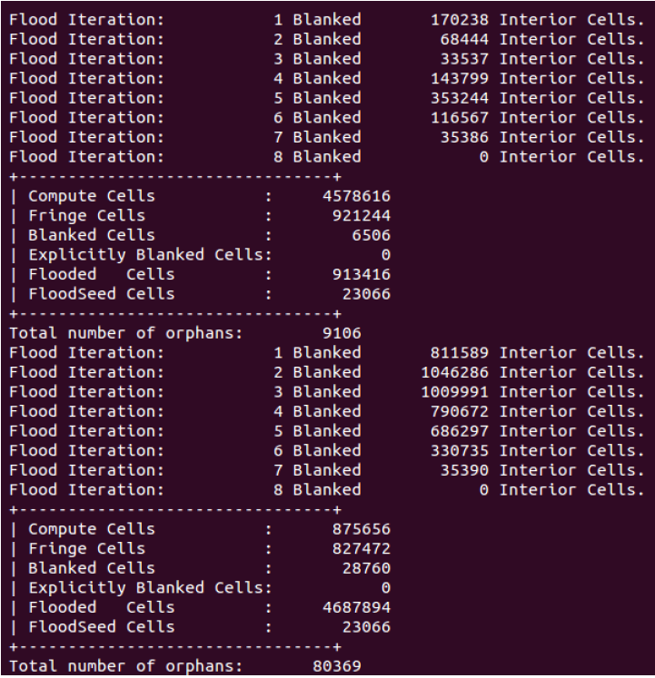
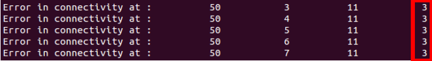

.. _overset_theory:

########################
Overset Theory
########################

Overset Mesh
=============

ADFlow can only process multiblock structured meshes. For simple geometries, this is fine. 
But it can be really hard to generate a single structured mesh for a complex geometry. 
It might even be impossible to archive the required mesh quality.

To mitigate this problem, the overset approach (also called chimera-patch) was developed. Instead 
of having one big structured mesh, the fluid domain is split up in different, overlapping meshes. The 
fluid solver then interpolates between those. Typically, there are one farfield and multiple nearfield 
meshes:

.. figure:: images/overset_Overview.png
    :align: center 

    Multiple nearfield and one farfield mesh can be seen.
..
    src: https://openmdao.org/wp-content/uploads/2018/06/bli_16_9_clean.png

More about the overset implementation in ADFlow can be found here: `An Efficient Parallel Overset 
Method for Aerodynamic Shape Optimization 
<https://www.researchgate.net/publication/313459613_An_Efficient_Parallel_Overset_Method_for_Aerodynamic_Shape_Optimization>`_\.

.. note:: As the solver has to interpolate in the overlapping region, the calculated solution will locally not be
          as accurate. This means it should not happen in critical regions like the wing tip.

Implicit Hole Cutting (IHC)
===========================
When there are overlapping meshes, we must decide which cells of one grid should exchange information 
with cells from an other grid. Additionally there will be some cells, that should be ignored at all. 
This process is called hole cutting. Depending on the solver, the user must set it up in advance. ADFlow 
does this implicitly without any additional user input. It works on the assumption, that the cells closer 
to a wall have a smaller area. If there are overlapping meshes, it basically uses the smaller cells and 
blanks/interpolates the bigger ones.

.. figure:: images/overset_IHC.png
    :align: center 

    Before (left) and after IHC (right).
..
    src: overset_guide.pdf page 7

More about IHC can be found here: `Implicit Hole Cutting - A New Approach to Overset Grid Connectivity
<https://arc.aiaa.org/doi/10.2514/6.2003-4128>`_\.

Zipper Mesh
===========
As seen in the first figure on this page, there can be multiple nearfield meshes that overlap on a surface.
This makes it hard to correctly integrate the forces and moments acting there. For that reason, ADFlow uses
zipper meshes to provide a watertight surface. 

.. figure:: images/overset_zipper.png
    :align: center 

    Overlapped meshes (left), Removed overlaps (mid), Triangulated gaps (right)

..
    src: overset_guide.pdf page 20

More about zipper meshes can be found here: `Enhancements to the Hybrid Mesh Approach to
Surface Loads Integration on Overset Structured Grids 
<https://www.nas.nasa.gov/assets/pdf/staff/Chan_W_Enhancements_to_the_Hybrid_Mesh_Approach_to_Surface_Loads_Integration_on_Overset_Structured_Grids.pdf>`_\.

Things to note
==============

Tip #1
------
Make sure there is sufficient overlap between meshes.

.. figure:: images/overset_tip1.png
    :align: center 

    Overlapping is needed betwee meshes.

Tip #2
------
Match cells sizes of the overlapped meshes, especially near boundaries

.. figure:: images/overset_tip2.png
    :align: center 

    Left: Not remommended. May give a valid hole cutting with additional effort. Right: Better transition. Easier to find interpolation stencils.

Tip #3
------
Match the growth ratios of the mesh extrusion. 

* Use similar values of initial cell height for all meshes (``s0`` option in pyHyp)
* Make sure that all meshes have similar growth ratios during the pyHyp extrusion. A variation of +- 0.05 is okay
* If you want to priorize one mesh, use slightly smaler values for ``s0`` and growth ratio.

Debugging an Overset Mesh
========================

Sometimes overset meshes are a bit tricky. This section is here to help you. The following
points indicate a Problem with your mesh:

* Several flooding iterations
* Small number of compute cells
* Orphan cells are present

    Bad IHC terminal output.

Flood troubleshooting
---------------------

The following points might help to fix your flooding issue. Check them first.

Flooding is usually caused by cells that grow too fast off a wall.
    The mesh with a high growth ratio may cause the flooding of the other overlapped meshes, since the other 
    meshes will not create a layer of interpolate cells to contain the flood. 
    Check if meshes have similar growth ratios for the pyHyp extrusion.

Change the ``nearwalldist`` option in ADow.
    This option controls how compute cells are preserved near walls. Changing this value may prevent 
    flooding. We usually use 0.01 for a full-scale aircraft mesh defined in metric units. If a collar mesh 
    is flooding, try increasing ``nearwalldist`` to reduce the number of flood seeds.

Check for sufficient overlap on the surface and in the volume.
    The overlap should have at least 5 cells from each mesh.

The background mesh may be too coarse.
    Either extend the near-field meshes or refine the background mesh until you have a 5 cell 
    overlap along the off-wall direction.

Orphans troubleshooting
-----------------------
ADflow outputs the CGNS block id, and the i ,j ,k position of the orphan cells. The k values (4th column) 
may point to the issue.

    Output from a mesh with an orphan issue.

Orphans with high k: Lack of volume overlap.
    Some interpolate cells cannot find donors. So they become blanked cells within the stencil of a 
    compute cell. Possible solutions are increasing the mesh extrusion distance (``marchDist`` option in pyHyp) 
    or adding more layers to the mesh extrusion process (``N`` option in pyHyp). You may also refine the background mesh.

Orphans with small k: Reduce ``nearwalldist`` option in ADflow.
    You have compute cells beneath the surface defined by overlapping meshes. The smaller ``nearwalldist`` may 
    flood these unnecessary cells.