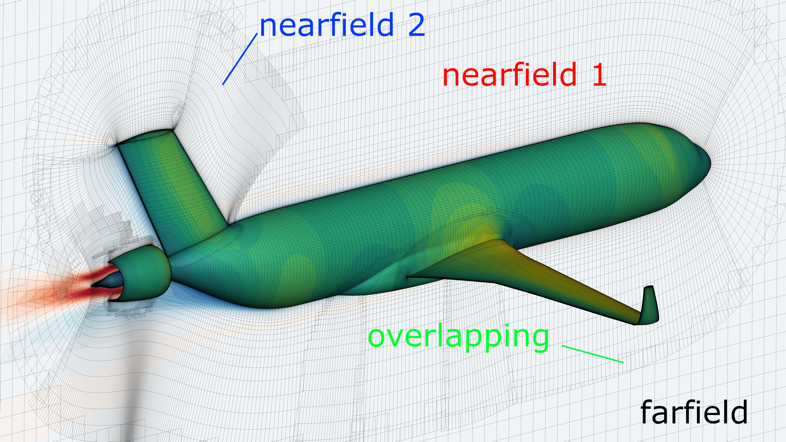
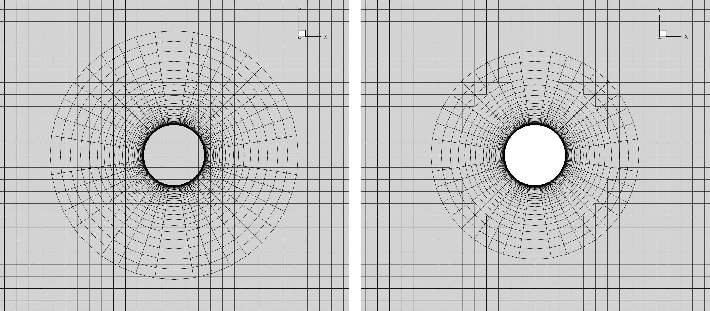
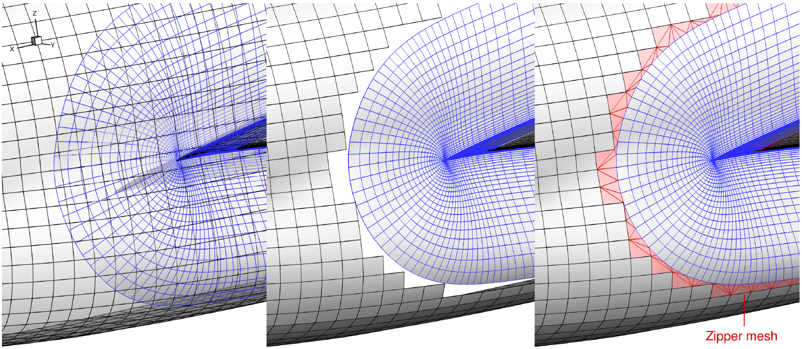

.. _overset_theory:

########################
Overset Theory
########################

Overset Mesh
=============

ADFlow can only process multiblock structured meshes. For simple geometries, this is fine. 
But it can be really hard to generate a single structured mesh for a complex geometry. 
It might even be impossible to archive the required mesh quality.

To mitigate this problem, the overset approach (also called chimera-patch) was developed. Instead 
of having one big structured mesh, the fluid domain is split up in different, overlapping meshes. The 
fluid solver then interpolates between those. Typically, there are one farfield and multiple nearfield 
meshes:

    Multiple nearfield and one farfield mesh can be seen.
..
    src: https://openmdao.org/wp-content/uploads/2018/06/bli_16_9_clean.png

More about the overset implementation in ADFlow can be found here: `An Efficient Parallel Overset 
Method for Aerodynamic Shape Optimization 
<https://www.researchgate.net/publication/313459613_An_Efficient_Parallel_Overset_Method_for_Aerodynamic_Shape_Optimization>`_

Implicit Hole Cutting (IHC)
===========================
When there are overlapping meshes, we must decide which cells of one grid should exchange information 
with cells from an other grid. Additionally there will be some cells, that should be ignored at all. 
This process is called hole cutting. Depending on the solver, the user must set it up in advance. ADFlow 
does this implicitly without any additional user input. It works on the assumption, that the cells closer 
to a wall have a smaller area. If there are overlapping meshes, it basically uses the smaller cells and 
blanks/interpolates the bigger ones.

    Before (left) and after IHC (right).
..
    src: overset_guide.pdf page 7

More about IHC can be found here: `Implicit Hole Cutting - A New Approach to Overset Grid Connectivity
<https://arc.aiaa.org/doi/10.2514/6.2003-4128>`_

Zipper Mesh
===========
As seen in the first figure on this page, there can be multiple nearfield meshes that overlap on a surface.
This makes it hard to correctly integrate the forces and moments acting there. For that reason, ADFlow uses
zipper meshes to provide a watertight surface. 

    Overlapped meshes (left), Removed overlaps (mid), Triangulated gaps (right)

..
    src: overset_guide.pdf page 20

More about zipper meshes can be found here: `Enhancements to the Hybrid Mesh Approach to
Surface Loads Integration on Overset Structured Grids 
<https://www.nas.nasa.gov/assets/pdf/staff/Chan_W_Enhancements_to_the_Hybrid_Mesh_Approach_to_Surface_Loads_Integration_on_Overset_Structured_Grids.pdf>`_