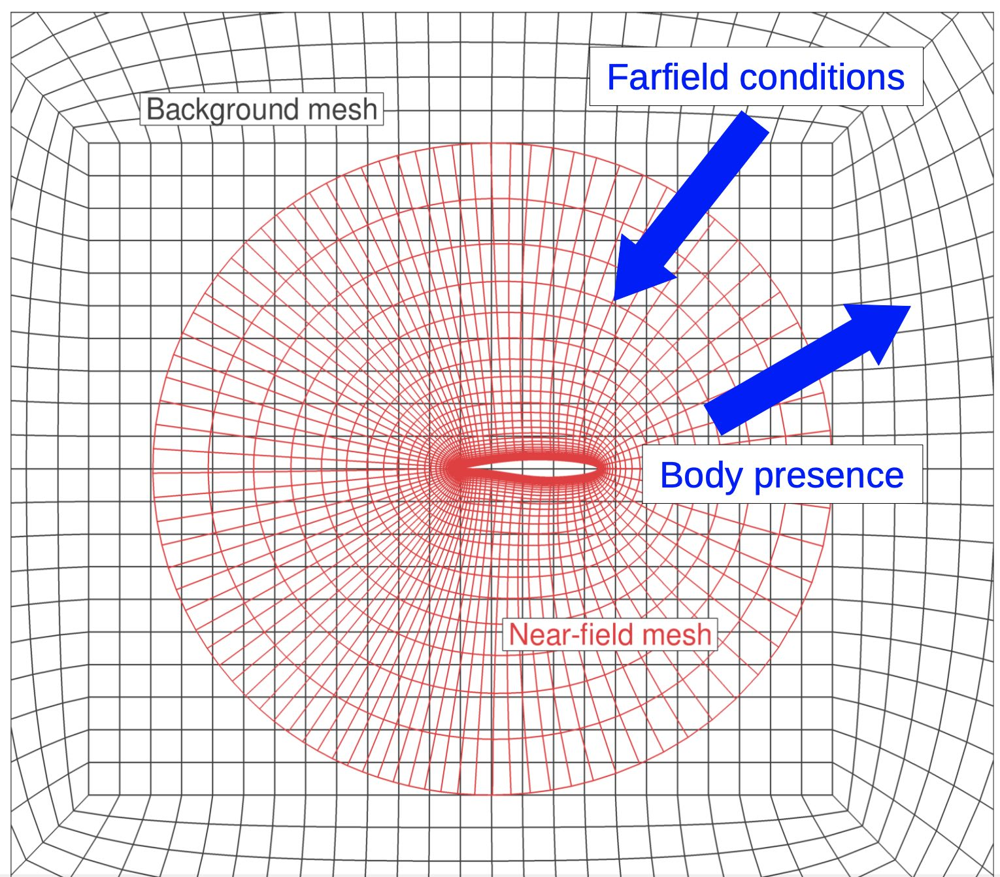
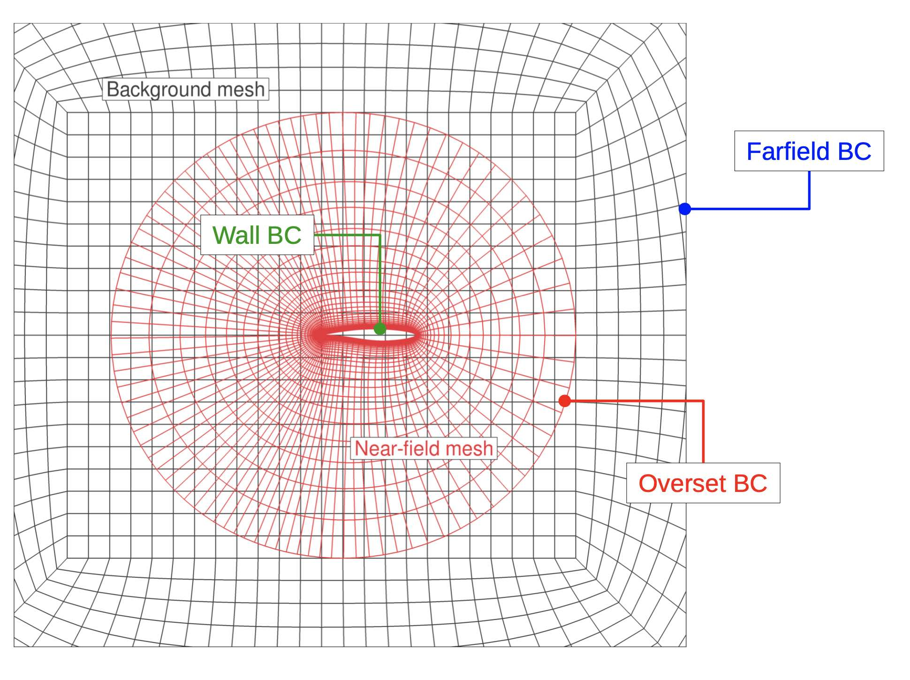
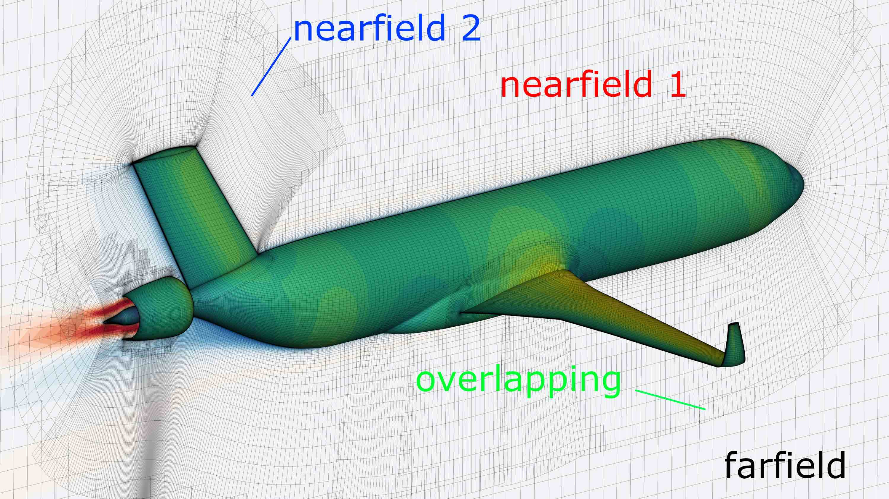
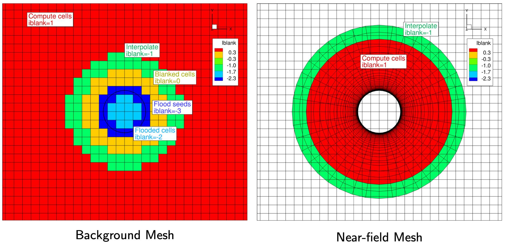
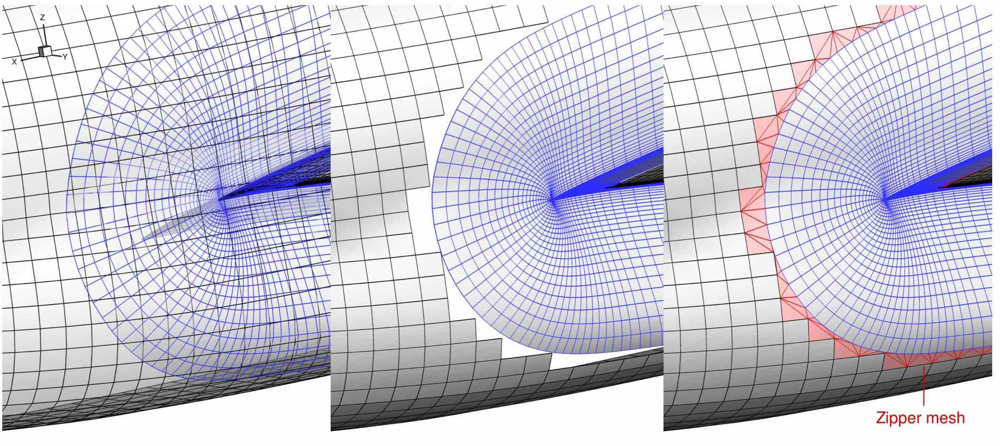
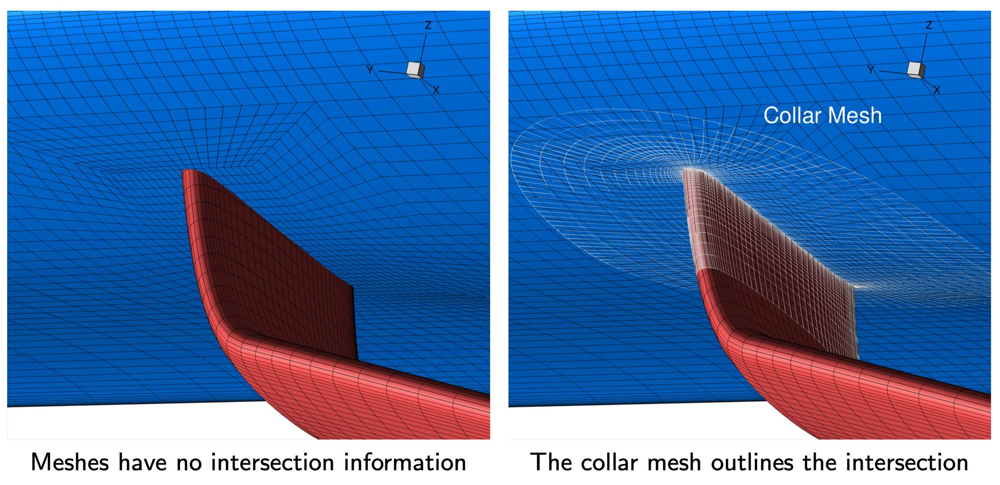
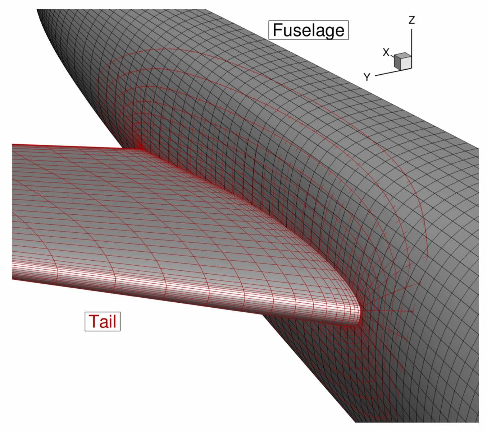
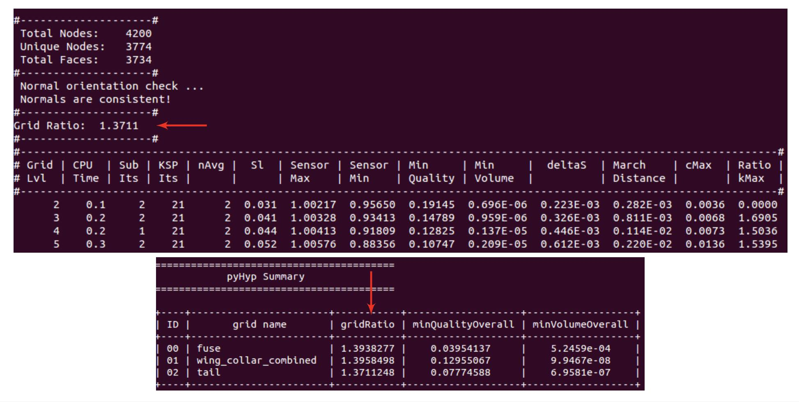
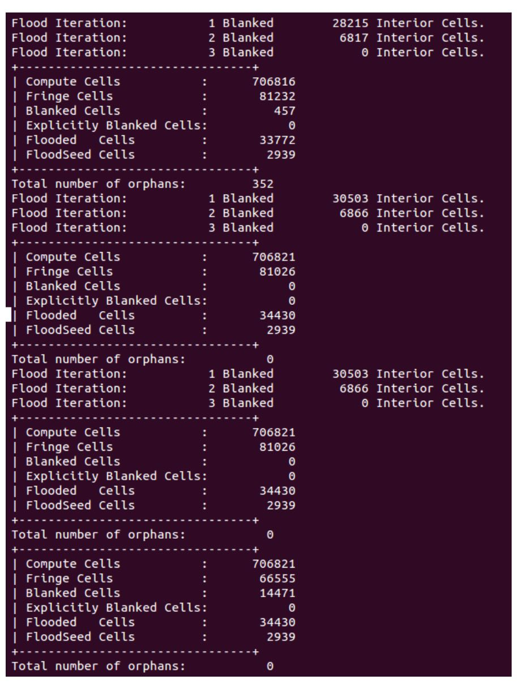
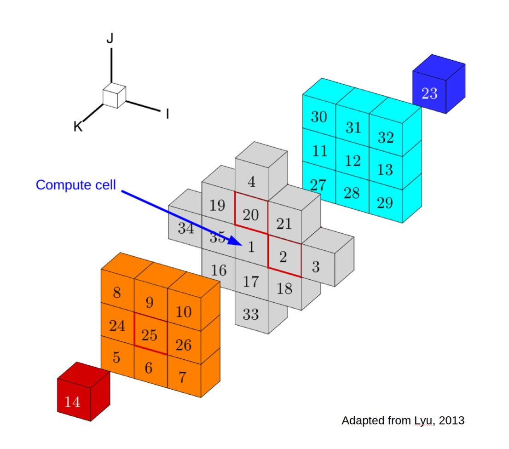

.. _overset_theory:

########################
Overset Theory
########################

The figures and the tips below are based off of the overset_guide document by Ney Secco.

Overset Mesh
=============

ADflow uses structured meshes.
For simple geometries, a valid structured mesh can be obtained by the multiblock structured mesh approach.
But it can be really hard to generate a single structured mesh for a complex geometry.
It might even be impossible to achieve the required mesh quality.

To mitigate this problem, the overset approach (also called chimera-patch) was implemented in ADflow.
Overset meshes can be viewed as an *unstructured* network of overlapping *structured* meshes.
Instead of having one big structured mesh, the fluid domain is split up in different, overlapping meshes.
Information is interpolated among overlapping meshes on every solver iteration.

    A simple 2-D overset mesh. The nearfield mesh of the airfoil is red, and the farfield is black.

..
    src: overset_guide.pdf page 3

The boundary conditions for this example is set as follows:

    The boundary-condition information for the simple overset example.

..
    src: overset_guide.pdf page 4

Cells assume different tasks in an overset mesh:

* Compute Cells: Active cells that are relevant to the solution as they represent the volume. The PDEs are enforced on these cells.
* Blanked Cells: Non-representative cells as they may be inside bodies or overlapped by better quality cells.
* Interpolated Cells (Receivers): Cells that will inherit state variables from donor cells that belong to other overlapping meshes on every iteration. They are responsible by the Overset boundary condition.

The *compute cells* in an overset mesh for a more complicated configuration looks like this:

    Example of a farfield mesh embedding multiple nearfield meshes for the CFD mesh of NASA's STARC-ABL concept.
..
    src: https://openmdao.org/wp-content/uploads/2018/06/bli_16_9_clean.jpg

More about the overset implementation in ADflow can be found here: `An Efficient Parallel Overset
Method for Aerodynamic Shape Optimization
<https://www.researchgate.net/publication/313459613_An_Efficient_Parallel_Overset_Method_for_Aerodynamic_Shape_Optimization>`_\.

.. note:: As the solver has to interpolate in the overlapping region, the numerical solution will locally not be as accurate. It is recommended to avoid such overlapping near critical regions of the flowfield, like the wing tip.

Implicit Hole Cutting (IHC)
===========================
We use Implicit Hole Cutting (IHC) to classify cells.
IHC is an automatic way to assign overset connectivities.
It is based on the assumption that cells are finer near walls.
Preserves smaller cells and blanks/interpolate bigger ones.

For some solvers, the user must set it up in advance.
ADflow does this implicitly without any additional input.
It works on the assumption, that the cells closer to a wall, have a smaller volume.
If there are overlapping meshes, it basically uses the smaller cells, and the code blanks or interpolates the bigger ones.

.. figure:: images/overset_IHC.png
    :align: center

    The original mesh (left) and only the compute cells after IHC (right).
..
    src: overset_guide.pdf page 7

The ``iBlank`` array indicates the function of each cell.
ADflow saves this array in the volume or surface CGNS files if you add ``blank`` to the ``surfaceVariables`` 
or ``volumeVariables`` respectively.

    The resulting iBlank values after the IHC process for the background and near-field meshes.
..
    src: overset_guide.pdf page 8

.. note::
    In the figure above, the red cells represent the compute cells in each mesh.
    The green cells are the interpolate cells, which bring in information from the overlapping compute cells.
    The dark blue are the flood-seeds; these are the cells in the background mesh that overlap with a surface in another mesh (the circle in this case).
    The light blue cells are the flooded cells; these were connected to the flood-seeds so they are marked as flooded.
    The flood-seed and flooded cells have no function in the actual solution.
    The yellow cells represent the blanked cells.
    These have no function in the actual solution; however, 2 layers of blank or interpolate cells are required to *stop the flooding*.
    Hence the flooded region is limited to the inside of the circle.
    If we did not have enough resolution in the interpolate and blank cells, the flood-seeds would flood the rest of the mesh and the IHC would fail.

More about IHC can be found here: `Implicit Hole Cutting - A New Approach to Overset Grid Connectivity
<https://arc.aiaa.org/doi/10.2514/6.2003-4128>`_\.

Zipper Mesh
===========
As seen in the STARC-ABL figure on this page, there can be multiple nearfield meshes that overlap on a surface.
This makes it difficult to correctly integrate the forces and moments acting there.
For that reason, ADflow uses zipper meshes to provide a watertight surface.

    Overlapped meshes (left), Removed overlaps (mid), Triangulated gaps (right)

..
    src: overset_guide.pdf page 20

More about zipper meshes can be found here: `Enhancements to the Hybrid Mesh Approach to
Surface Loads Integration on Overset Structured Grids
<https://www.nas.nasa.gov/assets/pdf/staff/Chan_W_Enhancements_to_the_Hybrid_Mesh_Approach_to_Surface_Loads_Integration_on_Overset_Structured_Grids.pdf>`_\.

Collar Mesh
===========

We need collar meshes to represent intersections.

    The collar mesh near the wing-strut intersection with the strut braced wing (SBW) configuration.
..
    src: overset_guide.pdf page 10

We can also use a half-collar to reduce the number of overset blocks:

    An example fuselage-horizontal tail region. The tail mesh is combined with the collar mesh for the fuselage.
..
    src: overset_guide.pdf page 11

In this example, the half-collar on the fuselage belongs to the tail mesh.
The half-collar and the rest of the tail mesh share the intersection line.

Steps to Create an Overset Mesh
===============================

Here is a list of commonly used steps to create an overset mesh with the usual workflow in the MDO Lab:

* Generate surface meshes for the main components in ICEM.
* Extrude surface meshes into volume meshes using pyHyp.
* Generate background mesh using cgns utils.
* Merge blocks in a single file using cgns utils.
* Check connectivities using ADflow.
* Run your case with ADflow

Tips for Getting a Valid Overset Mesh
=====================================

Tip #1
------
Make sure there is sufficient overlap between meshes.

.. figure:: images/overset_tip1.png
    :align: center

    Overlapping is needed between meshes.

Tip #2
------
Match cell sizes of the overlapped meshes, especially near boundaries

.. figure:: images/overset_tip2.png
    :align: center

    Left: Not recommended. May give a valid hole cutting with additional effort. Right: Better transition. Easier to find interpolation stencils.

Tip #3
------
Match the growth ratios of the mesh extrusion.

* Use similar values of initial cell height for all meshes (``s0`` option in pyHyp)
* Make sure that all meshes have similar growth ratios during the pyHyp extrusion. A variation of +- 0.05 is okay
* If you want to prioritize one mesh, use slightly smaller values for ``s0`` and growth ratio.

    Terminal output from a pyHypMulti run showing how to find the grid ratio value.
..
    src: overset_guide.pdf page 14

Debugging an Overset Mesh
=========================

The ADflow output might help you to debug an overset mesh.
Here is how the output from a valid IHC process looks like:

    ADflow terminal output with a successful hole-cutting process. This results in a valid overset mesh in ADflow.
..
    src: overset_guide.pdf page 15

The following points indicate a problem.

* Several flooding iterations
* Small number of compute cells
* Orphan cells are present

.. figure:: images/overset_bad_IHC.png
    :align: center
    :width: 400

    Bad IHC terminal output.

During the IHC, each cell gets an logical attribute, that defines if it should be calculated as usual, deactivated/blanked or used for interpolation between meshes.
The basic principle of IHC is to always use the smaller cell and blank the bigger one.
If you look at the cells of a farfield mesh that lie behind a body, there are no smaller cells to pick.
This means, they must be blanked by a different condition.
This condition is something like: "If a patch of cells is completely surrounded by interpolation cells, the whole patch can be blanked".
This is process is called ``flooding``.

An ``orphan cell`` is a cell, that could not find a corresponding cell on a different mesh for interpolation purposes.

More about this and the implementation of IHC in ADflow can be found `here <http://mdolab.engin.umich.edu/bibliography/Kenway2017a.html>`_

Flood troubleshooting
---------------------

If the mesh is flooding (too many flooding iterations, a high number of flooded cells), we need to fist prevent this to get a valid hole cutting.
For this, we need to check leaks in the flooding process:

#. Set the ADflow option: ``'nrefine`:1``. This stops the IHC algorithm after one iteartion. You will get error warnings but this is fine, we just want to get an intermediate output for debugging. The ``nrefine`` option controls how many iterations of the IHC algorithm is performed. You can also modify the ``nFloodIter`` option to control how many *flooding* iterations are performed. For example, if ADflow seg-faults in the first overset iteration because the whole mesh floods, then you can stop the flooding iterations early by setting ``nFloodIter`` to 1 or 2. A value of 1 will just determine the flood-seeds, a value of 2 will do a first pass of the flooding process.
#. Set ADflow option: ``‘usezippermesh’:False`` This skips the zipper mesh generation, which may crash if the hole cutting does not work.
#. Run the overset check file: ihc_check.py (Note from Anil: I copied Ney's notes as is, I am not aware where this file is now.)
#. Open the ``fc_-001_vol.cgns`` file in Tecplot
#. Use the blanking option to hide cells with iblank ≥ -1. This will show just the flood seeds (iblank=-3) and flooded cells (iblank=-2).
#. Check which CGNS blocks are fully flooded and then find the cells that are connecting the side of the mesh that is inside the body to the exterior side of the mesh.

The following points might help to fix your flooding issue.
Check them first.

Flooding is usually caused by cells that grow too fast off a wall.
    The mesh with a high growth ratio may cause the flooding of the other overlapped meshes, since the other meshes will not create a layer of interpolate cells to contain the flood.
    Check if meshes have similar growth ratios for the pyHyp extrusion.

Change the ``nearwalldist`` option in ADflow.
    This option controls how compute cells are preserved near walls.
    Changing this value may prevent flooding.
    We usually use 0.01 for a full-scale aircraft mesh defined in metric units.
    If a collar mesh is flooding, try increasing ``nearwalldist`` to reduce the number of flood seeds.

Check for sufficient overlap on the surface and in the volume.
    The overlap should have at least 5 cells from each mesh.

The background mesh may be too coarse.
    Either extend the near-field meshes or refine the background mesh until you have a 5 cell
    overlap along the off-wall direction.

Requirement for a Valid Hole Cutting
------------------------------------

In the figure below, the center cell is the cell number 1, and all of the other cubes represent an exploded view of the computational stencil used in ADflow for RANS simulations.
The stencil of all compute cells should include only other compute or interpolated cells.
If this is not satisfied, the center cell is tagged as an *orphan* cell.
We will need to fix all of the orphan cells in the mesh by adjusting the mesh or the options so that every compute cell has a full stencil with either compute or interpolate cells.

    I am not sure what caption should go here?
..
    src: overset_guide.pdf page 18

Orphans troubleshooting
-----------------------
ADflow outputs the CGNS block id, and the i ,j ,k position of the orphan cells.
The k values (4th column) may point to the issue.

.. figure:: images/overset_orphan_debug.png
    :align: center
    :width: 450

    Output from a mesh with an orphan issue.

Orphans with high k: Lack of volume overlap.
    Some interpolate cells cannot find donors.
    So they become blanked cells within the stencil of a compute cell.
    Possible solutions are increasing the mesh extrusion distance (``marchDist`` option in pyHyp) or adding more layers to the mesh extrusion process (``N`` option in pyHyp).
    You may also refine the background mesh.

Orphans with small k: Reduce ``nearwalldist`` option in ADflow.
    You have compute cells beneath the surface defined by overlapping meshes.
    The smaller ``nearwalldist`` may flood these unnecessary cells.

More Overset Tips from Ney
==========================

Below is a text file containing several important tips about overset meshes from Ney Secco.
This text file is copied here without modification to stay true to the original; however, the suggested modification in ``adflow/src/overset/floodInteriorCells.F90`` is now outdated.
Users can currently control this behavior via the Python level option called ``nFloodIter``.

.. note:: To debug the hole cutting process, users can set the ``nRefine`` option to control how many overset iterations will be performed. If the mesh is flooding completely, then the ``nFloodIter`` option can be used to stop the flooding algorithm early to get a volume output and diagnose the iBlank values. When limiting the flooding iterations via ``nFloodIter``, users should also limit the number of refinement steps to stop the overset algorithm at that point and to get an output.

.. include:: ney_overset_tips.txt
   :literal: