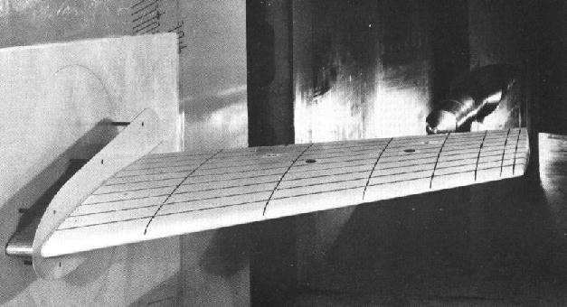
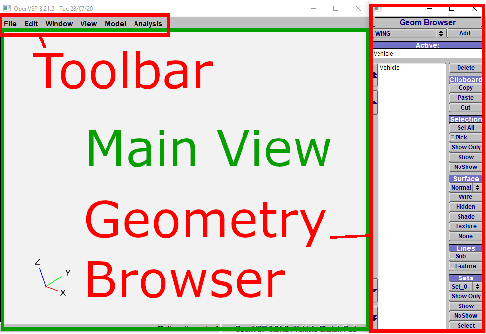
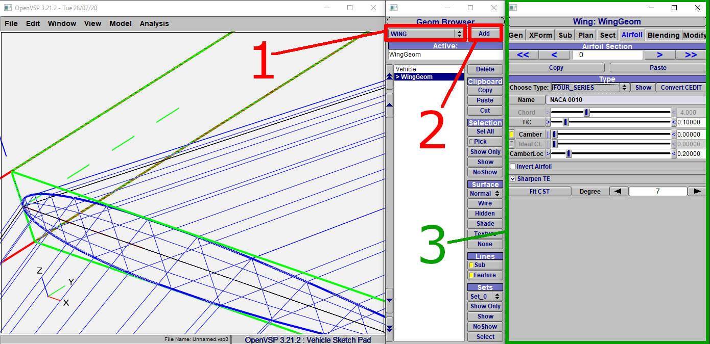
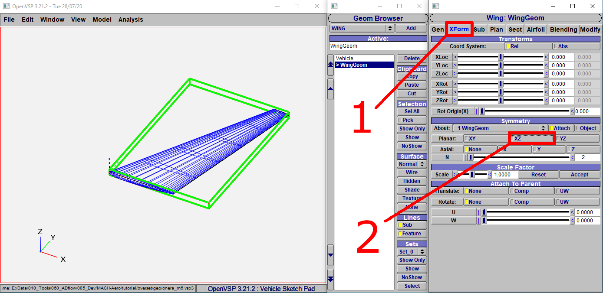
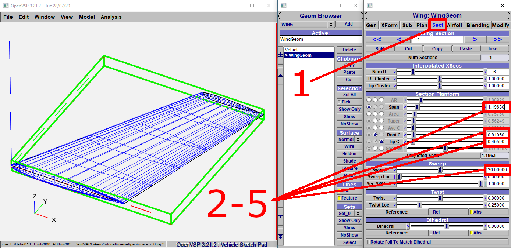
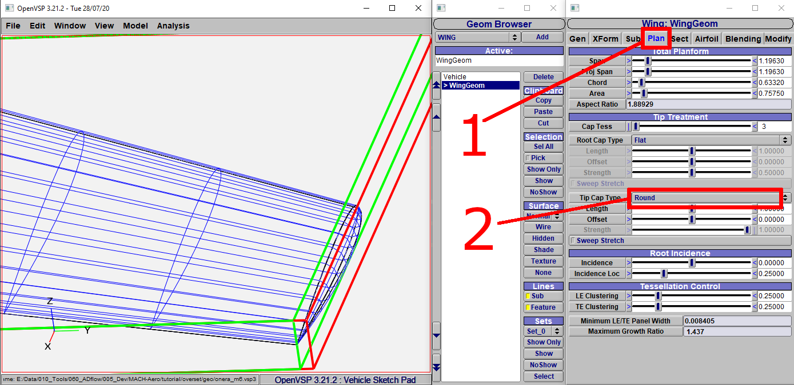
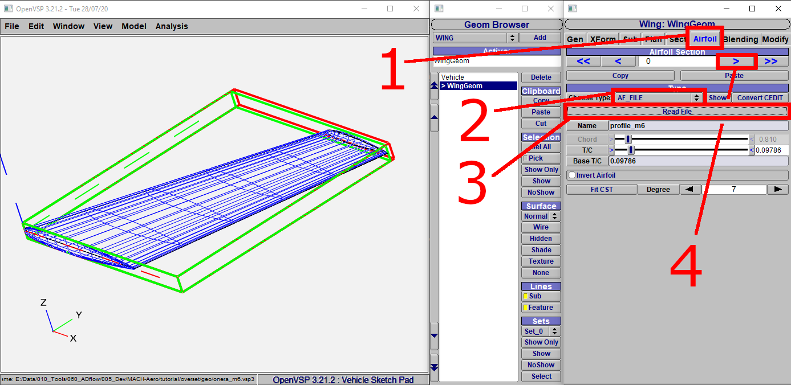
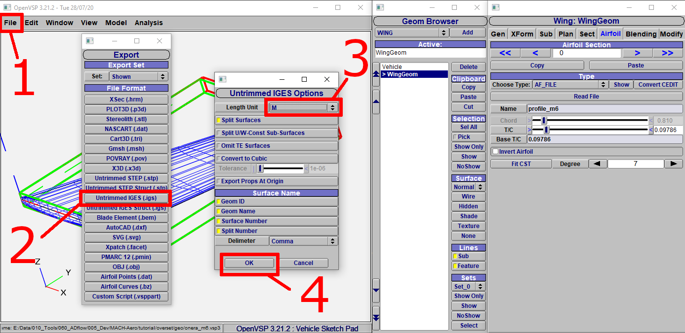

.. _overset_vsp:

*********************************
Geometry Generation
*********************************

Introduction
============

OpenVSP is a parametric aircraft geometry tool. It allows the user to quickly generate aircraft geometries.
We will use it to generate the ONERA M6 wing. This is not a full blown tutorial, more a walk through. If you
want to learn more about it, you can go to their `tutorial videos <http://openvsp.org/vid_tutorial.shtml>`_

Files
=====
Navigate to the directory ``overset/geo`` in your tutorial folder. Copy the file ``profile_m6.dat`` from the
``tutorial`` directory:

.. prompt:: bash

    cp ../../../tutorial/overset/geo/profile_m6.dat .

Geometry Overview
=================
Before we start, we should familiarize ourself with the geometry we are going to create.
The real ONERA M6 experiment looked like this :cite:`nasaM6real`:

    ONERA M6 experiment.

As we are not the first to simulate this wing, we can grab the geometry data and the airfoil from :cite:`nasaM6sim`\.
Here is a short summary:

+--------------------+-----------------------------------------------------------------------------------------------------------------------------------------------------------+
| Airfoil            | `profile_M6 <https://turbmodels.larc.nasa.gov/Onerawingnumerics_val/profile_M6_streamwise_alongy=0.dat>`_ (this can also be found in the tutorial folder) |
+--------------------+-----------------------------------------------------------------------------------------------------------------------------------------------------------+
| Root Chord         | 0.8105 m                                                                                                                                                  |
+--------------------+-----------------------------------------------------------------------------------------------------------------------------------------------------------+
| Tip chord          | 0.4559 m                                                                                                                                                  |
+--------------------+-----------------------------------------------------------------------------------------------------------------------------------------------------------+
| Semispan           | 1.1963 m                                                                                                                                                  |
+--------------------+-----------------------------------------------------------------------------------------------------------------------------------------------------------+
| Leading Edge Sweep | 30°                                                                                                                                                       |
+--------------------+-----------------------------------------------------------------------------------------------------------------------------------------------------------+

Geometry Generation
===================

OpenVSP Window
--------------
If you open OpenVSP the first time, it should look like that:

    OpenVSP Overview.

Lets start the geometry generation:

Add a new Wing
-----------------
1.  Choose ``WING``
2.  Click ``Add``
3.  A new Window ``Wing: WingGeom`` pops up

    Add a new wing to OpenVSP.

We notice a new geometry in the ``Main View``. This is the wing we just added. It also
shows up as ``WingGeom`` in the ``Geom Browser``\. To control the view, use
the following key- and mouse combinations:

zoom
    Press the middle mouse button and move your mouse up and down.
rotate
    Press the left mouse button and move your mouse.
move
    Press the right mouse button and move you mouse.

Manipulate the wing geometry
------------------------------

Move your view, so you can take a look the whole wing. The first thing we notice,
it is a 'full' wing, but we need only half of it. To change this, do the following:

1. Click on ``XForm``
2. Uncheck ``XZ`` in the ``Symmetry`` area

    Disable ``XZ`` Symmetry.

Now we change the wing geometry. OpenVSP has no units, but we want to create the mesh in meters and thus
choose our unit size to be one meter.

1. Click on ``Sect``
2. Change the values to the values listed in the table above

    Adjust the wing geometry.

To make the meshing process easier, we will round the tip:

1. Click on ``Plan``
2. Choose ``Round`` for the ``Tip Cap Type``

    Adjust the wing geometry.

Change the airfoil
------------------

Now, the wing geometry is as it should be, but we still have to change the airfoil:

1. Click on ``Airfoil``
2. Select ``AF_FILE`` for ``Choose Type``
3. Open the file ``profile_m6.dat`` in the ``tutorial\overset\geo`` folder
4. Click on the ``right single arrow`` to select the Tip airfoil
5. repeat the process from ``2`` to ``3``

    Change the airfoil.

Export the geometry
-------------------

Now we can export the geometry to read it into our meshing software. It might also be a good idea to save
it first.

1. Click on ``File`` -> ``Export``
2. Click ``Untrimmed IGES (.igs)``
3. Choose the proper unit. In this case it should be meter
4. Click ``OK`` and save it

    Export the geometry.