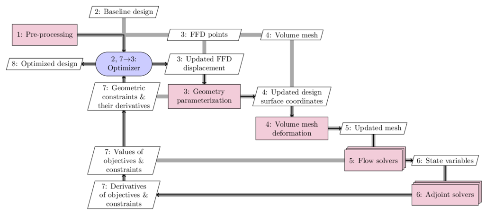

.. _aso:

MACH-Aero
==============

This page provides and overview of the aerodynamic shape optimization capability within MACH (framework for MDO of aircraft configurations with high fidelity).

MACH-Aero consists of six major modules:

- Pre-processing (`pyHyp <http://mdolab.engin.umich.edu/docs/packages/pyhyp/doc/index.html>`_, `ANSYS ICEM-CFD <https://ansys.com>`_)

- Optimizer (`pyOptSparse <http://mdolab.engin.umich.edu/docs/packages/pyoptsparse/doc/index.html>`_)

- Geometry parameterization (`pyGeo <http://mdolab.engin.umich.edu/docs/packages/pygeo/doc/index.html>`_)

- Volume mesh deformation (`IDWarp <http://mdolab.engin.umich.edu/docs/packages/idwarp/doc/index.html>`_)

- Flow simulation (`ADflow <http://mdolab.engin.umich.edu/docs/packages/adflow/doc/index.html>`_, `DAFoam <https://dafoam.rtfd.io>`_)

- Adjoint computation (`ADflow <http://mdolab.engin.umich.edu/docs/packages/adflow/doc/index.html>`_, `DAFoam <https://dafoam.rtfd.io>`_)

See the following papers for technical background of the above modules. **If you use these modules in publications, please cite the corresponding papers**.

- Ruben E. Perez, Peter W. Jansen, Joaquim R.R.A. Martins, pyOpt: A Python-based object-oriented framework for nonlinear constrained optimization, Structural and Multidisciplinary Optimization 45, 101–118, 2012. https://doi.org/10.1007/s00158-011-0666-3 (**pyOptSparse**)

- Gaetan K.W. Kenway, Graeme J. Kennedy, Joaquim R.R.A. Martins, A CAD-free approach to high-fidelity aerostructural optimization, Proceedings of the 13th AIAA/ISSMO Multidisciplinary Analysis Optimization Conference, Fort Worth, TX, 2010. https://doi.org/10.2514/6.2010-9231 (**pyGeo**)

- Gaetan K.W. Kenway, Charles A. Mader, Ping He, Joaquim R.R.A. Martins, Effective adjoint approaches for computational fluid dynamics, Progress in Aerospace Sciences, 2019. https://doi.org/10.1016/j.paerosci.2019.05.002 (**ADflow**)

- Anil Yildirim, Gaetan K.W. Kenway, Charles A. Mader, Joaquim R.R.A. Martins, A Jacobian-free approximate Newton–Krylov startup strategy for RANS simulations, Journal of Computational Physics, 2019. https://doi.org/10.1016/j.jcp.2019.06.018 (**ADflow**)

- Ping He, Charles A. Mader, Joaquim R.R.A. Martins, Kevin J. Maki, An aerodynamic design optimization framework using a discrete adjoint approach with OpenFOAM, Computers \& Fluids 168, 285-303, 2018. https://doi.org/10.1016/j.compfluid.2018.04.012 (**DAFoam**)

Generally, MACH-Aero starts with a baseline design and uses the derivatives (gradient) to find the most promising direction in the design space for improvement.
This process is repeated until the optimality and feasibility conditions are satisfied.
More specific process is as follows, taking the above figure as reference.
Here we use the extended design structure matrix (XDSM) representation developed by Lambe and Martins (2012).
The diagonal nodes represent the modules and the off-diagonal nodes represent the data.
The black lines represent the process flow in the adjoint, whereas the thick gray lines represent the data flow.
The number in each node represents the execution order:

- First, we generate volume mesh for the baseline design geometry (pre-processing in process 1). Several mesh generation tools are available including `pyHyp <http://mdolab.engin.umich.edu/docs/packages/pyhyp/doc/index.html>`_ and ICEM. Refer to `Surface Meshing <http://mdolab.engin.umich.edu/docs/packages/mach_aero_tutorials/doc/aero_icem.html>`_, `Volume Meshing <http://mdolab.engin.umich.edu/docs/packages/mach_aero_tutorials/doc/aero_pyhyp.html>`_, and `Mesh Manipulation <http://mdolab.engin.umich.edu/docs/packages/mach_aero_tutorials/doc/aero_cgnsutils.html>`_ for more details. The generated mesh will be used later in process 4. In the pre-processing step, we also generate free-form deformation (FFD) points (process 3) that will be used later to morph the design surface. Refer to `Geometric Parameterization <http://mdolab.engin.umich.edu/docs/packages/mach_aero_tutorials/doc/opt_ffd.html>`_.

- Then, we give a set of baseline design variables to the optimizer (process 2). We use SNOPT as the optimizer who uses the SQP algorithm. We use `pyOptSparse <http://mdolab.engin.umich.edu/docs/packages/pyoptsparse/doc/index.html>`_ to facilitate the optimization problem setup. The optimizer will update the design variables and give them to the geometry parameterization module (`pyGeo <http://mdolab.engin.umich.edu/docs/packages/pygeo/doc/index.html>`_; process 3). pyGeo receives the updated design variables and the FFD points generated in the pre-processing step, perform the deformation for the design surface, and outputs the deformed design surface to the mesh deformation module (`IDWarp <http://mdolab.engin.umich.edu/docs/packages/idwarp/doc/index.html>`_) in process 4. pyGeo also computes the values of geometric constraints and their derivatives with respect to the design variables (process 7).

- Next, `IDWarp <http://mdolab.engin.umich.edu/docs/packages/idwarp/doc/index.html>`_ deforms the volume mesh based on the updated design surface and outputs the updated volume mesh to the flow simulation module in process 5.

- The flow simulation module receives the updated volume mesh and uses high-fidelity CFD tools (e.g., `ADflow <http://mdolab.engin.umich.edu/docs/packages/adflow/doc/index.html>`_, `DAFoam <https://dafoam.rtfd.io>`_) to compute the state variables (process 6) or physical fields (pressure, density, velocity, etc.). The flow simulation module also computes the objective and constrain functions (e.g., drag and lift; see process 7) and output the state variables to the adjoint computation module.

- Then, the adjoint computation module (process 6) computes the total derivatives of objective and constraint functions with respect to the design variables (process 7) and gives them back to the optimizer in process 7. The benefit of using the adjoint method to compute derivatives is because its computational cost is independent of the number of design variables, which makes it attractive for handling large-scale, complex design problems such as aircraft design. There are two available adjoint solvers: `ADflow <http://mdolab.engin.umich.edu/docs/packages/adflow/doc/index.html>`_, `DAFoam <https://dafoam.rtfd.io>`_.

- Finally, the optimizer receives the values and derivatives of objectives and constraints in process 7, performs the SQP computation, and outputs a set of updated design variables to pyGeo.

The above process is repeated until the optimization converges (optimality and feasibility conditions satisfied).
Refer to `Optimization <http://mdolab.engin.umich.edu/docs/packages/mach_aero_tutorials/doc/opt_overview.html>`_ for more detailed description of high-fidelity gradient-based optimization and `Airfoil Optimization
<http://mdolab.engin.umich.edu/docs/packages/mach_aero_tutorials/doc/airfoilopt_overview.html>`_ and `Analysis and Optimization with Overset Meshes <http://mdolab.engin.umich.edu/docs/packages/mach_aero_tutorials/doc/overset_overview.html>`_ for tutorials.